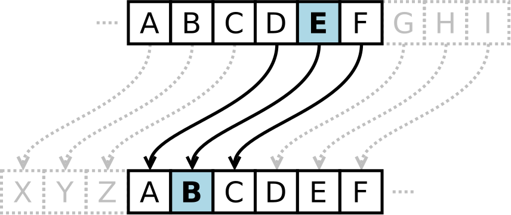

# Polynomial Rolling Hash

## Hash Function

**Hash functions** are used to map large data sets of elements of an arbitrary
length (_the keys_) to smaller data sets of elements of a fixed length
(_the fingerprints_).

The basic application of hashing is efficient testing of equality of keys by
comparing their fingerprints.

A _collision_ happens when two different keys have the same fingerprint. The way
in which collisions are handled is crucial in most applications of hashing.
Hashing is particularly useful in construction of efficient practical algorithms.

## Rolling Hash

A **rolling hash** (also known as recursive hashing or rolling checksum) is a hash
function where the input is hashed in a window that moves through the input.

A few hash functions allow a rolling hash to be computed very quickly — the new
hash value is rapidly calculated given only the following data:

- old hash value,
- the old value removed from the window,
- and the new value added to the window.

## Polynomial String Hashing

An ideal hash function for strings should obviously depend both on the _multiset_ of
the symbols present in the key and on the _order_ of the symbols. The most common
family of such hash functions treats the symbols of a string as coefficients of
a _polynomial_ with an integer variable `p` and computes its value modulo an
integer constant `M`:

The _Rabin–Karp string search algorithm_ is often explained using a very simple
rolling hash function that only uses multiplications and
additions — **polynomial rolling hash**:

> H(s<sub>0</sub>, s<sub>1</sub>, ..., s<sub>k</sub>) = s<sub>0</sub> _ p<sup>k-1</sup> + s<sub>1</sub> _ p<sup>k-2</sup> + ... + s<sub>k</sub> \* p<sup>0</sup>

where `p` is a constant, and _(s<sub>1</sub>, ... , s<sub>k</sub>)_ are the input
characters.

For example, we can convert short strings to key numbers by multiplying digit codes by
powers of a constant. The three letter word `ace` could turn into a number
by calculating:

> key = 1 _ 26<sup>2</sup> + 3 _ 26<sup>1</sup> + 5 \* 26<sup>0</sup>

In order to avoid manipulating huge `H` values, all math is done modulo `M`.

> H(s<sub>0</sub>, s<sub>1</sub>, ..., s<sub>k</sub>) = (s<sub>0</sub> _ p<sup>k-1</sup> + s<sub>1</sub> _ p<sup>k-2</sup> + ... + s<sub>k</sub> \* p<sup>0</sup>) mod M

A careful choice of the parameters `M`, `p` is important to obtain “good”
properties of the hash function, i.e., low collision rate.

This approach has the desirable attribute of involving all the characters in the
input string. The calculated key value can then be hashed into an array index in
the usual way:

```javascript
function hash(key, arraySize) {
  const base = 13;

  let hash = 0;
  for (let charIndex = 0; charIndex < key.length; charIndex += 1) {
    const charCode = key.charCodeAt(charIndex);
    hash += charCode * base ** (key.length - charIndex - 1);
  }

  return hash % arraySize;
}
```

The `hash()` method is not as efficient as it might be. Other than the
character conversion, there are two multiplications and an addition inside
the loop. We can eliminate one multiplication by using \*_Horner's method_:

> a<sub>4</sub> _ x<sup>4</sup> + a<sub>3</sub> _ x<sup>3</sup> + a<sub>2</sub> _ x<sup>2</sup> + a<sub>1</sub> _ x<sup>1</sup> + a<sub>0</sub> = (((a<sub>4</sub> _ x + a<sub>3</sub>) _ x + a<sub>2</sub>) _ x + a<sub>1</sub>) _ x + a<sub>0</sub>

In other words:

> H<sub>i</sub> = (P \* H<sub>i-1</sub> + S<sub>i</sub>) mod M

The `hash()` cannot handle long strings because the hashVal exceeds the size of
int. Notice that the key always ends up being less than the array size.
In Horner's method we can apply the modulo (%) operator at each step in the
calculation. This gives the same result as applying the modulo operator once at
the end, but avoids the overflow.

```javascript
function hash(key, arraySize) {
  const base = 13;

  let hash = 0;
  for (let charIndex = 0; charIndex < key.length; charIndex += 1) {
    const charCode = key.charCodeAt(charIndex);
    hash = (hash * base + charCode) % arraySize;
  }

  return hash;
}
```

Polynomial hashing has a rolling property: the fingerprints can be updated
efficiently when symbols are added or removed at the ends of the string
(provided that an array of powers of p modulo M of sufficient length is stored).
The popular Rabin–Karp pattern matching algorithm is based on this property

# Rail Fence Cipher

The **rail fence cipher** (also called a **zigzag cipher**) is a [transposition cipher](https://en.wikipedia.org/wiki/Transposition_cipher) in which the message is split across a set of rails on a fence for encoding. The fence is populated with the message's characters, starting at the top left and adding a character on each position, traversing them diagonally to the bottom. Upon reaching the last rail, the direction should then turn diagonal and upwards up to the very first rail in a zig-zag motion. Rinse and repeat until the message is fully disposed across the fence. The encoded message is the result of concatenating the text in each rail, from top to bottom.

From [wikipedia](https://en.wikipedia.org/wiki/Rail_fence_cipher), this is what the message `WE ARE DISCOVERED. FLEE AT ONCE` looks like on a `3`-rail fence:

```
W . . . E . . . C . . . R . . . L . . . T . . . E
. E . R . D . S . O . E . E . F . E . A . O . C .
. . A . . . I . . . V . . . D . . . E . . . N . .
-------------------------------------------------
             WECRLTEERDSOEEFEAOCAIVDEN
```

The message can then be decoded by re-creating the encoded fence, with the same traversal pattern, except characters should only be added on one rail at a time. To illustrate that, a dash can be added on the rails that are not supposed to be populated yet. This is what the fence would look like after populating the first rail, the dashes represent positions that were visited but not populated.

```
W . . . E . . . C . . . R . . . L . . . T . . . E
. - . - . - . - . - . - . - . - . - . - . - . - .
. . - . . . - . . . - . . . - . . . - . . . - . .
```

It's time to start populating the next rail once the number of visited fence positions is equal to the number of characters in the message.

# Caesar Cipher Algorithm

In cryptography, a **Caesar cipher**, also known as **Caesar's cipher**, the **shift cipher**, **Caesar's code** or **Caesar shift**, is one of the simplest and most widely known encryption techniques. It is a type of substitution cipher in which each letter in the plaintext is replaced by a letter some fixed number of positions down the alphabet. For example, with a left shift of `3`, `D` would be replaced by `A`, `E` would become `B`, and so on. The method is named after Julius Caesar, who used it in his private correspondence.



## Example

The transformation can be represented by aligning two alphabets; the cipher alphabet is the plain alphabet rotated left or right by some number of positions. For instance, here is a Caesar cipher using a left rotation of three places, equivalent to a right shift of 23 (the shift parameter is used as the key):

```text
Plain:    ABCDEFGHIJKLMNOPQRSTUVWXYZ
Cipher:   XYZABCDEFGHIJKLMNOPQRSTUVW
```

When encrypting, a person looks up each letter of the message in the "plain" line and writes down the corresponding letter in the "cipher" line.

```text
Plaintext:  THE QUICK BROWN FOX JUMPS OVER THE LAZY DOG
Ciphertext: QEB NRFZH YOLTK CLU GRJMP LSBO QEB IXWV ALD
```

## Complexity

- Time: `O(|n|)`
- Space: `O(|n|)`

# Hill Cipher

The **Hill cipher** is a [polygraphic substitution](https://en.wikipedia.org/wiki/Polygraphic_substitution) cipher based on linear algebra.

Each letter is represented by a number [modulo](https://en.wikipedia.org/wiki/Modular_arithmetic) `26`. Though this is not an essential feature of the cipher, this simple scheme is often used:

| **Letter** | A   | B   | C   | D   | E   | F   | G   | H   | I   | J   | K   | L   | M   | N   | O   | P   | Q   | R   | S   | T   | U   | V   | W   | X   | Y   | Z   |
| ---------- | --- | --- | --- | --- | --- | --- | --- | --- | --- | --- | --- | --- | --- | --- | --- | --- | --- | --- | --- | --- | --- | --- | --- | --- | --- | --- |
| **Number** | 0   | 1   | 2   | 3   | 4   | 5   | 6   | 7   | 8   | 9   | 10  | 11  | 12  | 13  | 14  | 15  | 16  | 17  | 18  | 19  | 20  | 21  | 22  | 23  | 24  | 25  |

## Encryption

To encrypt a message, each block of `n` letters (considered as an `n`-component vector) is multiplied by an invertible `n × n` matrix, against modulus `26`.

The matrix used for encryption is the _cipher key_, and it should be chosen randomly from the set of invertible `n × n` matrices (modulo `26`). The cipher can, of course, be adapted to an alphabet with any number of letters; all arithmetic just needs to be done modulo the number of letters instead of modulo `26`.

Consider the message `ACT`, and the key below (or `GYB/NQK/URP` in letters):

```
| 6   24   1  |
| 13  16   10 |
| 20  17   15 |
```

Since `A` is`0`, `C` is `2` and `T` is `19`, the message is the vector:

```
|  0  |
|  2  |
|  19 |
```

Thus, the enciphered vector is given by:

```
| 6   24   1  |  |  0  |   |  67  |   |  15 |
| 13  16   10 |  |  2  | = |  222 | ≡ |  14 | (mod 26)
| 20  17   15 |  |  19 |   |  319 |   |  7  |
```

which corresponds to a ciphertext of `POH`.

Now, suppose that our message is instead `CAT` (notice how we're using the same letters as in `ACT` here), or:

```
|  2  |
|  0  |
|  19 |
```

This time, the enciphered vector is given by:

```
| 6   24   1  |  |  2  |   |  31  |   |  5  |
| 13  16   10 |  |  0  | = |  216 | ≡ |  8  | (mod 26)
| 20  17   15 |  |  19 |   |  325 |   |  13 |
```

which corresponds to a ciphertext of `FIN`. Every letter has changed.

## Decryption

To decrypt the message, each block is multiplied by the inverse of the matrix used for encryption. We turn the ciphertext back into a vector, then simply multiply by the inverse matrix of the key matrix (`IFK/VIV/VMI` in letters). (See [matrix inversion](https://en.wikipedia.org/wiki/Matrix_inversion) for methods to calculate the inverse matrix.) We find that, modulo 26, the inverse of the matrix used in the previous example is:

```
                -1
| 6   24   1  |                | 8   5    10 |
| 13  16   10 |    (mod 26) ≡  | 21  8    21 |
| 20  17   15 |                | 21  12   8  |
```

Taking the previous example ciphertext of `POH`, we get:

```
| 8   5    10 |  |  15 |   |  260 |   |  0  |
| 21  8    21 |  |  14 | = |  574 | ≡ |  2  | (mod 26)
| 21  12   8  |  |  7  |   |  539 |   |  19 |
```

which gets us back to `ACT`, as expected.

## Defining the encrypting matrix

Two complications exist in picking the encrypting matrix:

1. Not all matrices have an inverse. The matrix will have an inverse if and only if its [determinant](https://en.wikipedia.org/wiki/Determinant) is not zero.
2. The determinant of the encrypting matrix must not have any common factors with the modular base.

Thus, if we work modulo `26` as above, the determinant must be nonzero, and must not be divisible by `2` or `13`. If the determinant is `0`, or has common factors with the modular base, then the matrix cannot be used in the Hill cipher, and another matrix must be chosen (otherwise it will not be possible to decrypt). Fortunately, matrices which satisfy the conditions to be used in the Hill cipher are fairly common.
