# Depth-First Search (DFS)

Depth-first search (DFS) is an algorithm for traversing or
searching tree or graph data structures. One starts at
the root (selecting some arbitrary node as the root in
the case of a graph) and explores as far as possible
along each branch before backtracking.

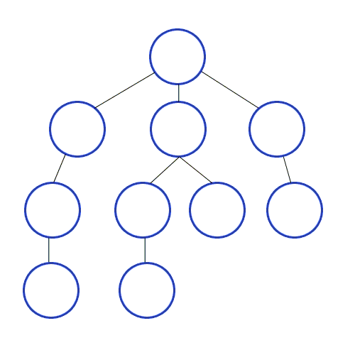

# Breadth-First Search (BFS)

Breadth-first search (BFS) is an algorithm for traversing,
searching tree, or graph data structures. It starts at
the tree root (or some arbitrary node of a graph, sometimes
referred to as a 'search key') and explores the neighbor
nodes first, before moving to the next level neighbors.


# Kruskal's Algorithm

Kruskal's algorithm is a minimum-spanning-tree algorithm which
finds an edge of the least possible weight that connects any two
trees in the forest. It is a greedy algorithm in graph theory
as it finds a minimum spanning tree for a connected weighted
graph adding increasing cost arcs at each step. This means it
finds a subset of the edges that forms a tree that includes every
vertex, where the total weight of all the edges in the tree is
minimized. If the graph is not connected, then it finds a
minimum spanning forest (a minimum spanning tree for each
connected component).

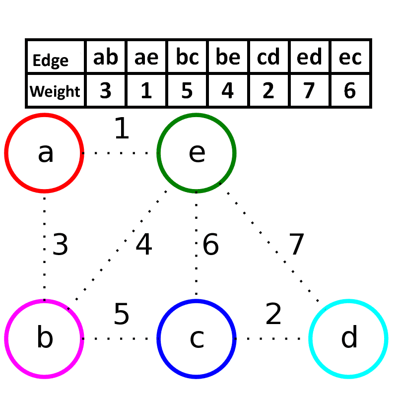


A demo for Kruskal's algorithm based on Euclidean distance.

## Minimum Spanning Tree

A **minimum spanning tree** (MST) or minimum weight spanning tree
is a subset of the edges of a connected, edge-weighted
(un)directed graph that connects all the vertices together,
without any cycles and with the minimum possible total edge
weight. That is, it is a spanning tree whose sum of edge weights
is as small as possible. More generally, any edge-weighted
undirected graph (not necessarily connected) has a minimum
spanning forest, which is a union of the minimum spanning
trees for its connected components.

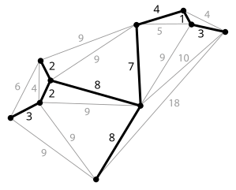

A planar graph and its minimum spanning tree. Each edge is
labeled with its weight, which here is roughly proportional
to its length.

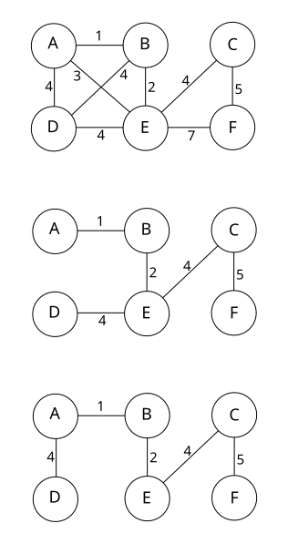

This figure shows there may be more than one minimum spanning
tree in a graph. In the figure, the two trees below the graph
are two possibilities of minimum spanning tree of the given graph.

# Dijkstra's Algorithm

Dijkstra's algorithm is an algorithm for finding the shortest
paths between nodes in a graph, which may represent, for example,
road networks.

The algorithm exists in many variants; Dijkstra's original variant
found the shortest path between two nodes, but a more common
variant fixes a single node as the "source" node and finds the
shortest paths from the source to all other nodes in the graph,
producing a shortest-path tree.


Dijkstra's algorithm to find the shortest path between `a` and `b`.
It picks the unvisited vertex with the lowest distance,
calculates the distance through it to each unvisited neighbor,
and updates the neighbor's distance if smaller. Mark visited
(set to red) when done with neighbors.

# Bellman–Ford Algorithm

The Bellman–Ford algorithm is an algorithm that computes the shortest
paths from a single source vertex to all the other vertices
in a weighted digraph. It is slower than Dijkstra's algorithm
for the same problem, but more versatile, as it is capable of
handling graphs in which some edge weights are negative
numbers.

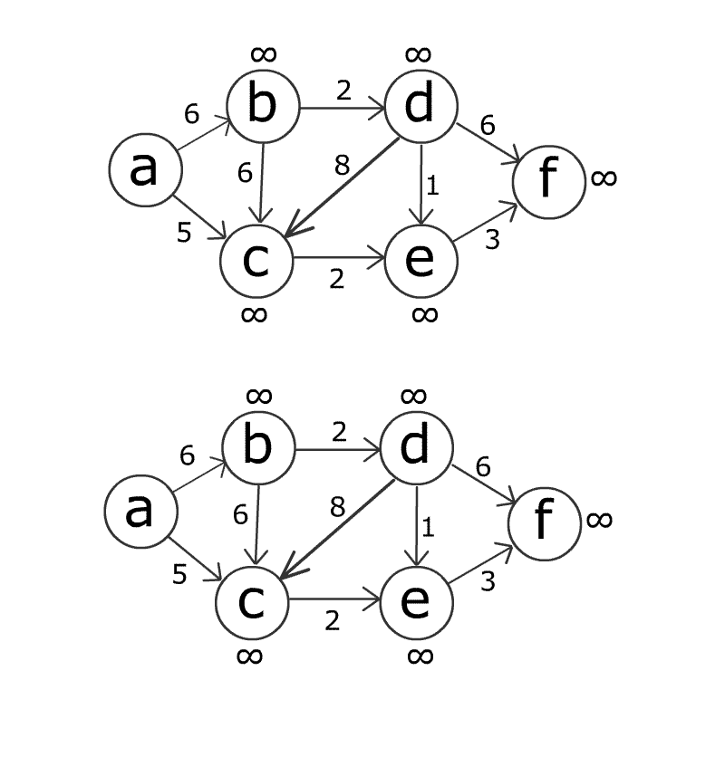

## Complexity

Worst-case performance `O(|V||E|)`
Best-case performance `O(|E|)`
Worst-case space complexity `O(|V|)`

# Floyd–Warshall Algorithm

In computer science, the **Floyd–Warshall algorithm** is an algorithm for finding the
shortest paths in a weighted graph with positive or negative edge weights (but
with no negative cycles). A single execution of the algorithm will find the
lengths (summed weights) of the shortest paths between all pairs of vertices. Although
it does not return details of the paths themselves, it is possible to reconstruct
the paths with simple modifications to the algorithm.

## Algorithm

The Floyd–Warshall algorithm compares all possible paths through the graph between
each pair of vertices. It is able to do this with `O(|V|^3)` comparisons in a graph.
This is remarkable considering that there may be up to `|V|^2` edges in the graph,
and every combination of edges is tested. It does so by incrementally improving an
estimate on the shortest path between two vertices, until the estimate is optimal.

Consider a graph `G` with vertices `V` numbered `1` through `N`. Further consider
a function `shortestPath(i, j, k)` that returns the shortest possible path
from `i` to `j` using vertices only from the set `{1, 2, ..., k}` as
intermediate points along the way. Now, given this function, our goal is to
find the shortest path from each `i` to each `j` using only vertices
in `{1, 2, ..., N}`.


This formula is the heart of the Floyd–Warshall algorithm.

## Example

The algorithm above is executed on the graph on the left below:

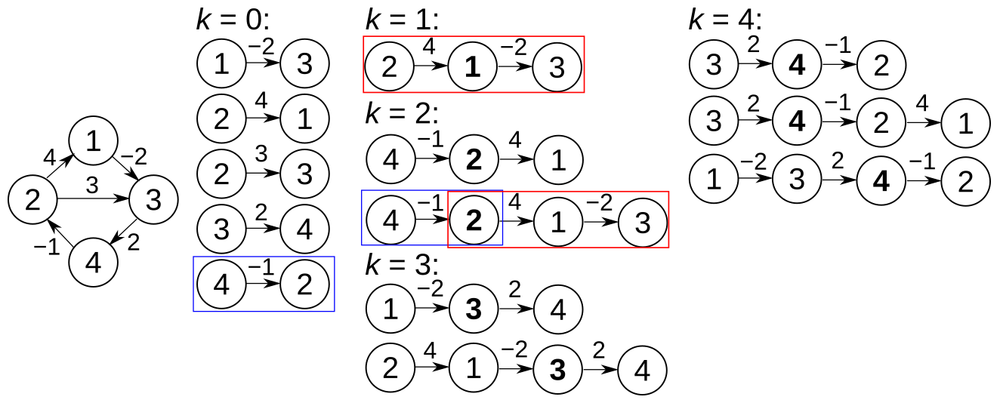

In the tables below `i` is row numbers and `j` is column numbers.

**k = 0**

|       |  1  |  2  |  3  |  4  |
| :---: | :-: | :-: | :-: | :-: |
| **1** |  0  |  ∞  | −2  |  ∞  |
| **2** |  4  |  0  |  3  |  ∞  |
| **3** |  ∞  |  ∞  |  0  |  2  |
| **4** |  ∞  | −1  |  ∞  |  0  |

**k = 1**

|       |  1  |  2  |  3  |  4  |
| :---: | :-: | :-: | :-: | :-: |
| **1** |  0  |  ∞  | −2  |  ∞  |
| **2** |  4  |  0  |  2  |  ∞  |
| **3** |  ∞  |  ∞  |  0  |  2  |
| **4** |  ∞  |  −  |  ∞  |  0  |

**k = 2**

|       |  1  |  2  |  3  |  4  |
| :---: | :-: | :-: | :-: | :-: |
| **1** |  0  |  ∞  | −2  |  ∞  |
| **2** |  4  |  0  |  2  |  ∞  |
| **3** |  ∞  |  ∞  |  0  |  2  |
| **4** |  3  | −1  |  1  |  0  |

**k = 3**

|       |  1  |  2  |  3  |  4  |
| :---: | :-: | :-: | :-: | :-: |
| **1** |  0  |  ∞  | −2  |  0  |
| **2** |  4  |  0  |  2  |  4  |
| **3** |  ∞  |  ∞  |  0  |  2  |
| **4** |  3  | −1  |  1  |  0  |

**k = 4**

|       |  1  |  2  |  3  |  4  |
| :---: | :-: | :-: | :-: | :-: |
| **1** |  0  | −1  | −2  |  0  |
| **2** |  4  |  0  |  2  |  4  |
| **3** |  5  |  1  |  0  |  2  |
| **4** |  3  | −1  |  1  |  0  |

# Detect Cycle in Graphs

In graph theory, a **cycle** is a path of edges and vertices
wherein a vertex is reachable from itself. There are several types of cycles, principally a **closed walk** and
a **simple cycle**.

## Definitions

A **closed walk** consists of a sequence of vertices starting
and ending at the same vertex, with each two consecutive vertices
in the sequence adjacent to each other in the graph. In a directed graph,
each edge must be traversed by the walk consistently with its direction:
the edge must be oriented from the earlier of two consecutive vertices
to the later of the two vertices in the sequence.
The choice of starting vertex is not important: traversing the same cyclic
sequence of edges from different starting vertices produces the same closed walk.

A **simple cycle may** be defined either as a closed walk with no repetitions of
vertices and edges allowed, other than the repetition of the starting and ending
vertex, or as the set of edges in such a walk. The two definitions are equivalent
in directed graphs, where simple cycles are also called directed cycles: the cyclic
sequence of vertices and edges in a walk is completely determined by the set of
edges that it uses. In undirected graphs the set of edges of a cycle can be
traversed by a walk in either of two directions, giving two possible directed cycles
for every undirected cycle. A circuit can be a closed walk allowing repetitions of
vertices but not edges; however, it can also be a simple cycle, so explicit
definition is recommended when it is used.

## Example

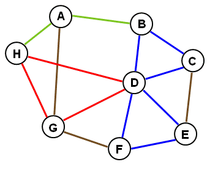

A graph with edges colored to illustrate **path** `H-A-B` (green), closed path or
**walk with a repeated vertex** `B-D-E-F-D-C-B` (blue) and a **cycle with no repeated edge** or
vertex `H-D-G-H` (red)

### Cycle in undirected graph

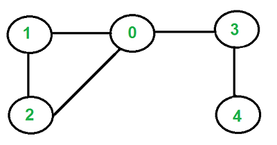

### Cycle in directed graph

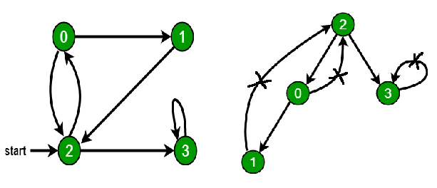

# Prim's Algorithm

In computer science, **Prim's algorithm** is a greedy algorithm that
finds a minimum spanning tree for a weighted undirected graph.

The algorithm operates by building this tree one vertex at a
time, from an arbitrary starting vertex, at each step adding
the cheapest possible connection from the tree to another vertex.

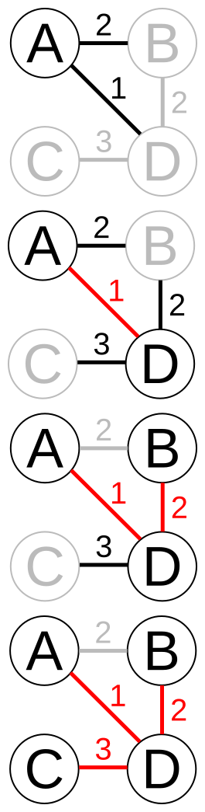

Prim's algorithm starting at vertex `A`. In the third step, edges
`BD` and `AB` both have weight `2`, so `BD` is chosen arbitrarily.
After that step, `AB` is no longer a candidate for addition
to the tree because it links two nodes that are already
in the tree.

## Minimum Spanning Tree

A **minimum spanning tree** (MST) or minimum weight spanning tree
is a subset of the edges of a connected, edge-weighted
(un)directed graph that connects all the vertices together,
without any cycles and with the minimum possible total edge
weight. That is, it is a spanning tree whose sum of edge weights
is as small as possible. More generally, any edge-weighted
undirected graph (not necessarily connected) has a minimum
spanning forest, which is a union of the minimum spanning
trees for its connected components.


A planar graph and its minimum spanning tree. Each edge is
labeled with its weight, which here is roughly proportional
to its length.


This figure shows there may be more than one minimum spanning
tree in a graph. In the figure, the two trees below the graph
are two possibilities of minimum spanning tree of the given graph.

# Topological Sorting

In the field of computer science, a topological sort or
topological ordering of a directed graph is a linear ordering
of its vertices such that for every directed edge `uv` from
vertex `u` to vertex `v`, `u` comes before `v` in the ordering.

For instance, the vertices of the graph may represent tasks to
be performed, and the edges may represent constraints that one
task must be performed before another; in this application, a
topological ordering is just a valid sequence for the tasks.

A topological ordering is possible if and only if the graph has
no directed cycles, that is, if it is a [directed acyclic graph](https://en.wikipedia.org/wiki/Directed_acyclic_graph)
(DAG). Any DAG has at least one topological ordering, and algorithms are
known for constructing a topological ordering of any DAG in linear time.

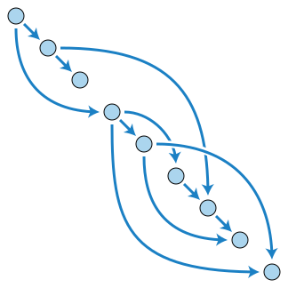

A topological ordering of a directed acyclic graph: every edge goes from
earlier in the ordering (upper left) to later in the ordering (lower right).
A directed graph is acyclic if and only if it has a topological ordering.

## Example

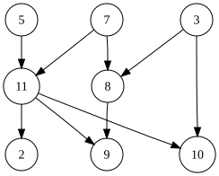

The graph shown above has many valid topological sorts, including:

- `5, 7, 3, 11, 8, 2, 9, 10` (visual left-to-right, top-to-bottom)
- `3, 5, 7, 8, 11, 2, 9, 10` (smallest-numbered available vertex first)
- `5, 7, 3, 8, 11, 10, 9, 2` (fewest edges first)
- `7, 5, 11, 3, 10, 8, 9, 2` (largest-numbered available vertex first)
- `5, 7, 11, 2, 3, 8, 9, 10` (attempting top-to-bottom, left-to-right)
- `3, 7, 8, 5, 11, 10, 2, 9` (arbitrary)

## Application

The canonical application of topological sorting is in
**scheduling a sequence of jobs** or tasks based on their dependencies. The jobs
are represented by vertices, and there is an edge from `x` to `y` if
job `x` must be completed before job `y` can be started (for
example, when washing clothes, the washing machine must finish
before we put the clothes in the dryer). Then, a topological sort
gives an order in which to perform the jobs.

Other application is **dependency resolution**. Each vertex is a package
and each edge is a dependency of package `a` on package 'b'. Then topological
sorting will provide a sequence of installing dependencies in a way that every
next dependency has its dependent packages to be installed in prior.

# Articulation Points (or Cut Vertices)

A vertex in an undirected connected graph is an articulation point
(or cut vertex) if removing it (and edges through it) disconnects
the graph. Articulation points represent vulnerabilities in a
connected network – single points whose failure would split the
network into 2 or more disconnected components. They are useful for
designing reliable networks.

For a disconnected undirected graph, an articulation point is a
vertex removing which increases number of connected components.

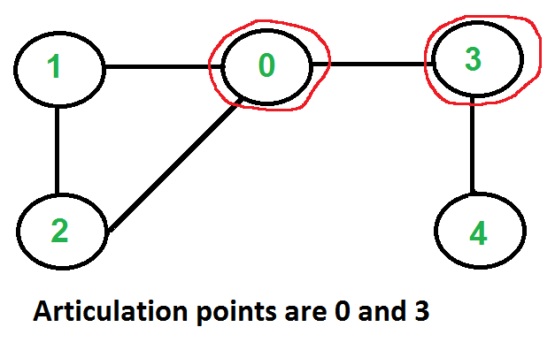

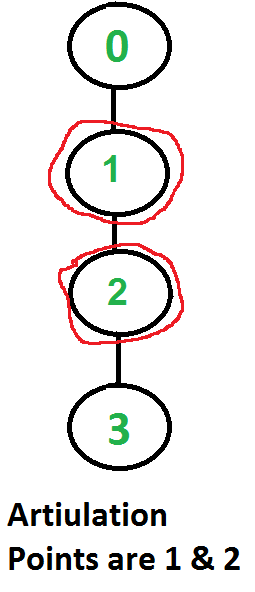

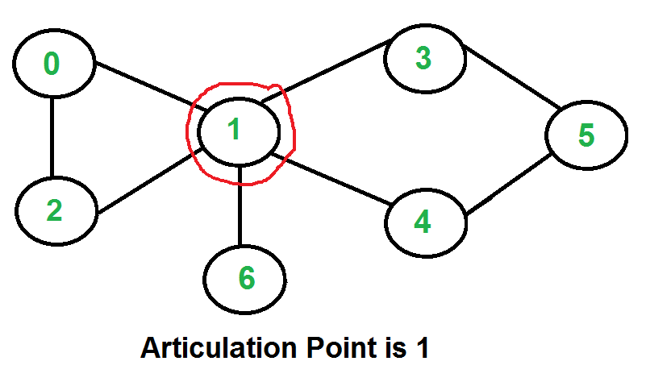

# Bridges in Graph

In graph theory, a **bridge**, **isthmus**, **cut-edge**, or **cut arc** is an edge
of a graph whose deletion increases its number of connected components. Equivalently,
an edge is a bridge if and only if it is not contained in any cycle. A graph is said
to be bridgeless or isthmus-free if it contains no bridges.

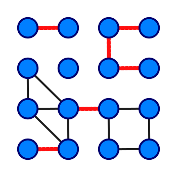

A graph with 16 vertices and 6 bridges (highlighted in red)

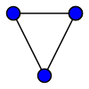

An undirected connected graph with no cut edges

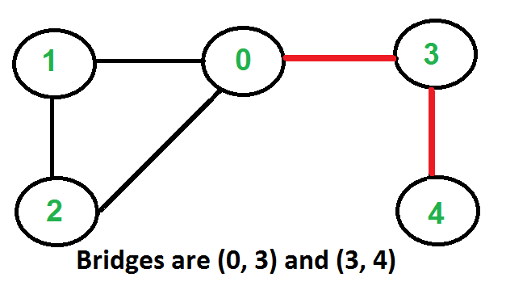

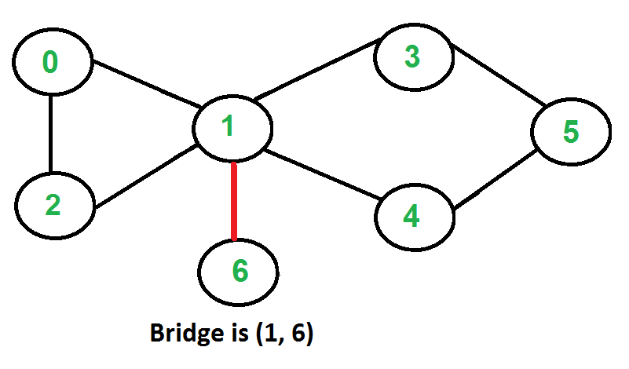

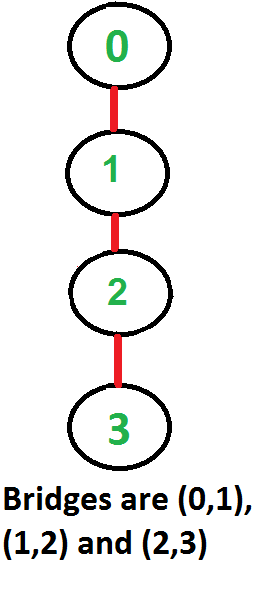

# Eulerian Path

In graph theory, an **Eulerian trail** (or **Eulerian path**) is a
trail in a finite graph which visits every edge exactly once.
Similarly, an **Eulerian circuit** or **Eulerian cycle** is an
Eulerian trail which starts and ends on the same vertex.

Euler proved that a necessary condition for the existence of Eulerian
circuits is that all vertices in the graph have an even degree, and
stated that connected graphs with all vertices of even degree have
an Eulerian circuit.

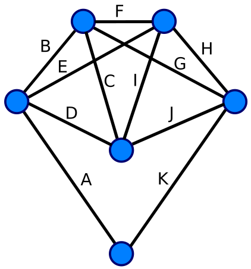

Every vertex of this graph has an even degree. Therefore, this is
an Eulerian graph. Following the edges in alphabetical order gives
an Eulerian circuit/cycle.

For the existence of Eulerian trails it is necessary that zero or
two vertices have an odd degree; this means the Königsberg graph
is not Eulerian. If there are no vertices of odd degree,
all Eulerian trails are circuits. If there are exactly two vertices
of odd degree, all Eulerian trails start at one of them and end at
the other. A graph that has an Eulerian trail but not an Eulerian
circuit is called semi-Eulerian.


The Königsberg Bridges multigraph. This multigraph is not Eulerian,
therefore, a solution does not exist.

# Hamiltonian Path

**Hamiltonian path** (or **traceable path**) is a path in an
undirected or directed graph that visits each vertex exactly once.
A **Hamiltonian cycle** (or **Hamiltonian circuit**) is a
Hamiltonian path that is a cycle. Determining whether such paths
and cycles exist in graphs is the **Hamiltonian path problem**.

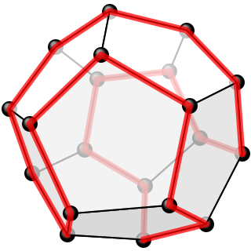

One possible Hamiltonian cycle through every vertex of a
dodecahedron is shown in red — like all platonic solids, the
dodecahedron is Hamiltonian.

## Naive Algorithm

Generate all possible configurations of vertices and print a
configuration that satisfies the given constraints. There
will be `n!` (n factorial) configurations.

```
while there are untried configurations
{
   generate the next configuration
   if ( there are edges between two consecutive vertices of this
      configuration and there is an edge from the last vertex to
      the first ).
   {
      print this configuration;
      break;
   }
}
```

## Backtracking Algorithm

Create an empty path array and add vertex `0` to it. Add other
vertices, starting from the vertex `1`. Before adding a vertex,
check for whether it is adjacent to the previously added vertex
and not already added. If we find such a vertex, we add the
vertex as part of the solution. If we do not find a vertex
then we return false.

# Strongly Connected Component

A directed graph is called **strongly connected** if there is a path
in each direction between each pair of vertices of the graph.
In a directed graph G that may not itself be strongly connected,
a pair of vertices `u` and `v` are said to be strongly connected
to each other if there is a path in each direction between them.

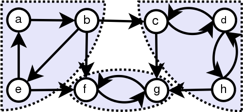

Graph with strongly connected components marked

# Travelling Salesman Problem

The travelling salesman problem (TSP) asks the following question:
"Given a list of cities and the distances between each pair of
cities, what is the shortest possible route that visits each city
and returns to the origin city?"

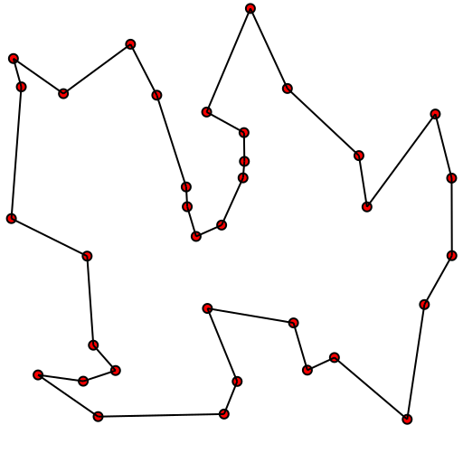

Solution of a travelling salesman problem: the black line shows
the shortest possible loop that connects every red dot.


TSP can be modelled as an undirected weighted graph, such that
cities are the graph's vertices, paths are the graph's edges,
and a path's distance is the edge's weight. It is a minimization
problem starting and finishing at a specified vertex after having
visited each other vertex exactly once. Often, the model is a
complete graph (i.e., each pair of vertices is connected by an
edge). If no path exists between two cities, adding an arbitrarily
long edge will complete the graph without affecting the optimal tour.
