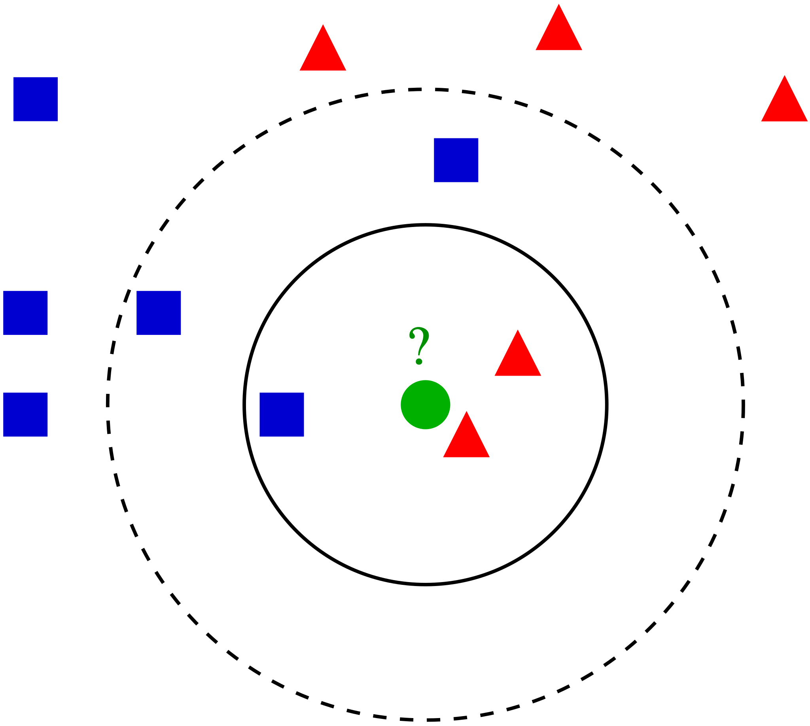
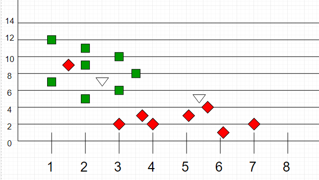

# k-Nearest Neighbors Algorithm

The **k-nearest neighbors algorithm (k-NN)** is a supervised Machine Learning algorithm. It's a classification algorithm, determining the class of a sample vector using a sample data.

In k-NN classification, the output is a class membership. An object is classified by a plurality vote of its neighbors, with the object being assigned to the class most common among its `k` nearest neighbors (`k` is a positive integer, typically small). If `k = 1`, then the object is simply assigned to the class of that single nearest neighbor.

The idea is to calculate the similarity between two data points on the basis of a distance metric. [Euclidean distance](https://en.wikipedia.org/wiki/Euclidean_distance) is used mostly for this task.

The algorithm is as follows:

1. Check for errors like invalid data/labels.
2. Calculate the euclidean distance of all the data points in training data with the classification point
3. Sort the distances of points along with their classes in ascending order
4. Take the initial `K` classes and find the mode to get the most similar class
5. Report the most similar class

Here is a visualization of k-NN classification for better understanding:

The test sample (green dot) should be classified either to blue squares or to red triangles. If `k = 3` (solid line circle) it is assigned to the red triangles because there are `2` triangles and only `1` square inside the inner circle. If `k = 5` (dashed line circle) it is assigned to the blue squares (`3` squares vs. `2` triangles inside the outer circle).

Another k-NN classification example:

Here, as we can see, the classification of unknown points will be judged by their proximity to other points.

It is important to note that `K` is preferred to have odd values in order to break ties. Usually `K` is taken as `3` or `5`.

# k-Means Algorithm

The **k-Means algorithm** is an unsupervised Machine Learning algorithm. It's a clustering algorithm, which groups the sample data on the basis of similarity between dimensions of vectors.

In k-Means classification, the output is a set of classes assigned to each vector. Each cluster location is continuously optimized in order to get the accurate locations of each cluster such that they represent each group clearly.

The idea is to calculate the similarity between cluster location and data vectors, and reassign clusters based on it. [Euclidean distance](https://github.com/trekhleb/javascript-algorithms/tree/master/src/algorithms/math/euclidean-distance) is used mostly for this task.

The algorithm is as follows:

1. Check for errors like invalid/inconsistent data
2. Initialize the `k` cluster locations with initial/random `k` points
3. Calculate the distance of each data point from each cluster
4. Assign the cluster label of each data point equal to that of the cluster at its minimum distance
5. Calculate the centroid of each cluster based on the data points it contains
6. Repeat each of the above steps until the centroid locations are varying

Here is a visualization of k-Means clustering for better understanding:

The centroids are moving continuously in order to create better distinction between the different set of data points. As we can see, after a few iterations, the difference in centroids is quite low between iterations. For example between iterations `13` and `14` the difference is quite small because there the optimizer is tuning boundary cases.

## Code Examples

- [kMeans.js](./kMeans.js)
- [kMeans.test.js](./__test__/kMeans.test.js) (test cases)
