# Bit Manipulation

#### Get Bit

This method shifts the relevant bit to the zeroth position.
Then we perform `AND` operation with one which has bitten
pattern like `0001`. This clears all bits from the original
number except the relevant one. If the relevant bit is one,
the result is `1`, otherwise the result is `0`.

> See [getBit.js](getBit.js) for further details.

#### Set Bit

This method shifts `1` over by `bitPosition` bits, creating a
value that looks like `00100`. Then we perform `OR` operation
that sets specific bit into `1`, but it does not affect on
other bits of the number.

> See [setBit.js](setBit.js) for further details.

#### Clear Bit

This method shifts `1` over by `bitPosition` bits, creating a
value that looks like `00100`. Then it inverts this mask to get
the number that looks like `11011`. Then `AND` operation is
being applied to both the number and the mask. That operation
unsets the bit.

> See [clearBit.js](clearBit.js) for further details.

#### Update Bit

This method is a combination of "Clear Bit" and "Set Bit" methods.

> See [updateBit.js](updateBit.js) for further details.

#### isEven

This method determines if the number provided is even.
It is based on the fact that odd numbers have their last
right bit to be set to 1.

```text
Number: 5 = 0b0101
isEven: false

Number: 4 = 0b0100
isEven: true
```

> See [isEven.js](isEven.js) for further details.

#### isPositive

This method determines if the number is positive. It is based on the fact that all positive
numbers have their leftmost bit to be set to `0`. However, if the number provided is zero
or negative zero, it should still return `false`.

```text
Number: 1 = 0b0001
isPositive: true

Number: -1 = -0b0001
isPositive: false
```

> See [isPositive.js](isPositive.js) for further details.

#### Multiply By Two

This method shifts original number by one bit to the left.
Thus, all binary number components (powers of two) are being
multiplying by two and thus the number itself is being
multiplied by two.

```
Before the shift
Number: 0b0101 = 5
Powers of two: 0 + 2^2 + 0 + 2^0

After the shift
Number: 0b1010 = 10
Powers of two: 2^3 + 0 + 2^1 + 0
```

> See [multiplyByTwo.js](multiplyByTwo.js) for further details.

#### Divide By Two

This method shifts original number by one bit to the right.
Thus, all binary number components (powers of two) are being
divided by two and thus the number itself is being
divided by two without remainder.

```
Before the shift
Number: 0b0101 = 5
Powers of two: 0 + 2^2 + 0 + 2^0

After the shift
Number: 0b0010 = 2
Powers of two: 0 + 0 + 2^1 + 0
```

> See [divideByTwo.js](divideByTwo.js) for further details.

#### Switch Sign

This method makes positive numbers to be negative and backwards.
To do so it uses "Twos Complement" approach which does it by
inverting all the bits of the number and adding 1 to it.

```
1101 -3
1110 -2
1111 -1
0000  0
0001  1
0010  2
0011  3
```

> See [switchSign.js](switchSign.js) for further details.

#### Multiply Two Signed Numbers

This method multiplies two signed integer numbers using bitwise operators.
This method is based on the following facts:

```text
a * b can be written in the below formats:
  0                     if a is zero or b is zero or both a and b are zeroes
  2a * (b/2)            if b is even
  2a * (b - 1)/2 + a    if b is odd and positive
  2a * (b + 1)/2 - a    if b is odd and negative
```

The advantage of this approach is that in each recursive step one of the operands
reduces to half its original value. Hence, the run time complexity is `O(log(b))` where `b` is
the operand that reduces to half on each recursive step.

> See [multiply.js](multiply.js) for further details.

#### Multiply Two Unsigned Numbers

This method multiplies two integer numbers using bitwise operators.
This method is based on that "Every number can be denoted as the sum of powers of 2".

The main idea of bitwise multiplication is that every number may be split
to the sum of powers of two:

I.e.

```text
19 = 2^4 + 2^1 + 2^0
```

Then multiplying number `x` by `19` is equivalent of:

```text
x * 19 = x * 2^4 + x * 2^1 + x * 2^0
```

Now we need to remember that `x * 2^4` is equivalent of shifting `x` left
by `4` bits (`x << 4`).

> See [multiplyUnsigned.js](multiplyUnsigned.js) for further details.

#### Count Set Bits

This method counts the number of set bits in a number using bitwise operators.
The main idea is that we shift the number right by one bit at a time and check
the result of `&` operation that is `1` if bit is set and `0` otherwise.

```text
Number: 5 = 0b0101
Count of set bits = 2
```

> See [countSetBits.js](countSetBits.js) for further details.

#### Count Bits to Flip One Number to Another

This method outputs the number of bits required to convert one number to another.
This makes use of property that when numbers are `XOR`-ed the result will be a number of different bits.

```
5 = 0b0101
1 = 0b0001
Count of Bits to be Flipped: 1
```

> See [bitsDiff.js](bitsDiff.js) for further details.

#### Count Bits of a Number

To calculate the number of valuable bits we need to shift `1` one bit left each
time and see if shifted number is bigger than the input number.

```
5 = 0b0101
Count of valuable bits is: 3
When we shift 1 four times it will become bigger than 5.
```

> See [bitLength.js](bitLength.js) for further details.

#### Is Power of Two

This method checks if a number provided is power of two. It uses the following
property. Let's say that `powerNumber` is a number that has been formed as a power
of two (i.e. 2, 4, 8, 16 etc.). Then if we'll do `&` operation between `powerNumber`
and `powerNumber - 1` it will return `0` (in case if number is power of two).

```
Number: 4 = 0b0100
Number: 3 = (4 - 1) = 0b0011
4 & 3 = 0b0100 & 0b0011 = 0b0000 <-- Equal to zero, is power of two.

Number: 10 = 0b01010
Number: 9 = (10 - 1) = 0b01001
10 & 9 = 0b01010 & 0b01001 = 0b01000 <-- Not equal to zero, not a power of two.
```

> See [isPowerOfTwo.js](isPowerOfTwo.js) for further details.

#### Full Adder

This method adds up two integer numbers using bitwise operators.

It implements [full adder](<https://en.wikipedia.org/wiki/Adder_(electronics)>)
electronics circuit logic to sum two 32-bit integers in two's complement format.
It's using the boolean logic to cover all possible cases of adding two input bits:
with and without a "carry bit" from adding the previous less-significant stage.

Legend:

- `A`: Number `A`
- `B`: Number `B`
- `ai`: ith bit of number `A`
- `bi`: ith bit of number `B`
- `carryIn`: a bit carried in from the previous less-significant stage
- `carryOut`: a bit to carry to the next most-significant stage
- `bitSum`: The sum of `ai`, `bi`, and `carryIn`
- `resultBin`: The full result of adding current stage with all less-significant stages (in binary)
- `resultDec`: The full result of adding current stage with all less-significant stages (in decimal)

```
A = 3: 011
B = 6: 110
┌──────┬────┬────┬─────────┬──────────┬─────────┬───────────┬───────────┐
│  bit │ ai │ bi │ carryIn │ carryOut │  bitSum │ resultBin │ resultDec │
├──────┼────┼────┼─────────┼──────────┼─────────┼───────────┼───────────┤
│   0  │ 1  │ 0  │    0    │    0     │     1   │       1   │     1     │
│   1  │ 1  │ 1  │    0    │    1     │     0   │      01   │     1     │
│   2  │ 0  │ 1  │    1    │    1     │     0   │     001   │     1     │
│   3  │ 0  │ 0  │    1    │    0     │     1   │    1001   │     9     │
└──────┴────┴────┴─────────┴──────────┴─────────┴───────────┴───────────┘
```

> See [fullAdder.js](fullAdder.js) for further details.
> See [Full Adder on YouTube](https://www.youtube.com/watch?v=wvJc9CZcvBc&list=PLLXdhg_r2hKA7DPDsunoDZ-Z769jWn4R8).

# Binary representation of floating-point numbers

Have you ever wondered how computers store the floating-point numbers like `3.1416` (𝝿) or `9.109 × 10⁻³¹` (the mass of the electron in kg) in the memory which is limited by a finite number of ones and zeroes (aka bits)?

It seems pretty straightforward for integers (i.e. `17`). Let's say we have 16 bits (2 bytes) to store the number. In 16 bits we may store the integers in a range of `[0, 65535]`:

```text
(0000000000000000)₂ = (0)₁₀

(0000000000010001)₂ =
    (1 × 2⁴) +
    (0 × 2³) +
    (0 × 2²) +
    (0 × 2¹) +
    (1 × 2⁰) = (17)₁₀

(1111111111111111)₂ =
    (1 × 2¹⁵) +
    (1 × 2¹⁴) +
    (1 × 2¹³) +
    (1 × 2¹²) +
    (1 × 2¹¹) +
    (1 × 2¹⁰) +
    (1 × 2⁹) +
    (1 × 2⁸) +
    (1 × 2⁷) +
    (1 × 2⁶) +
    (1 × 2⁵) +
    (1 × 2⁴) +
    (1 × 2³) +
    (1 × 2²) +
    (1 × 2¹) +
    (1 × 2⁰) = (65535)₁₀
```

If we need a signed integer we may use [two's complement](https://en.wikipedia.org/wiki/Two%27s_complement) and shift the range of `[0, 65535]` towards the negative numbers. In this case, our 16 bits would represent the numbers in a range of `[-32768, +32767]`.

As you might have noticed, this approach won't allow you to represent the numbers like `-27.15625` (numbers after the decimal point are just being ignored).

We're not the first ones who have noticed this issue though. Around ≈36 years ago some smart folks overcame this limitation by introducing the [IEEE 754](https://en.wikipedia.org/wiki/IEEE_754) standard for floating-point arithmetic.

The IEEE 754 standard describes the way (the framework) of using those 16 bits (or 32, or 64 bits) to store the numbers of wider range, including the small floating numbers (smaller than 1 and closer to 0).

To get the idea behind the standard we might recall the [scientific notation](https://en.wikipedia.org/wiki/Scientific_notation) - a way of expressing numbers that are too large or too small (usually would result in a long string of digits) to be conveniently written in decimal form.

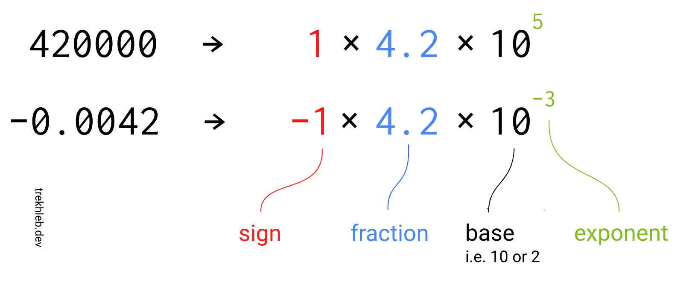

As you may see from the image, the number representation might be split into three parts:

- **sign**
- **fraction (aka significand)** - the valuable digits (the meaning, the payload) of the number
- **exponent** - controls how far and in which direction to move the decimal point in the fraction

The **base** part we may omit by just agreeing on what it will be equal to. In our case, we'll be using `2` as a base.

Instead of using all 16 bits (or 32 bits, or 64 bits) to store the fraction of the number, we may share the bits and store a sign, exponent, and fraction at the same time. Depending on the number of bits that we're going to use to store the number we end up with the following splits:

| Floating-point format                                                                    | Total bits | Sign bits | Exponent bits | Fraction bits | Base |
| :--------------------------------------------------------------------------------------- | :--------: | :-------: | :-----------: | :-----------: | :--: |
| [Half-precision](https://en.wikipedia.org/wiki/Half-precision_floating-point_format)     |     16     |     1     |       5       |      10       |  2   |
| [Single-precision](https://en.wikipedia.org/wiki/Single-precision_floating-point_format) |     32     |     1     |       8       |      23       |  2   |
| [Double-precision](https://en.wikipedia.org/wiki/Double-precision_floating-point_format) |     64     |     1     |      11       |      52       |  2   |

With this approach, the number of bits for the fraction has been reduced (i.e. for the 16-bits number it was reduced from 16 bits to 10 bits). It means that the fraction might take a narrower range of values now (losing some precision). However, since we also have an exponent part, it will actually increase the ultimate number range and also allow us to describe the numbers between 0 and 1 (if the exponent is negative).

> For example, a signed 32-bit integer variable has a maximum value of 2³¹ − 1 = 2,147,483,647, whereas an IEEE 754 32-bit base-2 floating-point variable has a maximum value of ≈ 3.4028235 × 10³⁸.

To make it possible to have a negative exponent, the IEEE 754 standard uses the [biased exponent](https://en.wikipedia.org/wiki/Exponent_bias). The idea is simple - subtract the bias from the exponent value to make it negative. For example, if the exponent has 5 bits, it might take the values from the range of `[0, 31]` (all values are positive here). But if we subtract the value of `15` from it, the range will be `[-15, 16]`. The number `15` is called bias, and it is being calculated by the following formula:

```
exponent_bias = 2 ^ (k−1) − 1

k - number of exponent bits
```

I've tried to describe the logic behind the converting of floating-point numbers from a binary format back to the decimal format on the image below. Hopefully, it will give you a better understanding of how the IEEE 754 standard works. The 16-bits number is being used here for simplicity, but the same approach works for 32-bits and 64-bits numbers as well.


> Checkout the [interactive version of this diagram](https://trekhleb.dev/blog/2021/binary-floating-point/) to play around with setting bits on and off, and seeing how it would influence the final result

Here is the number ranges that different floating-point formats support:

| Floating-point format | Exp min | Exp max | Range             | Min positive |
| :-------------------- | :------ | :------ | :---------------- | :----------- |
| Half-precision        | −14     | +15     | ±65,504           | 6.10 × 10⁻⁵  |
| Single-precision      | −126    | +127    | ±3.4028235 × 10³⁸ | 1.18 × 10⁻³⁸ |

Be aware that this is by no means a complete and sufficient overview of the IEEE 754 standard. It is rather a simplified and basic overview. Several corner cases were omitted in the examples above for simplicity of presentation (i.e. `-0`, `-∞`, `+∞` and `NaN` (not a number) values)

## Code examples

- See the [bitsToFloat.js](bitsToFloat.js) for the example of how to convert array of bits to the floating point number (the example is a bit artificial but still it gives the overview of how the conversion is going on)
- See the [floatAsBinaryString.js](floatAsBinaryString.js) for the example of how to see the actual binary representation of the floating-point number in JavaScript

# Factorial

In mathematics, the factorial of a non-negative integer `n`,
denoted by `n!`, is the product of all positive integers less
than or equal to `n`. For example:

```
5! = 5 * 4 * 3 * 2 * 1 = 120
```

| n   |                n! |
| --- | ----------------: |
| 0   |                 1 |
| 1   |                 1 |
| 2   |                 2 |
| 3   |                 6 |
| 4   |                24 |
| 5   |               120 |
| 6   |               720 |
| 7   |             5 040 |
| 8   |            40 320 |
| 9   |           362 880 |
| 10  |         3 628 800 |
| 11  |        39 916 800 |
| 12  |       479 001 600 |
| 13  |     6 227 020 800 |
| 14  |    87 178 291 200 |
| 15  | 1 307 674 368 000 |

# Fibonacci Number

In mathematics, the Fibonacci numbers are the numbers in the following
integer sequence, called the Fibonacci sequence, and characterized by
the fact that every number after the first two is the sum of the two
preceding ones:

`0, 1, 1, 2, 3, 5, 8, 13, 21, 34, 55, 89, 144, ...`

A tiling with squares whose side lengths are successive Fibonacci numbers

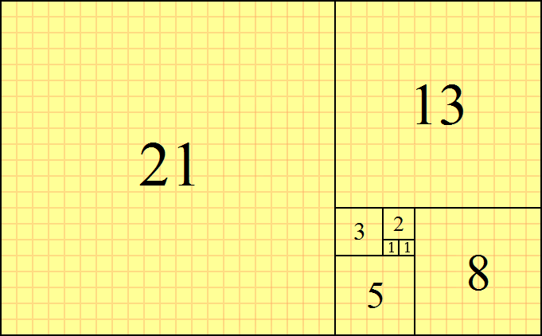

The Fibonacci spiral: an approximation of the golden spiral created by drawing circular arcs connecting the opposite corners of squares in the Fibonacci tiling;[4] this one uses squares of sizes 1, 1, 2, 3, 5, 8, 13 and 21.

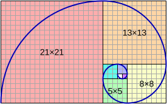

# Prime Factors

**Prime number** is a whole number greater than `1` that **cannot** be made by multiplying other whole numbers. The first few prime numbers are: `2`, `3`, `5`, `7`, `11`, `13`, `17`, `19` and so on.

If we **can** make it by multiplying other whole numbers it is a **Composite Number**.

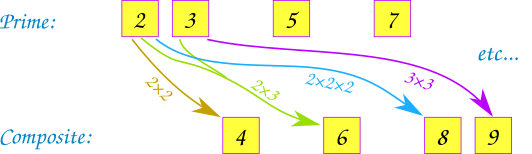

**Prime factors** are those [prime numbers](https://en.wikipedia.org/wiki/Prime_number) which multiply together to give the original number. For example `39` will have prime factors of `3` and `13` which are also prime numbers. Another example is `15` whose prime factors are `3` and `5`.

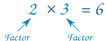

## Finding the prime factors and their count accurately

The approach is to keep on dividing the natural number `n` by indexes from `i = 2` to `i = n` (by prime indexes only). The value of `n` is being overridden by `(n / i)` on each iteration.

The time complexity till now is `O(n)` in the worst case scenario since the loop runs from index `i = 2` to `i = n`. This time complexity can be reduced from `O(n)` to `O(sqrt(n))`. The optimization is achievable when loop runs from `i = 2` to `i = sqrt(n)`. Now, we go only till `O(sqrt(n))` because when `i` becomes greater than `sqrt(n)`, we have the confirmation that there is no index `i` left which can divide `n` completely other than `n` itself.

## Hardy-Ramanujan formula for approximate calculation of prime-factor count

In 1917, a theorem was formulated by G.H Hardy and Srinivasa Ramanujan which states that the normal order of the number `ω(n)` of distinct prime factors of a number `n` is `log(log(n))`.

Roughly speaking, this means that most numbers have about this number of distinct prime factors.

# Primality Test

A **prime number** (or a **prime**) is a natural number greater than `1` that
cannot be formed by multiplying two smaller natural numbers. A natural number
greater than `1` that is not prime is called a composite number. For
example, `5` is prime because the only ways of writing it as a
product, `1 × 5` or `5 × 1`, involve `5` itself. However, `6` is
composite because it is the product of two numbers `(2 × 3)` that are
both smaller than `6`.

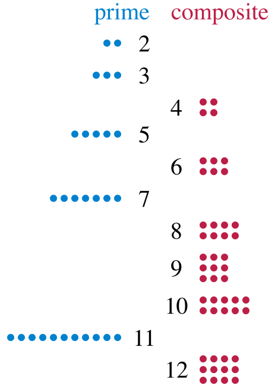

A **primality test** is an algorithm for determining whether an input
number is prime. Among other fields of mathematics, it is used
for cryptography. Unlike integer factorization, primality tests
do not generally give prime factors, only stating whether the
input number is prime or not. Factorization is thought to be
a computationally difficult problem, whereas primality testing
is comparatively easy (its running time is polynomial in the
size of the input).

# Euclidean Distance

In mathematics, the **Euclidean distance** between two points in Euclidean space is the length of a line segment between the two points. It can be calculated from the Cartesian coordinates of the points using the Pythagorean theorem, therefore occasionally being called the Pythagorean distance.


## Distance formulas

### One dimension

The distance between any two points on the real line is the absolute value of the numerical difference of their coordinates


### Two dimensions


### Higher dimensions

In three dimensions, for points given by their Cartesian coordinates, the distance is


Example: the distance between the two points `(8,2,6)` and `(3,5,7)`:

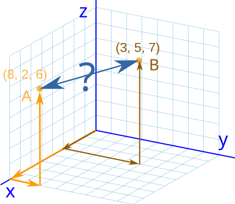

In general, for points given by Cartesian coordinates in `n`-dimensional Euclidean space, the distance is


# Least common multiple

In arithmetic and number theory, the least common multiple,
the lowest common multiple, or smallest common multiple of
two integers `a` and `b`, usually denoted by `LCM(a, b)`, is
the smallest positive integer that is divisible by
both `a` and `b`. Since division of integers by zero is
undefined, this definition has meaning only if `a` and `b` are
both different from zero. However, some authors define `lcm(a,0)`
as `0` for all `a`, which is the result of taking the `lcm`
to be the least upper bound in the lattice of divisibility.

## Example

What is the LCM of 4 and 6?

Multiples of `4` are:

```
4, 8, 12, 16, 20, 24, 28, 32, 36, 40, 44, 48, 52, 56, 60, 64, 68, 72, 76, ...
```

and the multiples of `6` are:

```
6, 12, 18, 24, 30, 36, 42, 48, 54, 60, 66, 72, ...
```

Common multiples of `4` and `6` are simply the numbers
that are in both lists:

```
12, 24, 36, 48, 60, 72, ....
```

So, from this list of the first few common multiples of
the numbers `4` and `6`, their least common multiple is `12`.

## Computing the least common multiple

The following formula reduces the problem of computing the
least common multiple to the problem of computing the greatest
common divisor (GCD), also known as the greatest common factor:

```
lcm(a, b) = |a * b| / gcd(a, b)
```

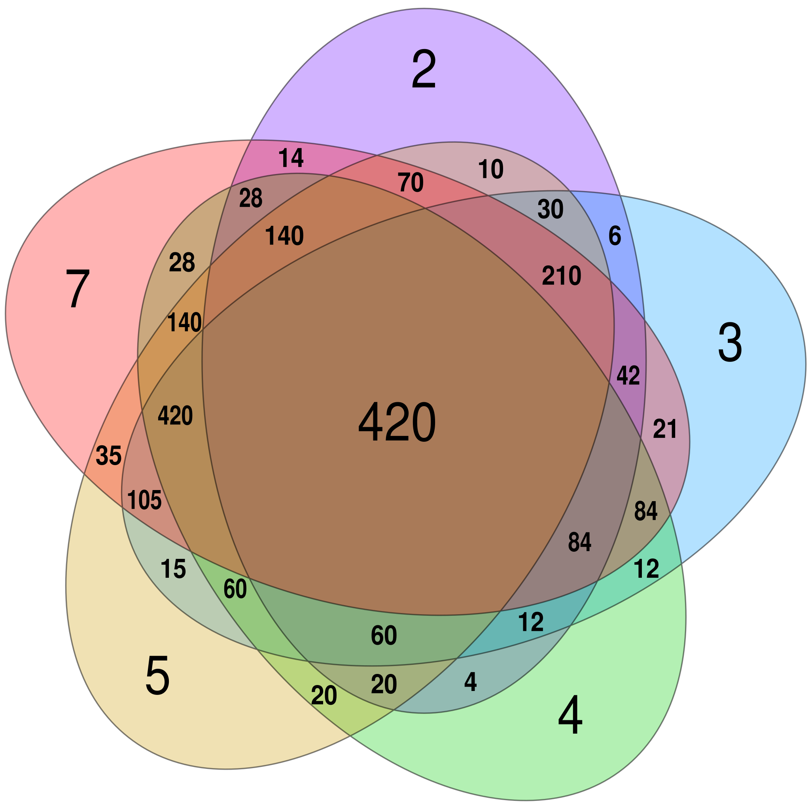

A Venn diagram showing the least common multiples of
combinations of `2`, `3`, `4`, `5` and `7` (`6` is skipped as
it is `2 × 3`, both of which are already represented).

For example, a card game which requires its cards to be
divided equally among up to `5` players requires at least `60`
cards, the number at the intersection of the `2`, `3`, `4`
and `5` sets, but not the `7` set.

# Sieve of Eratosthenes

The Sieve of Eratosthenes is an algorithm for finding all prime numbers up to some limit `n`.

It is attributed to Eratosthenes of Cyrene, an ancient Greek mathematician.

## How it works

1. Create a boolean array of `n + 1` positions (to represent the numbers `0` through `n`)
2. Set positions `0` and `1` to `false`, and the rest to `true`
3. Start at position `p = 2` (the first prime number)
4. Mark as `false` all the multiples of `p` (that is, positions `2 * p`, `3 * p`, `4 * p`... until you reach the end of the array)
5. Find the first position greater than `p` that is `true` in the array. If there is no such position, stop. Otherwise, let `p` equal this new number (which is the next prime), and repeat from step 4

When the algorithm terminates, the numbers remaining `true` in the array are all
the primes below `n`.

An improvement of this algorithm is, in step 4, start marking multiples
of `p` from `p * p`, and not from `2 * p`. The reason why this works is because,
at that point, smaller multiples of `p` will have already been marked `false`.

## Example


## Complexity

The algorithm has a complexity of `O(n log(log n))`.

# Is a power of two

Given a positive integer, write a function to find if it is
a power of two or not.

**Naive solution**

In naive solution we just keep dividing the number by two
unless the number becomes `1` and every time we do so, we
check that remainder after division is always `0`. Otherwise, the number can't be a power of two.

**Bitwise solution**

Powers of two in binary form always have just one bit set.
The only exception is with a signed integer (e.g., an 8-bit
signed integer with a value of -128 looks like: `10000000`)

```
1: 0001
2: 0010
4: 0100
8: 1000
```

So after checking that the number is greater than zero,
we can use a bitwise hack to test that one and only one
bit is set.

```
number & (number - 1)
```

For example for number `8` that operations will look like:

```
  1000
- 0001
  ----
  0111

  1000
& 0111
  ----
  0000
```

# Pascal's Triangle

In mathematics, **Pascal's triangle** is a triangular array of
the [binomial coefficients](https://en.wikipedia.org/wiki/Binomial_coefficient).

The rows of Pascal's triangle are conventionally enumerated
starting with row `n = 0` at the top (the `0th` row). The
entries in each row are numbered from the left beginning
with `k = 0` and are usually staggered relative to the
numbers in the adjacent rows. The triangle may be constructed
in the following manner: In row `0` (the topmost row), there
is a unique nonzero entry `1`. Each entry of each subsequent
row is constructed by adding the number above and to the
left with the number above and to the right, treating blank
entries as `0`. For example, the initial number in the
first (or any other) row is `1` (the sum of `0` and `1`),
whereas the numbers `1` and `3` in the third row are added
to produce the number `4` in the fourth row.


## Formula

The entry in the `nth` row and `kth` column of Pascal's
triangle is denoted .
For example, the unique nonzero entry in the topmost
row is .

With this notation, the construction of the previous
paragraph may be written as follows:


for any non-negative integer `n` and any
integer `k` between `0` and `n`, inclusive.


## Calculating triangle entries in O(n) time

We know that `i`-th entry in a line number `lineNumber` is
Binomial Coefficient `C(lineNumber, i)` and all lines start
with value `1`. The idea is to
calculate `C(lineNumber, i)` using `C(lineNumber, i-1)`. It
can be calculated in `O(1)` time using the following:

```
C(lineNumber, i)   = lineNumber! / ((lineNumber - i)! * i!)
C(lineNumber, i - 1) = lineNumber! / ((lineNumber - i + 1)! * (i - 1)!)
```

We can derive following expression from above two expressions:

```
C(lineNumber, i) = C(lineNumber, i - 1) * (lineNumber - i + 1) / i
```

So `C(lineNumber, i)` can be calculated
from `C(lineNumber, i - 1)` in `O(1)` time.

# Complex Number

A **complex number** is a number that can be expressed in the
form `a + b * i`, where `a` and `b` are real numbers, and `i` is a solution of
the equation `x^2 = −1`. Because no _real number_ satisfies this
equation, `i` is called an _imaginary number_. For the complex
number `a + b * i`, `a` is called the _real part_, and `b` is called
the _imaginary part_.


A Complex Number is a combination of a Real Number and an Imaginary Number:


Geometrically, complex numbers extend the concept of the one-dimensional number
line to the _two-dimensional complex plane_ by using the horizontal axis for the
real part and the vertical axis for the imaginary part. The complex
number `a + b * i` can be identified with the point `(a, b)` in the complex plane.

A complex number whose real part is zero is said to be _purely imaginary_; the
points for these numbers lie on the vertical axis of the complex plane. A complex
number whose imaginary part is zero can be viewed as a _real number_; its point
lies on the horizontal axis of the complex plane.

| Complex Number | Real Part | Imaginary Part |                  |
| :------------- | :-------: | :------------: | ---------------- |
| 3 + 2i         |     3     |       2        |                  |
| 5              |     5     |     **0**      | Purely Real      |
| −6i            |   **0**   |       -6       | Purely Imaginary |

A complex number can be visually represented as a pair of numbers `(a, b)` forming
a vector on a diagram called an _Argand diagram_, representing the _complex plane_.
`Re` is the real axis, `Im` is the imaginary axis, and `i` satisfies `i^2 = −1`.

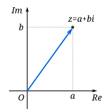

> Complex does not mean complicated. It means the two types of numbers, real and
> imaginary, together form a complex, just like a building complex (buildings
> joined together).

## Polar Form

An alternative way of defining a point `P` in the complex plane, other than using
the x- and y-coordinates, is to use the distance of the point from `O`, the point
whose coordinates are `(0, 0)` (the origin), together with the angle subtended
between the positive real axis and the line segment `OP` in a counterclockwise
direction. This idea leads to the polar form of complex numbers.

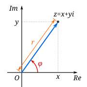

The _absolute value_ (or modulus or magnitude) of a complex number `z = x + yi` is:


The argument of `z` (in many applications referred to as the "phase") is the angle
of the radius `OP` with the positive real axis, and is written as `arg(z)`. As
with the modulus, the argument can be found from the rectangular form `x+yi`:


Together, `r` and `φ` give another way of representing complex numbers, the
polar form, as the combination of modulus and argument fully specify the
position of a point on the plane. Recovering the original rectangular
co-ordinates from the polar form is done by the formula called trigonometric
form:


Using Euler's formula this can be written as:


## Basic Operations

### Adding

To add two complex numbers we add each part separately:

```text
(a + b * i) + (c + d * i) = (a + c) + (b + d) * i
```

**Example**

```text
(3 + 5i) + (4 − 3i) = (3 + 4) + (5 − 3)i = 7 + 2i
```

On complex plane the adding operation will look like the following:

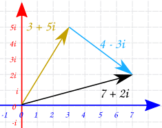

### Subtracting

To subtract two complex numbers we subtract each part separately:

```text
(a + b * i) - (c + d * i) = (a - c) + (b - d) * i
```

**Example**

```text
(3 + 5i) - (4 − 3i) = (3 - 4) + (5 + 3)i = -1 + 8i
```

### Multiplying

To multiply complex numbers each part of the first complex number gets multiplied
by each part of the second complex number:

Just use "FOIL", which stands for "**F**irsts, **O**uters, **I**nners, **L**asts" (
see [Binomial Multiplication](ttps://www.mathsisfun.com/algebra/polynomials-multiplying.html) for
more details):

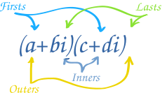

- Firsts: `a × c`
- Outers: `a × di`
- Inners: `bi × c`
- Lasts: `bi × di`

In general, it looks like this:

```text
(a + bi)(c + di) = ac + adi + bci + bdi^2
```

But there is also a quicker way!

Use this rule:

```text
(a + bi)(c + di) = (ac − bd) + (ad + bc)i
```

**Example**

```text
(3 + 2i)(1 + 7i)
= 3×1 + 3×7i + 2i×1+ 2i×7i
= 3 + 21i + 2i + 14i^2
= 3 + 21i + 2i − 14   (because i^2 = −1)
= −11 + 23i
```

```text
(3 + 2i)(1 + 7i) = (3×1 − 2×7) + (3×7 + 2×1)i = −11 + 23i
```

### Conjugates

We will need to know about conjugates in a minute!

A conjugate is where we change the sign in the middle like this:


A conjugate is often written with a bar over it:

```text
______
5 − 3i   =   5 + 3i
```

On the complex plane the conjugate number will be mirrored against real axes.

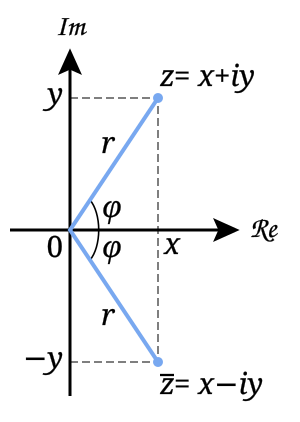

### Dividing

The conjugate is used to help complex division.

The trick is to _multiply both top and bottom by the conjugate of the bottom_.

**Example**

```text
2 + 3i
------
4 − 5i
```

Multiply top and bottom by the conjugate of `4 − 5i`:

```text
  (2 + 3i) * (4 + 5i)   8 + 10i + 12i + 15i^2
= ------------------- = ----------------------
  (4 − 5i) * (4 + 5i)   16 + 20i − 20i − 25i^2
```

Now remember that `i^2 = −1`, so:

```text
  8 + 10i + 12i − 15    −7 + 22i   −7   22
= ------------------- = -------- = -- + -- * i
  16 + 20i − 20i + 25      41      41   41

```

There is a faster way though.

In the previous example, what happened on the bottom was interesting:

```text
(4 − 5i)(4 + 5i) = 16 + 20i − 20i − 25i
```

The middle terms `(20i − 20i)` cancel out! Also, `i^2 = −1` so we end up with this:

```text
(4 − 5i)(4 + 5i) = 4^2 + 5^2
```

Which is really quite a simple result. The general rule is:

```text
(a + bi)(a − bi) = a^2 + b^2
```

# Radian

The **radian** (symbol **rad**) is the unit for measuring angles, and is the
standard unit of angular measure used in many areas of mathematics.

The length of an arc of a unit circle is numerically equal to the measurement
in radians of the angle that it subtends; one radian is just under `57.3` degrees.

An arc of a circle with the same length as the radius of that circle subtends an
angle of `1 radian`. The circumference subtends an angle of `2π radians`.

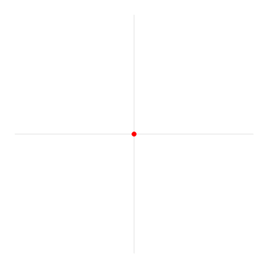

A complete revolution is 2π radians (shown here with a circle of radius one and
thus circumference `2π`).

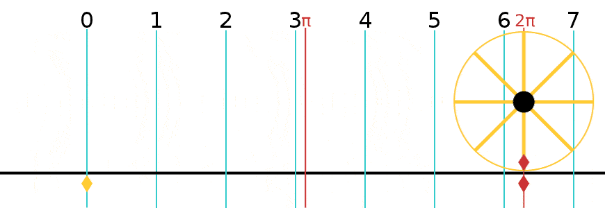

**Conversions**

| Radians | Degrees |
| :-----: | :-----: |
|    0    |   0°    |
|  π/12   |   15°   |
|   π/6   |   30°   |
|   π/4   |   45°   |
|    1    |  57.3°  |
|   π/3   |   60°   |
|   π/2   |   90°   |
|    π    |  180°   |
|   2π    |  360°   |

# Fast Powering Algorithm

**The power of a number** says how many times to use the number in a
multiplication.

It is written as a small number to the right and above the base number.

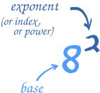

## Naive Algorithm Complexity

How to find `a` raised to the power `b`?

We multiply `a` to itself, `b` times. That
is, `a^b = a * a * a * ... * a` (`b` occurrences of `a`).

This operation will take `O(n)` time since we need to do multiplication operation
exactly `n` times.

## Fast Power Algorithm

Can we do better than naive algorithm does? Yes we may solve the task of
powering in `O(log(n))` time.

The algorithm uses divide and conquer approach to compute power. Currently, the
algorithm work for two positive integers `X` and `Y`.

The idea behind the algorithm is based on the fact that:

For **even** `Y`:

```text
X^Y = X^(Y/2) * X^(Y/2)
```

For **odd** `Y`:

```text
X^Y = X^(Y//2) * X^(Y//2) * X
where Y//2 is result of division of Y by 2 without reminder.
```

**For example**

```text
2^4 = (2 * 2) * (2 * 2) = (2^2) * (2^2)
```

```text
2^5 = (2 * 2) * (2 * 2) * 2 = (2^2) * (2^2) * (2)
```

Now, since on each step we need to compute the same `X^(Y/2)` power twice we may optimise
it by saving it to some intermediate variable to avoid its duplicate calculation.

**Time Complexity**

Since each iteration we split the power by half then we will call function
recursively `log(n)` times. This the time complexity of the algorithm is reduced to:

```text
O(log(n))
```

# Horner's Method

In mathematics, Horner's method (or Horner's scheme) is an algorithm for polynomial evaluation. With this method, it is possible to evaluate a polynomial with only `n` additions and `n` multiplications. Hence, its storage requirements are `n` times the number of bits of `x`.

Horner's method can be based on the following identity:


This identity is called _Horner's rule_.

To solve the right part of the identity above, for a given `x`, we start by iterating through the polynomial from the inside out, accumulating each iteration result. After `n` iterations, with `n` being the order of the polynomial, the accumulated result gives us the polynomial evaluation.

**Using the polynomial:**
`4 * x^4 + 2 * x^3 + 3 * x^2 + x^1 + 3`, a traditional approach to evaluate it at `x = 2`, could be representing it as an array `[3, 1, 3, 2, 4]` and iterate over it saving each iteration value at an accumulator, such as `acc += pow(x=2, index) * array[index]`. In essence, each power of a number (`pow`) operation is `n-1` multiplications. So, in this scenario, a total of `14` operations would have happened, composed of `4` additions, `5` multiplications, and `5` pows (we're assuming that each power is calculated by repeated multiplication).

Now, **using the same scenario but with Horner's rule**, the polynomial can be re-written as `x * (x * (x * (4 * x + 2) + 3) + 1) + 3`, representing it as `[4, 2, 3, 1, 3]` it is possible to save the first iteration as `acc = arr[0] * (x=2) + arr[1]`, and then finish iterations for `acc *= (x=2) + arr[index]`. In the same scenario but using Horner's rule, a total of `10` operations would have happened, composed of only `4` additions and `4` multiplications.

# Matrices

In mathematics, a **matrix** (plural **matrices**) is a rectangular array or table of numbers, symbols, or expressions, arranged in rows and columns. For example, the dimension of the matrix below is `2 × 3` (read "two by three"), because there are two rows and three columns:

```
| 1  9 -13 |
| 20 5 -6  |
```


An `m × n` matrix: the `m` rows are horizontal, and the `n` columns are vertical. Each element of a matrix is often denoted by a variable with two subscripts. For example, <i>a<sub>2,1</sub></i> represents the element at the second row and first column of the matrix

## Operations on matrices

### Addition

To add two matrices: add the numbers in the matching positions:

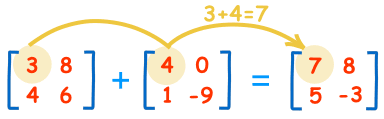

The two matrices must be the same size, i.e. the rows must match in size, and the columns must match in size.

### Subtracting

To subtract two matrices: subtract the numbers in the matching positions:

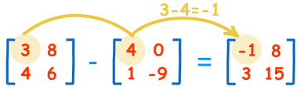

### Multiply by a Constant

We can multiply a matrix by a constant (the value 2 in this case):

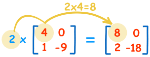

### Multiplying by Another Matrix

To multiply a matrix by another matrix we need to do the [dot product](https://www.mathsisfun.com/algebra/vectors-dot-product.html) of rows and columns.

To work out the answer for the **1st row** and **1st column**:

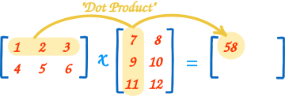

Here it is for the 1st row and 2nd column:

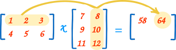

If we'll do the same for the rest of the rows and columns we'll get the following resulting matrix:

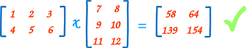

### Transposing

To "transpose" a matrix, swap the rows and columns.

We put a "T" in the top right-hand corner to mean transpose:

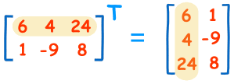

# Euclidean algorithm

In mathematics, the Euclidean algorithm, or Euclid's algorithm,
is an efficient method for computing the greatest common divisor
(GCD) of two numbers, the largest number that divides both of
them without leaving a remainder.

The Euclidean algorithm is based on the principle that the
greatest common divisor of two numbers does not change if
the larger number is replaced by its difference with the
smaller number. For example, `21` is the GCD of `252` and
`105` (as `252 = 21 × 12` and `105 = 21 × 5`), and the same
number `21` is also the GCD of `105` and `252 − 105 = 147`.
Since this replacement reduces the larger of the two numbers,
repeating this process gives successively smaller pairs of
numbers until the two numbers become equal.
When that occurs, they are the GCD of the original two numbers.

By reversing the steps, the GCD can be expressed as a sum of
the two original numbers each multiplied by a positive or
negative integer, e.g., `21 = 5 × 105 + (−2) × 252`.
The fact that the GCD can always be expressed in this way is
known as Bézout's identity.


Euclid's method for finding the greatest common divisor (GCD)
of two starting lengths `BA` and `DC`, both defined to be
multiples of a common "unit" length. The length `DC` being
shorter, it is used to "measure" `BA`, but only once because
remainder `EA` is less than `DC`. EA now measures (twice)
the shorter length `DC`, with remainder `FC` shorter than `EA`.
Then `FC` measures (three times) length `EA`. Because there is
no remainder, the process ends with `FC` being the `GCD`.
On the right Nicomachus' example with numbers `49` and `21`
resulting in their GCD of `7` (derived from Heath 1908:300).


A `24-by-60` rectangle is covered with ten `12-by-12` square
tiles, where `12` is the GCD of `24` and `60`. More generally,
an `a-by-b` rectangle can be covered with square tiles of
side-length `c` only if `c` is a common divisor of `a` and `b`.


Subtraction-based animation of the Euclidean algorithm.
The initial rectangle has dimensions `a = 1071` and `b = 462`.
Squares of size `462×462` are placed within it leaving a
`462×147` rectangle. This rectangle is tiled with `147×147`
squares until a `21×147` rectangle is left, which in turn is
tiled with `21×21` squares, leaving no uncovered area.
The smallest square size, `21`, is the GCD of `1071` and `462`.

# Integer Partition

In number theory and combinatorics, a partition of a positive
integer `n`, also called an **integer partition**, is a way of
writing `n` as a sum of positive integers.

Two sums that differ only in the order of their summands are
considered the same partition. For example, `4` can be partitioned
in five distinct ways:

```
4
3 + 1
2 + 2
2 + 1 + 1
1 + 1 + 1 + 1
```

The order-dependent composition `1 + 3` is the same partition
as `3 + 1`, while the two distinct
compositions `1 + 2 + 1` and `1 + 1 + 2` represent the same
partition `2 + 1 + 1`.

Young diagrams associated to the partitions of the positive
integers `1` through `8`. They are arranged so that images
under the reflection about the main diagonal of the square
are conjugate partitions.

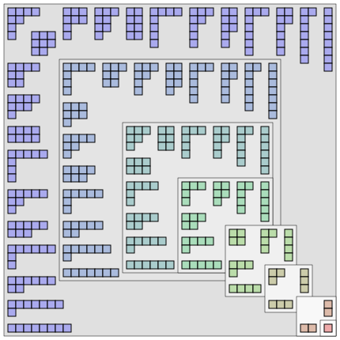

# Square Root (Newton's Method)

In numerical analysis, a branch of mathematics, there are several square root
algorithms or methods of computing the principal square root of a non-negative real
number. As, generally, the roots of a function cannot be computed exactly.
The root-finding algorithms provide approximations to roots expressed as floating
point numbers.

Finding  is
the same as solving the equation  for a
positive `x`. Therefore, any general numerical root-finding algorithm can be used.

**Newton's method** (also known as the Newton–Raphson method), named after
_Isaac Newton_ and _Joseph Raphson_, is one example of a root-finding algorithm. It is a
method for finding successively better approximations to the roots of a real-valued function.

Let's start by explaining the general idea of Newton's method and then apply it to our particular
case with finding a square root of the number.

## Newton's Method General Idea

The Newton–Raphson method in one variable is implemented as follows:

The method starts with a function `f` defined over the real numbers `x`, the function's derivative `f'`, and an
initial guess `x0` for a root of the function `f`. If the function satisfies the assumptions made in the derivation
of the formula and the initial guess is close, then a better approximation `x1` is:


Geometrically, `(x1, 0)` is the intersection of the `x`-axis and the tangent of
the graph of `f` at `(x0, f (x0))`.

The process is repeated as:


until a sufficiently accurate value is reached.

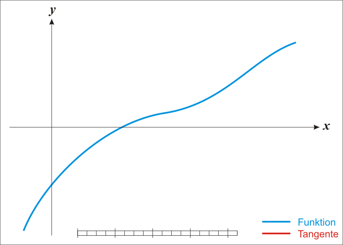

## Newton's Method of Finding a Square Root

As it was mentioned above, finding  is
the same as solving the equation  for a
positive `x`.

The derivative of the function `f(x)` in case of square root problem is `2x`.

After applying the Newton's formula (see above) we get the following equation for our algorithm iterations:

```text
x := x - (x² - S) / (2x)
```

The `x² − S` above is how far away `x²` is from where it needs to be, and the
division by `2x` is the derivative of `x²`, to scale how much we adjust `x` by how
quickly `x²` is changing.

# Liu Hui's π Algorithm

Liu Hui remarked in his commentary to The Nine Chapters on the Mathematical Art,
that the ratio of the circumference of an inscribed hexagon to the diameter of
the circle was `three`, hence `π` must be greater than three. He went on to provide
a detailed step-by-step description of an iterative algorithm to calculate `π` to
any required accuracy based on bisecting polygons; he calculated `π` to
between `3.141024` and `3.142708` with a 96-gon; he suggested that `3.14` was
a good enough approximation, and expressed `π` as `157/50`; he admitted that
this number was a bit small. Later he invented an ingenious quick method to
improve on it, and obtained `π ≈ 3.1416` with only a 96-gon, with an accuracy
comparable to that from a 1536-gon. His most important contribution in this
area was his simple iterative `π` algorithm.

## Area of a circle

Liu Hui argued:

> Multiply one side of a hexagon by the radius (of its
> circumcircle), then multiply this by three, to yield the
> area of a dodecagon; if we cut a hexagon into a
> dodecagon, multiply its side by its radius, then again
> multiply by six, we get the area of a 24-gon; the finer
> we cut, the smaller the loss with respect to the area
> of circle, thus with further cut after cut, the area of
> the resulting polygon will coincide and become one with
> the circle; there will be no loss

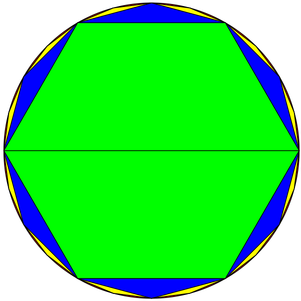

Liu Hui's method of calculating the area of a circle.

Further, Liu Hui proved that the area of a circle is half of its circumference
multiplied by its radius. He said:

> Between a polygon and a circle, there is excess radius. Multiply the excess
> radius by a side of the polygon. The resulting area exceeds the boundary of
> the circle

In the diagram `d = excess radius`. Multiplying `d` by one side results in
oblong `ABCD` which exceeds the boundary of the circle. If a side of the polygon
is small (i.e., there is a very large number of sides), then the excess radius
will be small, hence excess area will be small.

> Multiply the side of a polygon by its radius, and the area doubles;
> hence multiply half the circumference by the radius to yield the area of circle.

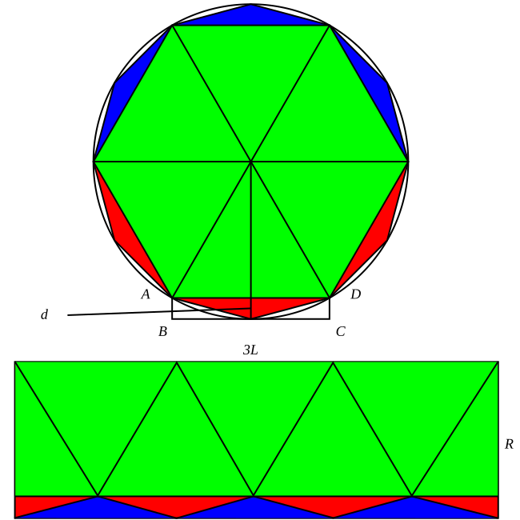

The area within a circle is equal to the radius multiplied by half the
circumference, or `A = r x C/2 = r x r x π`.

## Iterative algorithm

Liu Hui began with an inscribed hexagon. Let `M` be the length of one side `AB` of
hexagon, `r` is the radius of circle.

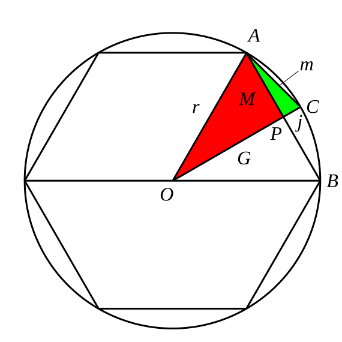

Bisect `AB` with line `OPC`, `AC` becomes one side of dodecagon (12-gon), let
its length be `m`. Let the length of `PC` be `j` and the length of `OP` be `G`.

`AOP`, `APC` are two right angle triangles. Liu Hui used
the [Gou Gu](https://en.wikipedia.org/wiki/Pythagorean_theorem) (Pythagorean theorem)
theorem repetitively:


From here, there is now a technique to determine `m` from `M`, which gives the
side length for a polygon with twice the number of edges. Starting with a
hexagon, Liu Hui could determine the side length of a dodecagon using this
formula. Then continue repetitively to determine the side length of a
24-gon given the side length of a dodecagon. He could do this recursively as
many times as necessary. Knowing how to determine the area of these polygons,
Liu Hui could then approximate `π`.

# Fourier Transform

## Definitions

The **Fourier Transform** (**FT**) decomposes a function of time (a signal) into
the frequencies that make it up, in a way similar to how a musical chord can be
expressed as the frequencies (or pitches) of its constituent notes.

The **Discrete Fourier Transform** (**DFT**) converts a finite sequence of
equally-spaced samples of a function into a same-length sequence of
equally-spaced samples of the discrete-time Fourier transform (DTFT), which is a
complex-valued function of frequency. The interval at which the DTFT is sampled
is the reciprocal of the duration of the input sequence. An inverse DFT is a
Fourier series, using the DTFT samples as coefficients of complex sinusoids at
the corresponding DTFT frequencies. It has the same sample-values as the original
input sequence. The DFT is therefore said to be a frequency domain representation
of the original input sequence. If the original sequence spans all the non-zero
values of a function, its DTFT is continuous (and periodic), and the DFT provides
discrete samples of one cycle. If the original sequence is one cycle of a periodic
function, the DFT provides all the non-zero values of one DTFT cycle.

The Discrete Fourier transform transforms a sequence of `N` complex numbers:

{x<sub>n</sub>} = x<sub>0</sub>, x<sub>1</sub>, x<sub>2</sub> ..., x<sub>N-1</sub>

into another sequence of complex numbers:

{X<sub>k</sub>} = X<sub>0</sub>, X<sub>1</sub>, X<sub>2</sub> ..., X<sub>N-1</sub>

which is defined by:


The **Discrete-Time Fourier Transform** (**DTFT**) is a form of Fourier analysis
that is applicable to the uniformly-spaced samples of a continuous function. The
term discrete-time refers to the fact that the transform operates on discrete data
(samples) whose interval often has units of time. From only the samples, it
produces a function of frequency that is a periodic summation of the continuous
Fourier transform of the original continuous function.

A **Fast Fourier Transform** (**FFT**) is an algorithm that samples a signal over
a period of time (or space) and divides it into its frequency components. These
components are single sinusoidal oscillations at distinct frequencies each with
their own amplitude and phase.

This transformation is illustrated in Diagram below. Over the time period measured
in the diagram, the signal contains 3 distinct dominant frequencies.

View of a signal in the time and frequency domain:

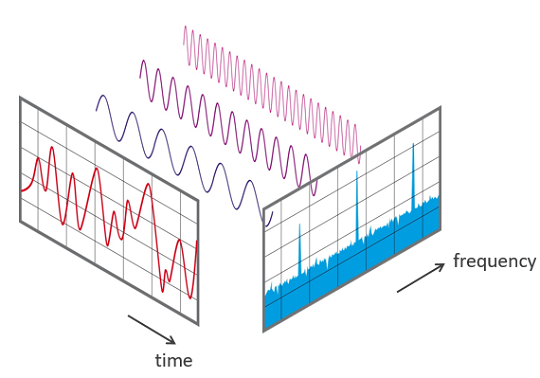

An FFT algorithm computes the discrete Fourier transform (DFT) of a sequence, or
its inverse (IFFT). Fourier analysis converts a signal from its original domain
to a representation in the frequency domain and vice versa. An FFT rapidly
computes such transformations by factorizing the DFT matrix into a product of
sparse (mostly zero) factors. As a result, it manages to reduce the complexity of
computing the DFT from O(n<sup>2</sup>), which arises if one simply applies the
definition of DFT, to O(n log n), where n is the data size.

Here a discrete Fourier analysis of a sum of cosine waves at 10, 20, 30, 40,
and 50 Hz:

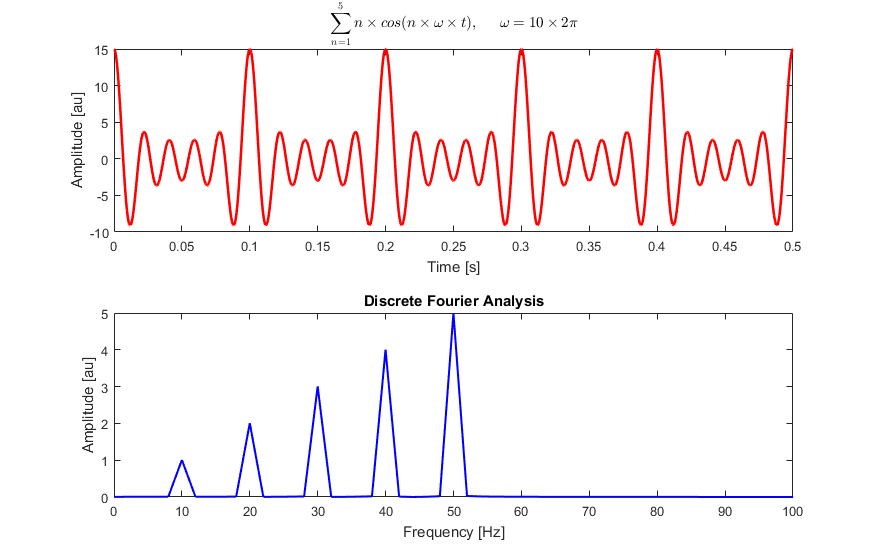

## Explanation

The Fourier Transform is one of deepest insights ever made. Unfortunately, the
meaning is buried within dense equations:

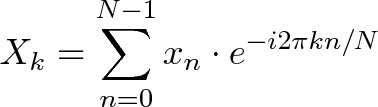

and

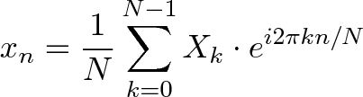

Rather than jumping into the symbols, let's experience the key idea firsthand. Here's a plain-English metaphor:

- _What does the Fourier Transform do?_ Given a smoothie, it finds the recipe.
- _How?_ Run the smoothie through filters to extract each ingredient.
- _Why?_ Recipes are easier to analyze, compare, and modify than the smoothie itself.
- _How do we get the smoothie back?_ Blend the ingredients.

**Think With Circles, Not Just Sinusoids**

The Fourier Transform is about circular paths (not 1-d sinusoids) and Euler's
formula is a clever way to generate one:

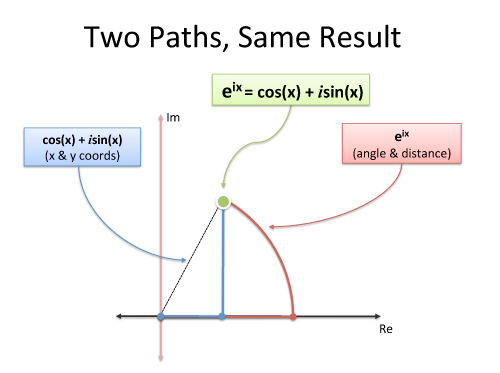

Must we use imaginary exponents to move in a circle? Nope. But it's convenient
and compact. And sure, we can describe our path as coordinated motion in two
dimensions (real and imaginary), but don't forget the big picture: we're just
moving in a circle.

**Discovering The Full Transform**

The big insight: our signal is just a bunch of time spikes! If we merge the
recipes for each time spike, we should get the recipe for the full signal.

The Fourier Transform builds the recipe frequency-by-frequency:

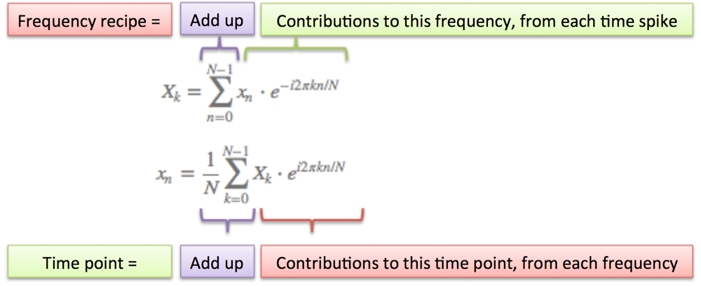

A few notes:

- N = number of time samples we have
- n = current sample we're considering (0 ... N-1)
- x<sub>n</sub> = value of the signal at time n
- k = current frequency we're considering (0 Hertz up to N-1 Hertz)
- X<sub>k</sub> = amount of frequency k in the signal (amplitude and phase, a complex number)
- The 1/N factor is usually moved to the reverse transform (going from frequencies back to time). This is allowed, though I prefer 1/N in the forward transform since it gives the actual sizes for the time spikes. You can get wild and even use 1/sqrt(N) on both transforms (going forward and back creates the 1/N factor).
- n/N is the percent of the time we've gone through. 2 _ pi _ k is our speed in radians / sec. e^-ix is our backwards-moving circular path. The combination is how far we've moved, for this speed and time.
- The raw equations for the Fourier Transform just say "add the complex numbers". Many programming languages cannot handle complex numbers directly, so you convert everything to rectangular coordinates and add those.

Stuart Riffle has a great interpretation of the Fourier Transform:

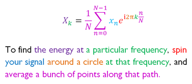
