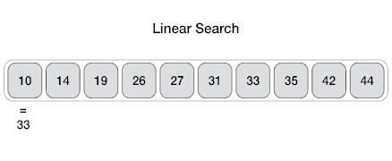
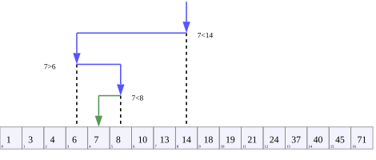

# Linear Search

In computer science, linear search or sequential search is a
method for finding a target value within a list. It sequentially
checks each element of the list for the target value until a
match is found or until all the elements have been searched.
Linear search runs in at worst linear time and makes at most `n`
comparisons, where `n` is the length of the list.



## Complexity

**Time Complexity**: `O(n)` — since in worst case we're checking each element
exactly once.

# Jump Search

Like Binary Search, **Jump Search** (or **Block Search**) is a searching algorithm
for sorted arrays. The basic idea is to check fewer elements (than linear search)
by jumping ahead by fixed steps or skipping some elements in place of searching all
elements.

For example, suppose we have an array `arr[]` of size `n` and block (to be jumped)
of size `m`. Then we search at the indexes `arr[0]`, `arr[m]`, `arr[2 * m]`, ..., `arr[k * m]` and
so on. Once we find the interval `arr[k * m] < x < arr[(k+1) * m]`, we perform a
linear search operation from the index `k * m` to find the element `x`.

**What is the optimal block size to be skipped?**
In the worst case, we have to do `n/m` jumps and if the last checked value is
greater than the element to be searched for, we perform `m - 1` comparisons more
for linear search. Therefore, the total number of comparisons in the worst case
will be `((n/m) + m - 1)`. The value of the function `((n/m) + m - 1)` will be
minimum when `m = √n`. Therefore, the best step size is `m = √n`.

## Complexity

**Time complexity**: `O(√n)` — because we do search by blocks of size `√n`.

# Binary Search

In computer science, binary search, also known as half-interval
search, logarithmic search, or binary chop, is a search algorithm
that finds the position of a target value within a sorted
array. Binary search compares the target value to the middle
element of the array; if they are unequal, the half in which
the target cannot lie is eliminated and the search continues
on the remaining half until it is successful. If the search
ends with the remaining half being empty, the target is not
in the array.



## Complexity

**Time Complexity**: `O(log(n))` — since we split search area by two for every
next iteration.

# Interpolation Search

**Interpolation search** is an algorithm for searching for a key in an array that
has been ordered by numerical values assigned to the keys (key values).

For example, we have a sorted array of `n` uniformly distributed values `arr[]`,
and we need to write a function to search for a particular element `x` in the array.

**Linear Search** finds the element in `O(n)` time, **Jump Search** takes `O(√ n)` time
and **Binary Search** take `O(Log n)` time.

The **Interpolation Search** is an improvement over Binary Search for instances,
where the values in a sorted array are _uniformly_ distributed. Binary Search
always goes to the middle element to check. On the other hand, interpolation
search may go to different locations according to the value of the key being
searched. For example, if the value of the key is closer to the last element,
interpolation search is likely to start search toward the end side.

To find the position to be searched, it uses following formula:

```
// The idea of formula is to return higher value of pos
// when element to be searched is closer to arr[hi]. And
// smaller value when closer to arr[lo]
pos = lo + ((x - arr[lo]) * (hi - lo) / (arr[hi] - arr[Lo]))

arr[] - Array where elements need to be searched
x - Element to be searched
lo - Starting index in arr[]
hi - Ending index in arr[]
```

## Complexity

**Time complexity**: `O(log(log(n))`
