# Cartesian Product

In set theory a Cartesian product is a mathematical operation that returns a set
(or product set or simply product) from multiple sets. That is, for sets A and B,
the Cartesian product A × B is the set of all ordered pairs (a, b)
where a ∈ A and b ∈ B.

Cartesian product `AxB` of two sets `A={x,y,z}` and `B={1,2,3}`

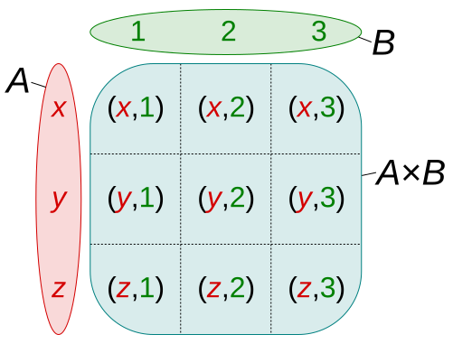

# Fisher–Yates shuffle

The Fisher–Yates shuffle is an algorithm for generating a random
permutation of a finite sequence—in plain terms, the algorithm
shuffles the sequence. The algorithm effectively puts all the
elements into a hat; it continually determines the next element
by randomly drawing an element from the hat until no elements
remain. The algorithm produces an unbiased permutation: every
permutation is equally likely. The modern version of the
algorithm is efficient: it takes time proportional to the
number of items being shuffled and shuffles them in place.

# Power Set

Power set of a set `S` is the set of all the subsets of `S`, including the
empty set and `S` itself. Power set of set `S` is denoted as `P(S)`.

For example for `{x, y, z}`, the subsets
are:

```text
{
  {}, // (also denoted empty set ∅ or the null set)
  {x},
  {y},
  {z},
  {x, y},
  {x, z},
  {y, z},
  {x, y, z}
}
```

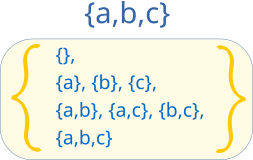

Here is how we may illustrate the elements of the power set of the set `{x, y, z}` ordered with respect to
inclusion:

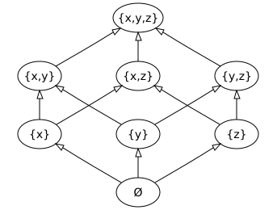

**Number of Subsets**

If `S` is a finite set with `|S| = n` elements, then the number of subsets
of `S` is `|P(S)| = 2^n`. This fact, which is the motivation for the
notation `2^S`, may be demonstrated simply as follows:

> First, order the elements of `S` in any manner. We write any subset of `S` in
> the format `{γ1, γ2, ..., γn}` where `γi , 1 ≤ i ≤ n`, can take the value
> of `0` or `1`. If `γi = 1`, the `i`-th element of `S` is in the subset;
> otherwise, the `i`-th element is not in the subset. Clearly the number of
> distinct subsets that can be constructed this way is `2^n` as `γi ∈ {0, 1}`.

## Algorithms

### Bitwise Solution

Each number in binary representation in a range from `0` to `2^n` does exactly
what we need: it shows by its bits (`0` or `1`) whether to include related
element from the set or not. For example, for the set `{1, 2, 3}` the binary
number of `0b010` would mean that we need to include only `2` to the current set.

|     | `abc` |   Subset    |
| :-: | :---: | :---------: |
| `0` | `000` |    `{}`     |
| `1` | `001` |    `{c}`    |
| `2` | `010` |    `{b}`    |
| `3` | `011` |  `{c, b}`   |
| `4` | `100` |    `{a}`    |
| `5` | `101` |  `{a, c}`   |
| `6` | `110` |  `{a, b}`   |
| `7` | `111` | `{a, b, c}` |

> See [bwPowerSet.js](./bwPowerSet.js) file for bitwise solution.

### Backtracking Solution

In backtracking approach we're constantly trying to add next element of the set
to the subset, memorizing it and then removing it and try the same with the next
element.

> See [btPowerSet.js](./btPowerSet.js) file for backtracking solution.

### Cascading Solution

This is, arguably, the simplest solution to generate a Power Set.

We start with an empty set:

```text
powerSets = [[]]
```

Now, let's say:

```text
originalSet = [1, 2, 3]
```

Let's add the 1st element from the originalSet to all existing sets:

```text
[[]] ← 1 = [[], [1]]
```

Adding the 2nd element to all existing sets:

```text
[[], [1]] ← 2 = [[], [1], [2], [1, 2]]
```

Adding the 3rd element to all existing sets:

```
[[], [1], [2], [1, 2]] ← 3 = [[], [1], [2], [1, 2], [3], [1, 3], [2, 3], [1, 2, 3]]
```

And so on, for the rest of the elements from the `originalSet`. On every iteration the number of sets is doubled, so we'll get `2^n` sets.

> See [caPowerSet.js](./caPowerSet.js) file for cascading solution.

# Permutations

When the order doesn't matter, it is a **Combination**.

When the order **does** matter it is a **Permutation**.

**"The combination to the safe is 472"**. We do care about the order. `724` won't work, nor will `247`.
It has to be exactly `4-7-2`.

## Permutations without repetitions

A permutation, also called an “arrangement number” or “order”, is a rearrangement of
the elements of an ordered list `S` into a one-to-one correspondence with `S` itself.

Below are the permutations of string `ABC`.

`ABC ACB BAC BCA CBA CAB`

Or for example the first three people in a running race: you can't be first and second.

**Number of combinations**

```
n * (n-1) * (n -2) * ... * 1 = n!
```

## Permutations with repetitions

When repetition is allowed we have permutations with repetitions.
For example the the lock below: it could be `333`.

<!--  -->

**Number of combinations**

```
n * n * n ... (r times) = n^r
```

## Cheatsheet


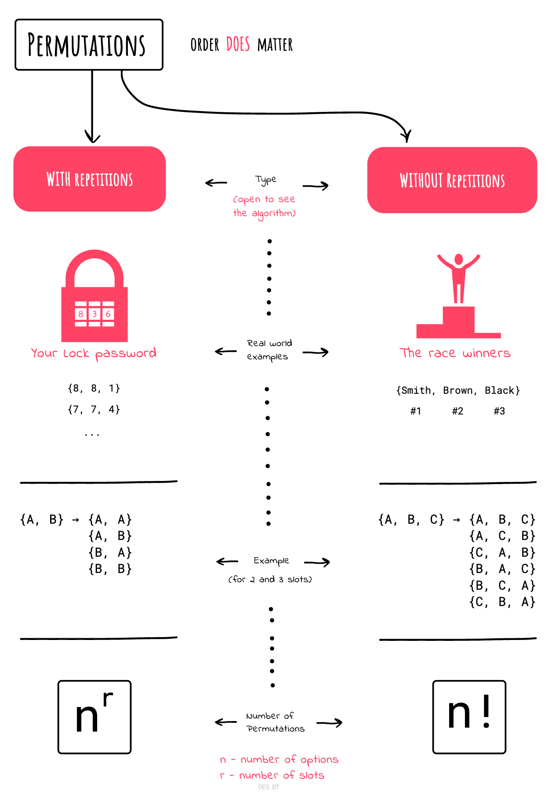

|                                                                             |                                                                                   |
| --------------------------------------------------------------------------- | --------------------------------------------------------------------------------- |
| 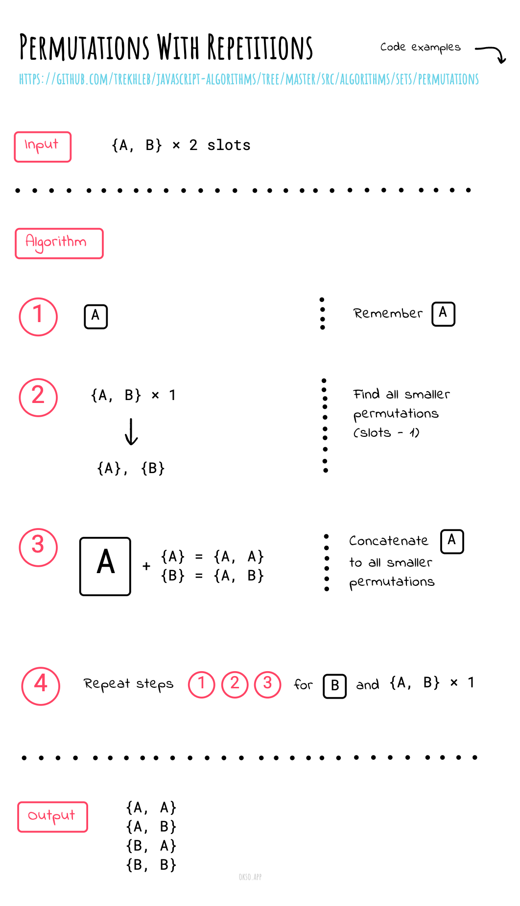 | 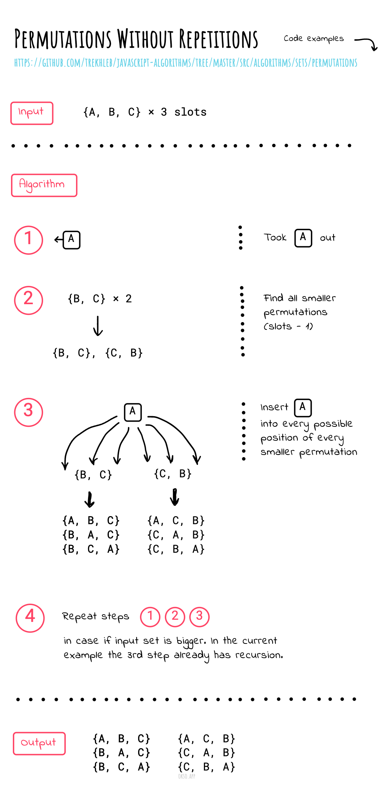 |

# Combinations

When the order doesn't matter, it is a **Combination**.

When the order **does** matter it is a **Permutation**.

**"My fruit salad is a combination of apples, grapes, and bananas"**
We don't care what order the fruits are in, they could also be
"bananas, grapes and apples" or "grapes, apples and bananas",
it's the same fruit salad.

## Combinations without repetitions

This is how lotteries work. The numbers are drawn one at a
time, and if we have the lucky numbers (no matter what order)
we win!

No Repetition: such as lottery numbers `(2,14,15,27,30,33)`

**Number of combinations**

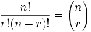

Where `n` is the number of things to choose from, and we choose `r` of them,
no repetition, order doesn't matter.

It is often called "n choose r" (such as "16 choose 3"). And is also known as the Binomial Coefficient.

## Combinations with repetitions

Repetition is Allowed: such as coins in your pocket `(5,5,5,10,10)`

Or let us say there are five flavors of ice cream:
`banana`, `chocolate`, `lemon`, `strawberry` and `vanilla`.

We can have three scoops. How many variations will there be?

Let's use letters for the flavors: `{b, c, l, s, v}`.
Example selections include:

- `{c, c, c}` (3 scoops of chocolate)
- `{b, l, v}` (one each of banana, lemon, and vanilla)
- `{b, v, v}` (one of banana, two of vanilla)

**Number of combinations**

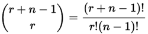

Where `n` is the number of things to choose from, and we
choose `r` of them. Repetition allowed,
order doesn't matter.

## Cheatsheet


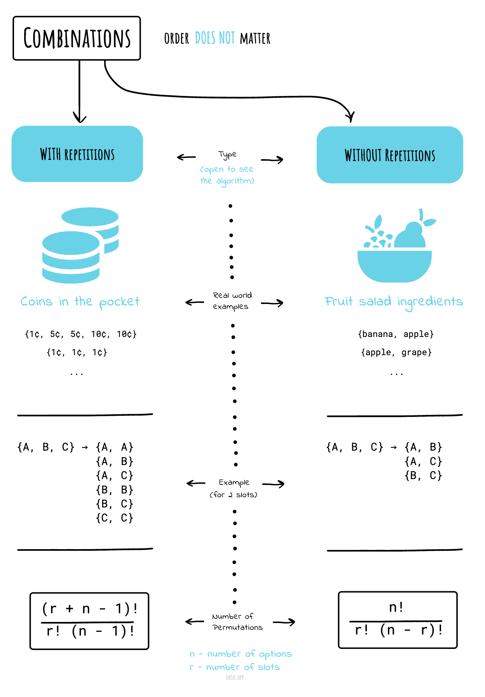

|                                                                             |                                                                                   |
| --------------------------------------------------------------------------- | --------------------------------------------------------------------------------- |
| 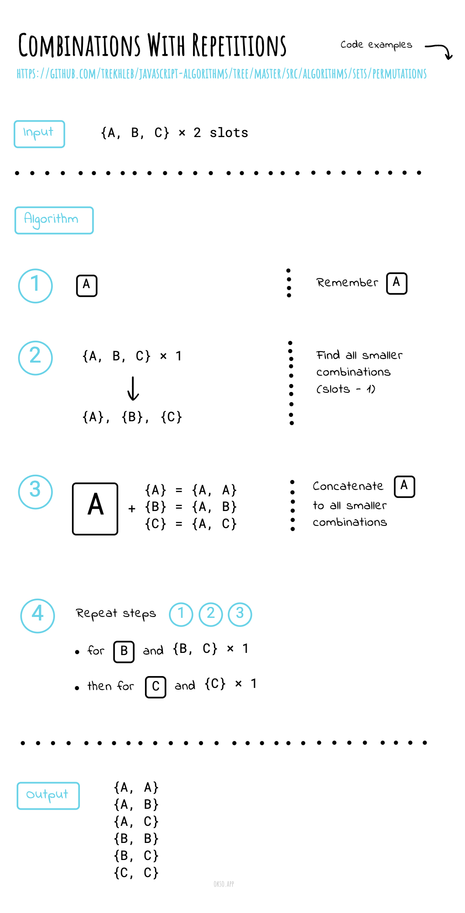 | 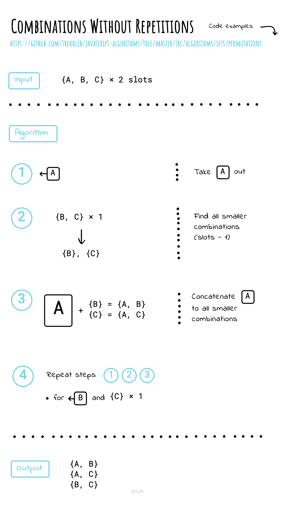 |

# Longest common subsequence problem

The longest common subsequence (LCS) problem is the problem of finding
the longest subsequence common to all sequences in a set of sequences
(often just two sequences). It differs from the longest common substring
problem: unlike substrings, subsequences are not required to occupy
consecutive positions within the original sequences.

## Application

The longest common subsequence problem is a classic computer science
problem, the basis of data comparison programs such as the diff utility,
and has applications in bioinformatics. It is also widely used by
revision control systems such as Git for reconciling multiple changes
made to a revision-controlled collection of files.

## Example

- LCS for input Sequences `ABCDGH` and `AEDFHR` is `ADH` of length 3.
- LCS for input Sequences `AGGTAB` and `GXTXAYB` is `GTAB` of length 4.

# Longest Increasing Subsequence

The longest increasing subsequence problem is to find a subsequence of a
given sequence in which the subsequence's elements are in sorted order,
lowest to highest, and in which the subsequence is as long as possible.
This subsequence is not necessarily contiguous, or unique.

## Complexity

The longest increasing subsequence problem is solvable in
time `O(n log n)`, where `n` denotes the length of the input sequence.

Dynamic programming approach has complexity `O(n * n)`.

## Example

In the first 16 terms of the binary Van der Corput sequence

```
0, 8, 4, 12, 2, 10, 6, 14, 1, 9, 5, 13, 3, 11, 7, 15
```

a longest increasing subsequence is

```
0, 2, 6, 9, 11, 15.
```

This subsequence has length six;
the input sequence has no seven-member increasing subsequences.
The longest increasing subsequence in this example is not unique: for
instance,

```
0, 4, 6, 9, 11, 15 or
0, 2, 6, 9, 13, 15 or
0, 4, 6, 9, 13, 15
```

are other increasing subsequences of equal length in the same
input sequence.

# Shortest Common Supersequence

The shortest common supersequence (SCS) of two sequences `X` and `Y`
is the shortest sequence which has `X` and `Y` as subsequences.

In other words assume we're given two strings str1 and str2, find
the shortest string that has both str1 and str2 as subsequences.

This is a problem closely related to the longest common
subsequence problem.

## Example

```
Input:   str1 = "geek",  str2 = "eke"
Output: "geeke"

Input:   str1 = "AGGTAB",  str2 = "GXTXAYB"
Output:  "AGXGTXAYB"
```

# Knapsack Problem

The knapsack problem or rucksack problem is a problem in
combinatorial optimization: Given a set of items, each with
a weight and a value, determine the number of each item to
include in a collection so that the total weight is less
than or equal to a given limit and the total value is as
large as possible.

It derives its name from the problem faced by someone who is
constrained by a fixed-size knapsack and must fill it with the
most valuable items.

Example of a one-dimensional (constraint) knapsack problem:
which boxes should be chosen to maximize the amount of money
while still keeping the overall weight under or equal to 15 kg?


## Definition

### 0/1 knapsack problem

The most common problem being solved is the **0/1 knapsack problem**,
which restricts the number `xi` of copies of each kind of item to zero or one.

Given a set of n items numbered from `1` up to `n`, each with a
weight `wi` and a value `vi`, along with a maximum weight
capacity `W`,

maximize 

subject to 
and 

Here `xi` represents the number of instances of item `i` to
include in the knapsack. Informally, the problem is to maximize
the sum of the values of the items in the knapsack so that the
sum of the weights is less than or equal to the knapsack's
capacity.

### Bounded knapsack problem (BKP)

The **bounded knapsack problem (BKP)** removes the restriction
that there is only one of each item, but restricts the number
`xi` of copies of each kind of item to a maximum non-negative
integer value `c`:

maximize 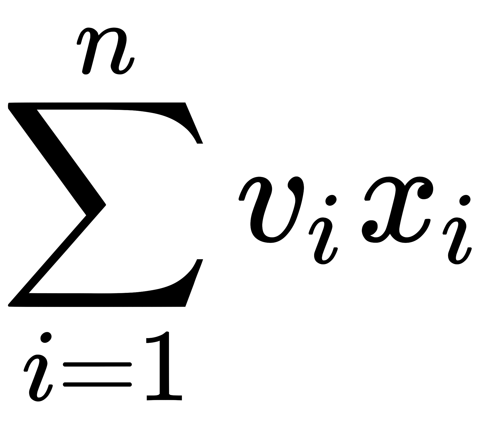

subject to 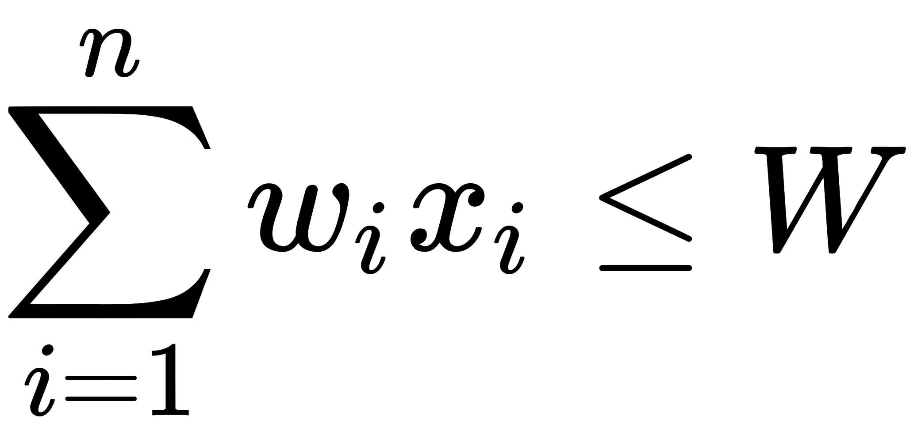
and 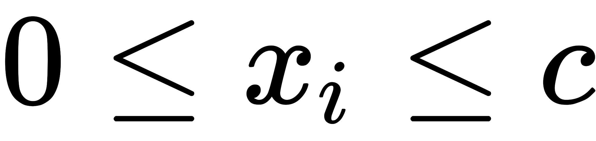

### Unbounded knapsack problem (UKP)

The **unbounded knapsack problem (UKP)** places no upper bound
on the number of copies of each kind of item and can be
formulated as above except for that the only restriction
on `xi` is that it is a non-negative integer.

maximize 

subject to 
and 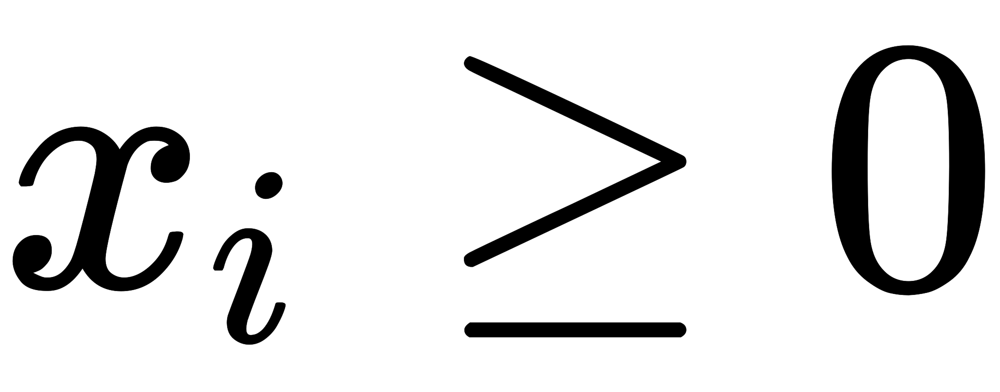

# Maximum subarray problem

The maximum subarray problem is the task of finding the contiguous
subarray within a one-dimensional array, `a[1...n]`, of numbers
which has the largest sum, where,

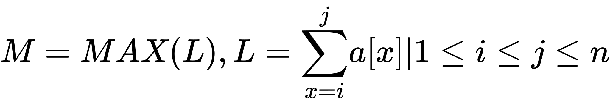

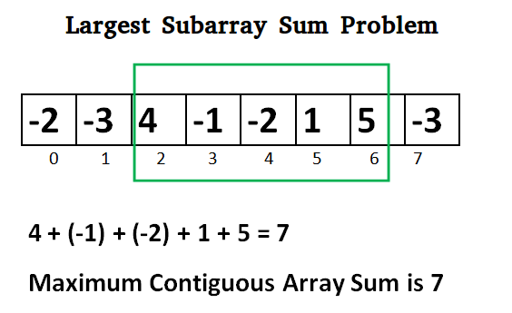

## Example

The list usually contains both positive and negative numbers along
with `0`. For example, for the array of
values `−2, 1, −3, 4, −1, 2, 1, −5, 4` the contiguous subarray
with the largest sum is `4, −1, 2, 1`, with sum `6`.

## Solutions

- Brute Force solution `O(n^2)`: [bfMaximumSubarray.js](./bfMaximumSubarray.js)
- Divide and Conquer solution `O(n^2)`: [dcMaximumSubarraySum.js](./dcMaximumSubarraySum.js)
- Dynamic Programming solution `O(n)`: [dpMaximumSubarray.js](./dpMaximumSubarray.js)

# Combination Sum Problem

Given a **set** of candidate numbers (`candidates`) **(without duplicates)** and
a target number (`target`), find all unique combinations in `candidates` where
the candidate numbers sums to `target`.

The **same** repeated number may be chosen from `candidates` unlimited number
of times.

**Note:**

- All numbers (including `target`) will be positive integers.
- The solution set must not contain duplicate combinations.

## Examples

```
Input: candidates = [2,3,6,7], target = 7,

A solution set is:
[
  [7],
  [2,2,3]
]
```

```
Input: candidates = [2,3,5], target = 8,

A solution set is:
[
  [2,2,2,2],
  [2,3,3],
  [3,5]
]
```

## Explanations

Since the problem is to get all the possible results, not the best or the
number of result, thus we don’t need to consider DP (dynamic programming),
backtracking approach using recursion is needed to handle it.

Here is an example of decision tree for the situation when `candidates = [2, 3]` and `target = 6`:

```
                0
              /   \
           +2      +3
          /   \      \
       +2       +3    +3
      /  \     /  \     \
    +2    ✘   ✘   ✘     ✓
   /  \
  ✓    ✘
```
