# Bubble Sort

Bubble sort, sometimes referred to as sinking sort, is a
simple sorting algorithm that repeatedly steps through
the list to be sorted, compares each pair of adjacent
items and swaps them if they are in the wrong order
(ascending or descending arrangement). The pass through
the list is repeated until no swaps are needed, which
indicates that the list is sorted.

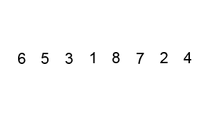

## Complexity

| Name            | Best |    Average    |     Worst     | Memory | Stable | Comments |
| --------------- | :--: | :-----------: | :-----------: | :----: | :----: | :------- |
| **Bubble sort** |  n   | n2 | n2 |   1    |  Yes   |          |

# Selection Sort

Selection sort is a sorting algorithm, specifically an
in-place comparison sort. It has O(n2) time complexity,
making it inefficient on large lists, and generally
performs worse than the similar insertion sort.
Selection sort is noted for its simplicity, and it has
performance advantages over more complicated algorithms
in certain situations, particularly where auxiliary
memory is limited.

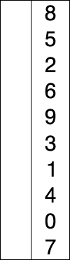

## Complexity

| Name               |     Best      |    Average    |     Worst     | Memory | Stable | Comments |
| ------------------ | :-----------: | :-----------: | :-----------: | :----: | :----: | :------- |
| **Selection sort** | n2 | n2 | n2 |   1    |   No   |          |

# Insertion Sort

Insertion sort is a simple sorting algorithm that builds
the final sorted array (or list) one item at a time.
It is much less efficient on large lists than more
advanced algorithms such as quicksort, heapsort, or merge
sort.

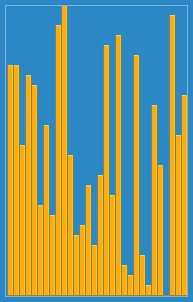

## Complexity

| Name               | Best |    Average    |     Worst     | Memory | Stable | Comments |
| ------------------ | :--: | :-----------: | :-----------: | :----: | :----: | :------- |
| **Insertion sort** |  n   | n2 | n2 |   1    |  Yes   |          |

# Heap Sort

Heapsort is a comparison-based sorting algorithm.
Heapsort can be thought of as an improved selection
sort: like that algorithm, it divides its input into
a sorted and an unsorted region, and it iteratively
shrinks the unsorted region by extracting the largest
element and moving that to the sorted region. The
improvement consists of the use of a heap data structure
rather than a linear-time search to find the maximum.

## Complexity

| Name          |     Best      |    Average    |     Worst     | Memory | Stable | Comments |
| ------------- | :-----------: | :-----------: | :-----------: | :----: | :----: | :------- |
| **Heap sort** | n&nbsp;log(n) | n&nbsp;log(n) | n&nbsp;log(n) |   1    |   No   |          |

# Merge Sort

In computer science, merge sort (also commonly spelled
mergesort) is an efficient, general-purpose,
comparison-based sorting algorithm. Most implementations
produce a stable sort, which means that the implementation
preserves the input order of equal elements in the sorted
output. Mergesort is a divide and conquer algorithm that
was invented by John von Neumann in 1945.

An example of merge sort. First divide the list into
the smallest unit (1 element), then compare each
element with the adjacent list to sort and merge the
two adjacent lists. Finally, all the elements are sorted
and merged.

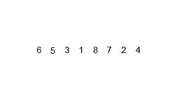

A recursive merge sort algorithm used to sort an array of 7
integer values. These are the steps a human would take to
emulate merge sort (top-down).

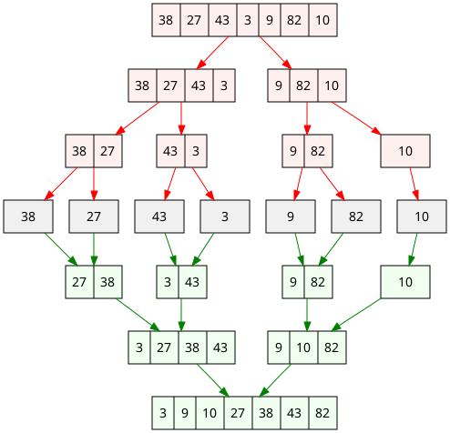

## Complexity

| Name           |     Best      |    Average    |     Worst     | Memory | Stable | Comments |
| -------------- | :-----------: | :-----------: | :-----------: | :----: | :----: | :------- |
| **Merge sort** | n&nbsp;log(n) | n&nbsp;log(n) | n&nbsp;log(n) |   n    |  Yes   |          |

# Quicksort

Quicksort is a divide and conquer algorithm.
Quicksort first divides a large array into two smaller
sub-arrays: the low elements and the high elements.
Quicksort can then recursively sort the sub-arrays

The steps are:

1. Pick an element, called a pivot, from the array.
2. Partitioning: reorder the array so that all elements with
   values less than the pivot come before the pivot, while all
   elements with values greater than the pivot come after it
   (equal values can go either way). After this partitioning,
   the pivot is in its final position. This is called the
   partition operation.
3. Recursively apply the above steps to the sub-array of
   elements with smaller values and separately to the
   sub-array of elements with greater values.

Animated visualization of the quicksort algorithm.
The horizontal lines are pivot values.

## Complexity

| Name           |     Best      |    Average    |     Worst     | Memory | Stable | Comments                                                      |
| -------------- | :-----------: | :-----------: | :-----------: | :----: | :----: | :------------------------------------------------------------ |
| **Quick sort** | n&nbsp;log(n) | n&nbsp;log(n) | n2 | log(n) |   No   | Quicksort is usually done in-place with O(log(n)) stack space |

# Shellsort

Shellsort, also known as Shell sort or Shell's method,
is an in-place comparison sort. It can be seen as either a
generalization of sorting by exchange (bubble sort) or sorting
by insertion (insertion sort). The method starts by sorting
pairs of elements far apart from each other, then progressively
reducing the gap between elements to be compared. Starting
with far apart elements, it can move some out-of-place
elements into position faster than a simple nearest neighbor
exchange

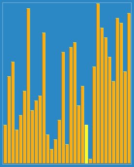

## How Shell Sort Works

For our example and ease of understanding, we take the interval
of `4`. Make a virtual sub-list of all values located at the
interval of 4 positions. Here these values are
`{35, 14}`, `{33, 19}`, `{42, 27}` and `{10, 44}`

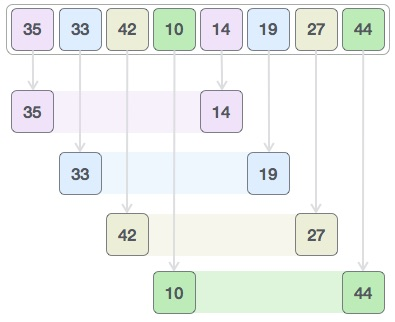

We compare values in each sub-list and swap them (if necessary)
in the original array. After this step, the new array should
look like this

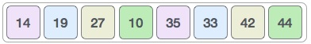

Then, we take interval of 2 and this gap generates two sub-lists

- `{14, 27, 35, 42}`, `{19, 10, 33, 44}`

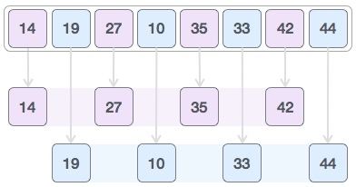

We compare and swap the values, if required, in the original array.
After this step, the array should look like this

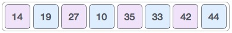

> UPD: On the picture below there is a typo and result array is supposed to be `[14, 10, 27, 19, 35, 33, 42, 44]`.

Finally, we sort the rest of the array using interval of value 1.
Shell sort uses insertion sort to sort the array.

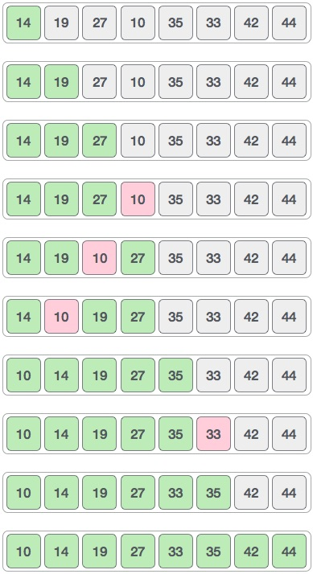

## Complexity

| Name           |     Best      |         Average         |            Worst            | Memory | Stable | Comments |
| -------------- | :-----------: | :---------------------: | :-------------------------: | :----: | :----: | :------- |
| **Shell sort** | n&nbsp;log(n) | depends on gap sequence | n&nbsp;(log(n))2 |   1    |   No   |          |

# Counting Sort

In computer science, **counting sort** is an algorithm for sorting
a collection of objects according to keys that are small integers;
that is, it is an integer sorting algorithm. It operates by
counting the number of objects that have each distinct key value,
and using arithmetic on those counts to determine the positions
of each key value in the output sequence. Its running time is
linear in the number of items and the difference between the
maximum and minimum key values, so it is only suitable for direct
use in situations where the variation in keys is not significantly
greater than the number of items. However, it is often used as a
subroutine in another sorting algorithm, radix sort, that can
handle larger keys more efficiently.

Because counting sort uses key values as indexes into an array,
it is not a comparison sort, and the `Ω(n log n)` lower bound for
comparison sorting does not apply to it. Bucket sort may be used
for many of the same tasks as counting sort, with a similar time
analysis; however, compared to counting sort, bucket sort requires
linked lists, dynamic arrays or a large amount of preallocated
memory to hold the sets of items within each bucket, whereas
counting sort instead stores a single number (the count of items)
per bucket.

Counting sorting works best when the range of numbers for each array
element is very small.

## Algorithm

**Step I**

In first step we calculate the count of all the elements of the
input array `A`. Then Store the result in the count array `C`.
The way we count is depicted below.

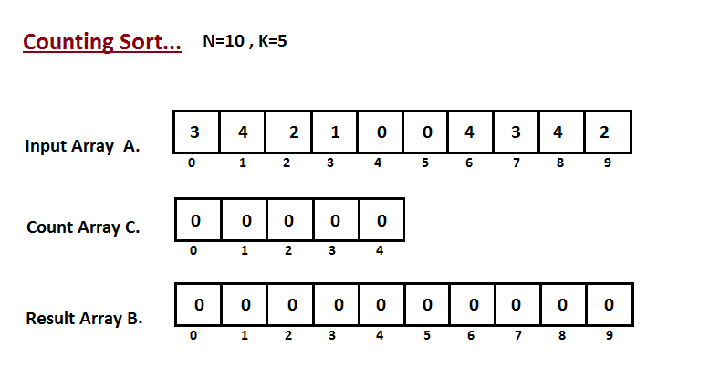

**Step II**

In second step we calculate how many elements exist in the input
array `A` which are less than or equals for the given index.
`Ci` = numbers of elements less than or equals to `i` in input array.

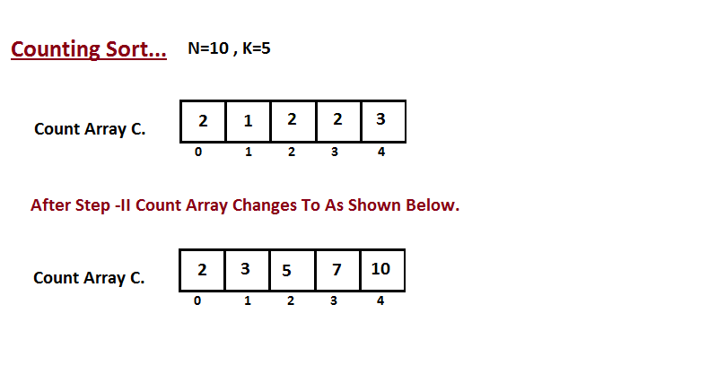

**Step III**

In this step we place the input array `A` element at sorted
position by taking help of constructed count array `C` ,i.e what
we constructed in step two. We used the result array `B` to store
the sorted elements. Here we handled the index of `B` start from
zero.

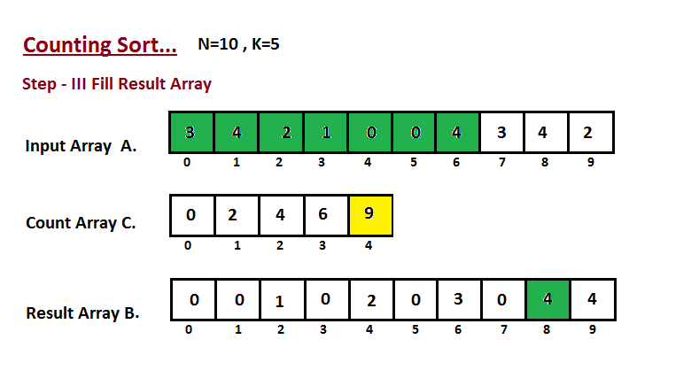

## Complexity

| Name              | Best  | Average | Worst | Memory | Stable | Comments                    |
| ----------------- | :---: | :-----: | :---: | :----: | :----: | :-------------------------- |
| **Counting sort** | n + r |  n + r  | n + r | n + r  |  Yes   | r - biggest number in array |

# Radix Sort

In computer science, **radix sort** is a non-comparative integer sorting
algorithm that sorts data with integer keys by grouping keys by the individual
digits which share the same significant position and value. A positional notation
is required, but because integers can represent strings of characters
(e.g., names or dates) and specially formatted floating point numbers, radix
sort is not limited to integers.

_Where does the name come from?_

In mathematical numeral systems, the _radix_ or base is the number of unique digits,
including the digit zero, used to represent numbers in a positional numeral system.
For example, a binary system (using numbers 0 and 1) has a radix of 2 and a decimal
system (using numbers 0 to 9) has a radix of 10.

## Efficiency

The topic of the efficiency of radix sort compared to other sorting algorithms is
somewhat tricky and subject to quite a lot of misunderstandings. Whether radix
sort is equally efficient, less efficient or more efficient than the best
comparison-based algorithms depends on the details of the assumptions made.
Radix sort complexity is `O(wn)` for `n` keys which are integers of word size `w`.
Sometimes `w` is presented as a constant, which would make radix sort better
(for sufficiently large `n`) than the best comparison-based sorting algorithms,
which all perform `O(n log n)` comparisons to sort `n` keys. However, in
general `w` cannot be considered a constant: if all `n` keys are distinct,
then `w` has to be at least `log n` for a random-access machine to be able to
store them in memory, which gives at best a time complexity `O(n log n)`. That
would seem to make radix sort at most equally efficient as the best
comparison-based sorts (and worse if keys are much longer than `log n`).

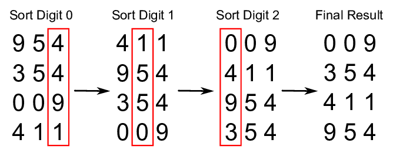

## Complexity

| Name           |  Best  | Average | Worst  | Memory | Stable | Comments                  |
| -------------- | :----: | :-----: | :----: | :----: | :----: | :------------------------ |
| **Radix sort** | n \* k | n \* k  | n \* k | n + k  |  Yes   | k - length of longest key |

# Bucket Sort

**Bucket sort**, or **bin sort**, is a sorting algorithm that works by distributing the elements of an array into a number of buckets. Each bucket is then sorted individually, either using a different sorting algorithm, or by recursively applying the bucket sorting algorithm.

## Algorithm

Bucket sort works as follows:

1. Set up an array of initially empty `buckets`.
2. **Scatter:** Go over the original array, putting each object in its `bucket`.
3. Sort each non-empty `bucket`.
4. **Gather:** Visit the `buckets` in order and put all elements back into the original array.

Elements are distributed among bins:

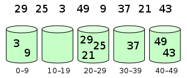

Then, elements are sorted within each bin:

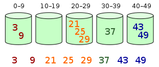

## Complexity

The computational complexity depends on the algorithm used to sort each bucket, the number of buckets to use, and whether the input is uniformly distributed.

The **worst-case** time complexity of bucket sort is
`O(n^2)` if the sorting algorithm used on the bucket is _insertion sort_, which is the most common use case since the expectation is that buckets will not have too many elements relative to the entire list. In the worst case, all elements are placed in one bucket, causing the running time to reduce to the worst-case complexity of insertion sort (all elements are in reverse order). If the worst-case running time of the intermediate sort used is `O(n * log(n))`, then the worst-case running time of bucket sort will also be
`O(n * log(n))`.

On **average**, when the distribution of elements across buckets is reasonably uniform, it can be shown that bucket sort runs on average `O(n + k)` for `k` buckets.
