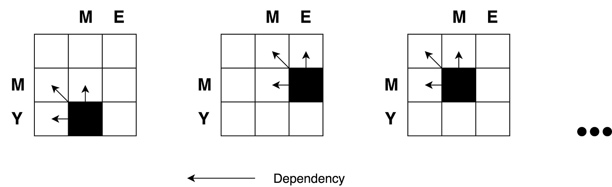
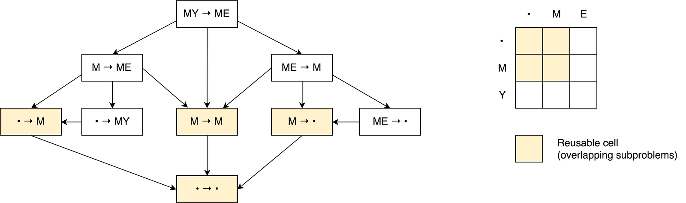
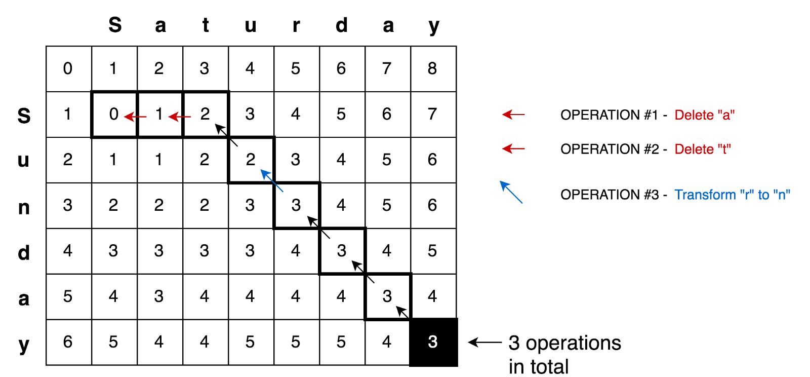
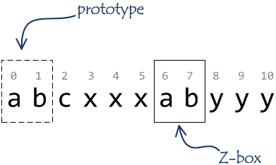

# Hamming Distance

The Hamming distance between two strings of equal length is the
number of positions at which the corresponding symbols are
different. In other words, it measures the minimum number of
substitutions required to change one string into the other, or
the minimum number of errors that could have transformed one
string into the other. In a more general context, the Hamming
distance is one of several string metrics for measuring the
edit distance between two sequences.

## Examples

The Hamming distance between:

- "ka**rol**in" and "ka**thr**in" is **3**.
- "k**a**r**ol**in" and "k**e**r**st**in" is **3**.
- 10**1**1**1**01 and 10**0**1**0**01 is **2**.
- 2**17**3**8**96 and 2**23**3**7**96 is **3**.

# Palindrome Check

A [Palindrome](https://en.wikipedia.org/wiki/Palindrome) is a string that reads the same forwards and backwards.
This means that the second half of the string is the reverse of the
first half.

## Examples

The following are palindromes (thus would return `TRUE`):

```
- "a"
- "pop"     ->  p + o + p
- "deed"    ->  de + ed
- "kayak"   ->  ka + y + ak
- "racecar" ->  rac + e + car
```

The following are NOT palindromes (thus would return `FALSE`):

```
- "rad"
- "dodo"
- "polo"
```

# Levenshtein Distance

The Levenshtein distance is a string metric for measuring the
difference between two sequences. Informally, the Levenshtein
distance between two words is the minimum number of
single-character edits (insertions, deletions or substitutions)
required to change one word into the other.

## Definition

Mathematically, the Levenshtein distance between two strings
`a` and `b` (of length `|a|` and `|b|` respectively) is given by

where


where

is the indicator function equal to `0` when

and equal to 1 otherwise, and

is the distance between the first `i` characters of `a` and the first
`j` characters of `b`.

Note that the first element in the minimum corresponds to
deletion (from `a` to `b`), the second to insertion and
the third to match or mismatch, depending on whether the
respective symbols are the same.

## Example

For example, the Levenshtein distance between `kitten` and
`sitting` is `3`, since the following three edits change one
into the other, and there is no way to do it with fewer than
three edits:

1. **k**itten → **s**itten (substitution of "s" for "k")
2. sitt**e**n → sitt**i**n (substitution of "i" for "e")
3. sittin → sittin**g** (insertion of "g" at the end).

## Applications

This has a wide range of applications, for instance, spell checkers, correction
systems for optical character recognition, fuzzy string searching, and software
to assist natural language translation based on translation memory.

## Dynamic Programming Approach Explanation

Let’s take a simple example of finding minimum edit distance between
strings `ME` and `MY`. Intuitively you already know that minimum edit distance
here is `1` operation, which is replacing `E` with `Y`. But
let’s try to formalize it in a form of the algorithm in order to be able to
do more complex examples like transforming `Saturday` into `Sunday`.

To apply the mathematical formula mentioned above to `ME → MY` transformation
we need to know minimum edit distances of `ME → M`, `M → MY` and `M → M` transformations
in prior. Then we will need to pick the minimum one and add _one_ operation to
transform last letters `E → Y`. So minimum edit distance of `ME → MY` transformation
is being calculated based on three previously possible transformations.

To explain this further let’s draw the following matrix:


- Cell `(0:1)` contains red number 1. It means that we need 1 operation to
  transform `M` to an empty string. And it is by deleting `M`. This is why this number is red.
- Cell `(0:2)` contains red number 2. It means that we need 2 operations
  to transform `ME` to an empty string. And it is by deleting `E` and `M`.
- Cell `(1:0)` contains green number 1. It means that we need 1 operation
  to transform an empty string to `M`. And it is by inserting `M`. This is why this number is green.
- Cell `(2:0)` contains green number 2. It means that we need 2 operations
  to transform an empty string to `MY`. And it is by inserting `Y` and `M`.
- Cell `(1:1)` contains number 0. It means that it costs nothing
  to transform `M` into `M`.
- Cell `(1:2)` contains red number 1. It means that we need 1 operation
  to transform `ME` to `M`. And it is by deleting `E`.
- And so on...

This looks easy for such small matrix as ours (it is only `3x3`). But here you
may find basic concepts that may be applied to calculate all those numbers for
bigger matrices (let’s say a `9x7` matrix for `Saturday → Sunday` transformation).

According to the formula you only need three adjacent cells `(i-1:j)`, `(i-1:j-1)`, and `(i:j-1)` to
calculate the number for current cell `(i:j)`. All we need to do is to find the
minimum of those three cells and then add `1` in case if we have different
letters in `i`'s row and `j`'s column.

You may clearly see the recursive nature of the problem.



Let's draw a decision graph for this problem.



You may see a number of overlapping sub-problems on the picture that are marked
with red. Also, there is no way to reduce the number of operations and make it
less than a minimum of those three adjacent cells from the formula.

Besides, you may notice that each cell number in the matrix is being calculated
based on previous ones. Thus, the tabulation technique (filling the cache in
bottom-up direction) is being applied here.

Applying this principle further we may solve more complicated cases like
with `Saturday → Sunday` transformation.



# Knuth–Morris–Pratt Algorithm

The Knuth–Morris–Pratt string searching algorithm (or
KMP algorithm) searches for occurrences of a "word" `W`
within a main "text string" `T` by employing the
observation that when a mismatch occurs, the word itself
embodies sufficient information to determine where the
next match could begin, thus bypassing re-examination
of previously matched characters.

## Complexity

- **Time:** `O(|W| + |T|)` (much faster comparing to trivial `O(|W| * |T|)`)
- **Space:** `O(|W|)`

# Z Algorithm

The Z-algorithm finds occurrences of a "word" `W`
within a main "text string" `T` in linear time `O(|W| + |T|)`.

Given a string `S` of length `n`, the algorithm produces
an array, `Z` where `Z[i]` represents the longest substring
starting from `S[i]` which is also a prefix of `S`. Finding
`Z` for the string obtained by concatenating the word, `W`
with a nonce character, say `$` followed by the text, `T`,
helps with pattern matching, for if there is some index `i`
such that `Z[i]` equals the pattern length, then the pattern
must be present at that point.

While the `Z` array can be computed with two nested loops in `O(|W| * |T|)` time, the
following strategy shows how to obtain it in linear time, based
on the idea that as we iterate over the letters in the string
(index `i` from `1` to `n - 1`), we maintain an interval `[L, R]`
which is the interval with maximum `R` such that `1 ≤ L ≤ i ≤ R`
and `S[L...R]` is a prefix that is also a substring (if no such
interval exists, just let `L = R =  - 1`). For `i = 1`, we can
simply compute `L` and `R` by comparing `S[0...]` to `S[1...]`.

**Example of Z array**

```
Index            0   1   2   3   4   5   6   7   8   9  10  11
Text             a   a   b   c   a   a   b   x   a   a   a   z
Z values         X   1   0   0   3   1   0   0   2   2   1   0
```

Other examples

```
str =  a a a a a a
Z[] =  x 5 4 3 2 1
```

```
str =  a a b a a c d
Z[] =  x 1 0 2 1 0 0
```

```
str =  a b a b a b a b
Z[] =  x 0 6 0 4 0 2 0
```

**Example of Z box**



## Complexity

- **Time:** `O(|W| + |T|)`
- **Space:** `O(|W|)`

# Rabin Karp Algorithm

In computer science, the Rabin–Karp algorithm or Karp–Rabin algorithm
is a string searching algorithm created by Richard M. Karp and
Michael O. Rabin (1987) that uses hashing to find any one of a set
of pattern strings in a text.

## Algorithm

The Rabin–Karp algorithm seeks to speed up the testing of equality of
the pattern to the substrings in the text by using a hash function. A
hash function is a function which converts every string into a numeric
value, called its hash value; for example, we might
have `hash('hello') = 5`. The algorithm exploits the fact
that if two strings are equal, their hash values are also equal. Thus,
string matching is reduced (almost) to computing the hash value of the
search pattern and then looking for substrings of the input string with
that hash value.

However, there are two problems with this approach. First, because there
are so many different strings and so few hash values, some differing
strings will have the same hash value. If the hash values match, the
pattern and the substring may not match; consequently, the potential
match of search pattern and the substring must be confirmed by comparing
them; that comparison can take a long time for long substrings.
Luckily, a good hash function on reasonable strings usually does not
have many collisions, so the expected search time will be acceptable.

## Hash Function Used

The key to the Rabin–Karp algorithm's performance is the efficient computation
of hash values of the successive substrings of the text.
The **Rabin fingerprint** is a popular and effective rolling hash function.

The **polynomial hash function** described in this example is not a Rabin
fingerprint, but it works equally well. It treats every substring as a
number in some base, the base being usually a large prime.

## Complexity

For text of length `n` and `p` patterns of combined length `m`, its average
and best case running time is `O(n + m)` in space `O(p)`, but its
worst-case time is `O(n * m)`.

## Application

A practical application of the algorithm is detecting plagiarism.
Given source material, the algorithm can rapidly search through a paper
for instances of sentences from the source material, ignoring details
such as case and punctuation. Because of the abundance of the sought
strings, single-string searching algorithms are impractical.

# Longest Common Substring Problem

The longest common substring problem is to find the longest string
(or strings) that is a substring (or are substrings) of two or more
strings.

## Example

The longest common substring of the strings `ABABC`, `BABCA` and
`ABCBA` is string `ABC` of length 3. Other common substrings are
`A`, `AB`, `B`, `BA`, `BC` and `C`.

```
ABABC
  |||
 BABCA
  |||
  ABCBA
```

# Regular Expression Matching

Given an input string `s` and a pattern `p`, implement regular
expression matching with support for `.` and `*`.

- `.` Matches any single character.
- `*` Matches zero or more of the preceding element.

The matching should cover the **entire** input string (not partial).

**Note**

- `s` could be empty and contains only lowercase letters `a-z`.
- `p` could be empty and contains only lowercase letters `a-z`, and characters like `.` or `*`.

## Examples

**Example #1**

Input:

```
s = 'aa'
p = 'a'
```

Output: `false`

Explanation: `a` does not match the entire string `aa`.

**Example #2**

Input:

```
s = 'aa'
p = 'a*'
```

Output: `true`

Explanation: `*` means zero or more of the preceding element, `a`.
Therefore, by repeating `a` once, it becomes `aa`.

**Example #3**

Input:

```
s = 'ab'
p = '.*'
```

Output: `true`

Explanation: `.*` means "zero or more (`*`) of any character (`.`)".

**Example #4**

Input:

```
s = 'aab'
p = 'c*a*b'
```

Output: `true`

Explanation: `c` can be repeated 0 times, `a` can be repeated
1 time. Therefore it matches `aab`.
