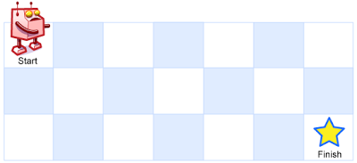
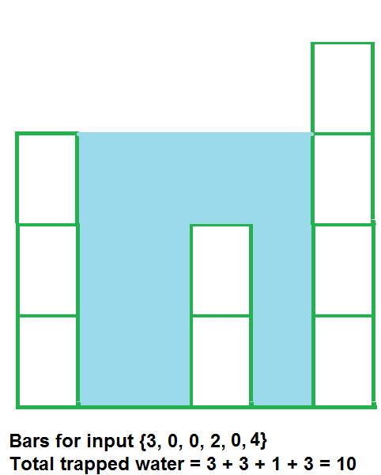
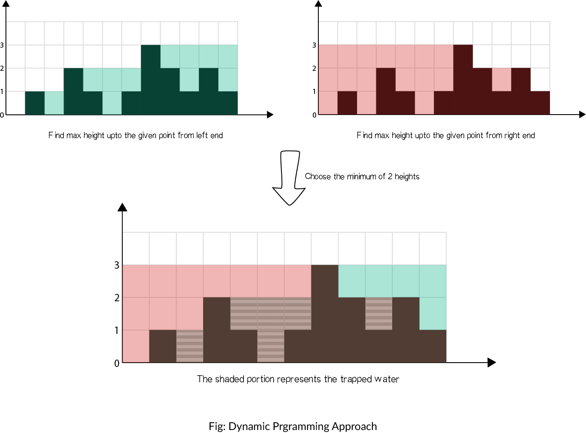
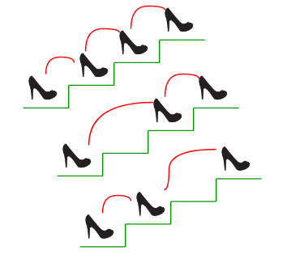
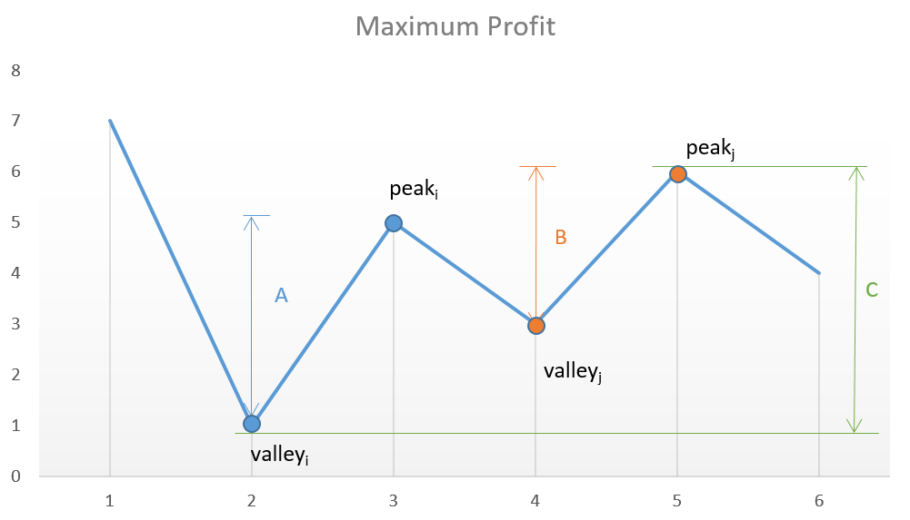
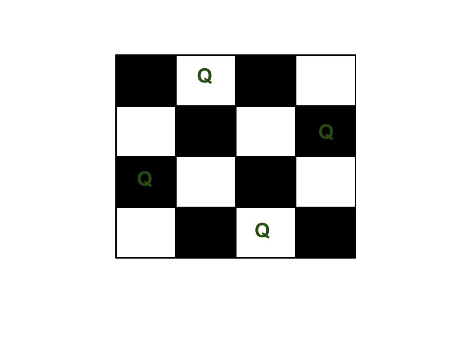
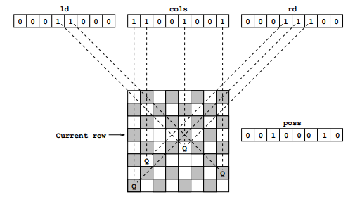
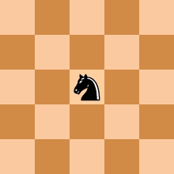

# Tower of Hanoi

The Tower of Hanoi (also called the Tower of Brahma or Lucas'
Tower and sometimes pluralized) is a mathematical game or puzzle.
It consists of three rods and a number of disks of different sizes,
which can slide onto any rod. The puzzle starts with the disks in
a neat stack in ascending order of size on one rod, the smallest
at the top, thus making a conical shape.

The objective of the puzzle is to move the entire stack to another
rod, obeying the following simple rules:

- Only one disk can be moved at a time.
- Each move consists of taking the upper disk from one of the
  stacks and placing it on top of another stack or on an empty rod.
- No disk may be placed on top of a smaller disk.


Animation of an iterative algorithm solving 6-disk problem

With `3` disks, the puzzle can be solved in `7` moves. The minimal
number of moves required to solve a Tower of Hanoi puzzle
is `2^n − 1`, where `n` is the number of disks.

# Square Matrix In-Place Rotation

## The Problem

You are given an `n x n` 2D matrix (representing an image).
Rotate the matrix by `90` degrees (clockwise).

**Note**

You have to rotate the image **in-place**, which means you
have to modify the input 2D matrix directly. **DO NOT** allocate
another 2D matrix and do the rotation.

## Examples

**Example #1**

Given input matrix:

```
[
  [1, 2, 3],
  [4, 5, 6],
  [7, 8, 9],
]
```

Rotate the input matrix in-place such that it becomes:

```
[
  [7, 4, 1],
  [8, 5, 2],
  [9, 6, 3],
]
```

**Example #2**

Given input matrix:

```
[
  [5, 1, 9, 11],
  [2, 4, 8, 10],
  [13, 3, 6, 7],
  [15, 14, 12, 16],
]
```

Rotate the input matrix in-place such that it becomes:

```
[
  [15, 13, 2, 5],
  [14, 3, 4, 1],
  [12, 6, 8, 9],
  [16, 7, 10, 11],
]
```

## Algorithm

We would need to do two reflections of the matrix:

- reflect vertically
- reflect diagonally from bottom-left to top-right

Or we also could Furthermore, you can reflect diagonally
top-left/bottom-right and reflect horizontally.

A common question is how do you even figure out what kind
of reflections to do? Simply rip a square piece of paper,
write a random word on it, so you know its rotation. Then,
flip the square piece of paper around until you figure out
how to come to the solution.

Here is an example of how first line may be rotated using
diagonal top-right/bottom-left rotation along with horizontal
rotation.

```
Let's say we have a string at the top of the matrix:

A B C
• • •
• • •

Let's do top-right/bottom-left diagonal reflection:

A B C
/ / •
/ • •

And now let's do horizontal reflection:

A → →
B → →
C → →

The string has been rotated to 90 degree:

• • A
• • B
• • C
```

# Jump Game

## The Problem

Given an array of non-negative integers, you are initially positioned at
the first index of the array. Each element in the array represents your maximum
jump length at that position.

Determine if you are able to reach the last index.

**Example #1**

```
Input: [2,3,1,1,4]
Output: true
Explanation: Jump 1 step from index 0 to 1, then 3 steps to the last index.
```

**Example #2**

```
Input: [3,2,1,0,4]
Output: false
Explanation: You will always arrive at index 3 no matter what. Its maximum
             jump length is 0, which makes it impossible to reach the last index.
```

## Naming

We call a position in the array a **"good index"** if starting at that position,
we can reach the last index. Otherwise, that index is called a **"bad index"**.
The problem then reduces to whether or not index 0 is a "good index".

## Solutions

### Approach 1: Backtracking

This is the inefficient solution where we try every single jump pattern that
takes us from the first position to the last. We start from the first position
and jump to every index that is reachable. We repeat the process until last
index is reached. When stuck, backtrack.

> See [backtrackingJumpGame.js](backtrackingJumpGame.js) file

**Time complexity:**: `O(2^n)`.
There are 2<sup>n</sup> (upper bound) ways of jumping from
the first position to the last, where `n` is the length of
array `nums`.

**Auxiliary Space Complexity**: `O(n)`.
Recursion requires additional memory for the stack frames.

### Approach 2: Dynamic Programming Top-down

Top-down Dynamic Programming can be thought of as optimized
backtracking. It relies on the observation that once we determine
that a certain index is good / bad, this result will never change.
This means that we can store the result and not need to recompute
it every time.

Therefore, for each position in the array, we remember whether the
index is good or bad. Let's call this array memo and let its values
be either one of: GOOD, BAD, UNKNOWN. This technique is
called memoization.

> See [dpTopDownJumpGame.js](dpTopDownJumpGame.js) file

**Time complexity:**: `O(n^2)`.
For every element in the array, say `i`, we are looking at the
next `nums[i]` elements to its right aiming to find a GOOD
index. `nums[i]` can be at most `n`, where `n` is the length
of array `nums`.

**Auxiliary Space Complexity**: `O(2 * n) = O(n)`.
First `n` originates from recursion. Second `n` comes from the
usage of the memo table.

### Approach 3: Dynamic Programming Bottom-up

Top-down to bottom-up conversion is done by eliminating recursion.
In practice, this achieves better performance as we no longer have the
method stack overhead and might even benefit from some caching. More
importantly, this step opens up possibilities for future optimization.
The recursion is usually eliminated by trying to reverse the order of
the steps from the top-down approach.

The observation to make here is that we only ever jump to the right.
This means that if we start from the right of the array, every time
we will query a position to our right, that position has already been
determined as being GOOD or BAD. This means we don't need to recurse
anymore, as we will always hit the memo table.

> See [dpBottomUpJumpGame.js](dpBottomUpJumpGame.js) file

**Time complexity:**: `O(n^2)`.
For every element in the array, say `i`, we are looking at the
next `nums[i]` elements to its right aiming to find a GOOD
index. `nums[i]` can be at most `n`, where `n` is the length
of array `nums`.

**Auxiliary Space Complexity**: `O(n)`.
This comes from the usage of the memo table.

### Approach 4: Greedy

Once we have our code in the bottom-up state, we can make one final,
important observation. From a given position, when we try to see if
we can jump to a GOOD position, we only ever use one - the first one.
In other words, the left-most one. If we keep track of this left-most
GOOD position as a separate variable, we can avoid searching for it in
the array. Not only that, but we can stop using the array altogether.

> See [greedyJumpGame.js](greedyJumpGame.js) file

**Time complexity:**: `O(n)`.
We are doing a single pass through the `nums` array, hence `n` steps,
where `n` is the length of array `nums`.

**Auxiliary Space Complexity**: `O(1)`.
We are not using any extra memory.

# Unique Paths Problem

A robot is located at the top-left corner of a `m x n` grid
(marked 'Start' in the diagram below).

The robot can only move either down or right at any point in
time. The robot is trying to reach the bottom-right corner
of the grid (marked 'Finish' in the diagram below).

How many possible unique paths are there?



## Examples

**Example #1**

```
Input: m = 3, n = 2
Output: 3
Explanation:
From the top-left corner, there are a total of 3 ways to reach the bottom-right corner:
1. Right -> Right -> Down
2. Right -> Down -> Right
3. Down -> Right -> Right
```

**Example #2**

```
Input: m = 7, n = 3
Output: 28
```

## Algorithms

### Backtracking

First thought that might come to mind is that we need to build a decision tree
where `D` means moving down and `R` means moving right. For example in case
of boars `width = 3` and `height = 2` we will have the following decision tree:

```
                START
                /   \
               D     R
             /     /   \
           R      D      R
         /      /         \
        R      R            D

       END    END          END
```

We can see three unique branches here that is the answer to our problem.

**Time Complexity**: `O(2 ^ n)` - roughly in the worst case with square board
of size `n`.

**Auxiliary Space Complexity**: `O(m + n)` - since we need to store current path with
positions.

### Dynamic Programming

Let's treat `BOARD[i][j]` as our sub-problem.

Since we have restriction of moving only to the right
and down we might say that number of unique paths to the current
cell is a sum of numbers of unique paths to the cell above the
current one and to the cell to the left of current one.

```
BOARD[i][j] = BOARD[i - 1][j] + BOARD[i][j - 1]; // since we can only move down or right.
```

Base cases are:

```
BOARD[0][any] = 1; // only one way to reach any top slot.
BOARD[any][0] = 1; // only one way to reach any slot in the leftmost column.
```

For the board `3 x 2` our dynamic programming matrix will look like:

|       |  0  |  1  |  1  |
| :---: | :-: | :-: | :-: |
| **0** |  0  |  1  |  1  |
| **1** |  1  |  2  |  3  |

Each cell contains the number of unique paths to it. We need
the bottom right one with number `3`.

**Time Complexity**: `O(m * n)` - since we're going through each cell of the DP matrix.

**Auxiliary Space Complexity**: `O(m * n)` - since we need to have DP matrix.

### Pascal's Triangle Based

This question is actually another form of Pascal Triangle.

The corner of this rectangle is at `m + n - 2` line, and
at `min(m, n) - 1` position of the Pascal's Triangle.

# Rain Terraces (Trapping Rain Water) Problem

Given an array of non-negative integers representing terraces in an elevation map
where the width of each bar is `1`, compute how much water it is able to trap
after raining.



## Examples

**Example #1**

```
Input: arr[] = [2, 0, 2]
Output: 2
Structure is like below:

| |
|_|

We can trap 2 units of water in the middle gap.
```

**Example #2**

```
Input: arr[] = [3, 0, 0, 2, 0, 4]
Output: 10
Structure is like below:

     |
|    |
|  | |
|__|_|

We can trap "3*2 units" of water between 3 an 2,
"1 unit" on top of bar 2 and "3 units" between 2
and 4. See below diagram also.
```

**Example #3**

```
Input: arr[] = [0, 1, 0, 2, 1, 0, 1, 3, 2, 1, 2, 1]
Output: 6
Structure is like below:

       |
   |   || |
_|_||_||||||

Trap "1 unit" between first 1 and 2, "4 units" between
first 2 and 3 and "1 unit" between second last 1 and last 2.
```

## The Algorithm

An element of array can store water if there are higher bars on left and right.
We can find amount of water to be stored in every element by finding the heights
of bars on left and right sides. The idea is to compute amount of water that can
be stored in every element of array. For example, consider the array
`[3, 0, 0, 2, 0, 4]`, We can trap "3\*2 units" of water between 3 an 2, "1 unit"
on top of bar 2 and "3 units" between 2 and 4. See below diagram also.

### Approach 1: Brute force

**Intuition**

For each element in the array, we find the maximum level of water it can trap
after the rain, which is equal to the minimum of maximum height of bars on both
the sides minus its own height.

**Steps**

- Initialize `answer = 0`
- Iterate the array from left to right:
  - Initialize `max_left = 0` and `max_right = 0`
  - Iterate from the current element to the beginning of array updating: `max_left = max(max_left, height[j])`
  - Iterate from the current element to the end of array updating: `max_right = max(max_right, height[j])`
  - Add `min(max_left, max_right) − height[i]` to `answer`

**Complexity Analysis**

Time complexity: `O(n^2)`. For each element of array, we iterate the left and right parts.

Auxiliary space complexity: `O(1)` extra space.

### Approach 2: Dynamic Programming

**Intuition**

In brute force, we iterate over the left and right parts again and again just to
find the highest bar size up to that index. But, this could be stored. Voilà,
dynamic programming.

So we may pre-compute the highest bar on left and right of every bar in `O(n)` time.
Then use these pre-computed values to find the amount of water in every array element.

The concept is illustrated as shown:



**Steps**

- Find maximum height of bar from the left end up to an index `i` in the array `left_max`.
- Find maximum height of bar from the right end up to an index `i` in the array `right_max`.
- Iterate over the `height` array and update `answer`:
  - Add `min(max_left[i], max_right[i]) − height[i]` to `answer`.

**Complexity Analysis**

Time complexity: `O(n)`. We store the maximum heights up to a point using 2
iterations of `O(n)` each. We finally update `answer` using the stored
values in `O(n)`.

Auxiliary space complexity: `O(n)` extra space. Additional space
for `left_max` and `right_max` arrays than in Approach 1.

# Recursive Staircase Problem

## The Problem

There are `n` stairs, a person standing at the bottom wants to reach the top. The person can climb either `1` or `2` stairs at a time. _Count the number of ways, the person can reach the top._



## The Solution

This is an interesting problem because there are several ways of how it may be solved that illustrate different programming paradigms.

- [Brute Force Recursive Solution](./recursiveStaircaseBF.js) - Time: `O(2^n)`; Space: `O(1)`
- [Recursive Solution With Memoization](./recursiveStaircaseMEM.js) - Time: `O(n)`; Space: `O(n)`
- [Dynamic Programming Solution](./recursiveStaircaseDP.js) - Time: `O(n)`; Space: `O(n)`
- [Iterative Solution](./recursiveStaircaseIT.js) - Time: `O(n)`; Space: `O(1)`

# Best Time to Buy and Sell Stock

## Task Description

Say you have an array prices for which the `i`-th element is the price of a given stock on day `i`.

Find the maximum profit. You may complete as many transactions as you like (i.e., buy one and sell one share of the stock multiple times).

> Note: You may not engage in multiple transactions at the same time (i.e., you must sell the stock before you buy again).

**Example #1**

```
Input: [7, 1, 5, 3, 6, 4]
Output: 7
```

_Explanation:_ Buy on day `2` (`price = 1`) and sell on day `3` (`price = 5`), `profit = 5-1 = 4`. Then buy on day `4` (`price = 3`) and sell on day `5` (`price = 6`), `profit = 6-3 = 3`.

**Example #2**

```
Input: [1, 2, 3, 4, 5]
Output: 4
```

_Explanation:_ Buy on day `1` (`price = 1`) and sell on day `5` (`price = 5`), `profit = 5-1 = 4`. Note that you cannot buy on day 1, buy on day 2 and sell them later, as you are engaging multiple transactions at the same time. You must sell before buying again.

**Example #3**

```
Input: [7, 6, 4, 3, 1]
Output: 0
```

_Explanation:_ In this case, no transaction is done, i.e. max `profit = 0`.

## Possible Solutions

### Divide and conquer approach `O(2^n)`

We may try **all** combinations of buying and selling and find out the most profitable one by applying _divide and conquer approach_.

Let's say we have an array of prices `[7, 6, 4, 3, 1]`, and we're on the _1st_ day of trading (at the very beginning of the array). At this point we may say that the overall maximum profit would be the _maximum_ of two following values:

1. _Option 1: Keep the money_ → profit would equal to the profit from buying/selling the rest of the stocks → `keepProfit = profit([6, 4, 3, 1])`.
2. _Option 2: Buy/sell at current price_ → profit in this case would equal to the profit from buying/selling the rest of the stocks plus (or minus, depending on whether we're selling or buying) the current stock price → `buySellProfit = -7 + profit([6, 4, 3, 1])`.

The overall profit would be equal to → `overallProfit = Max(keepProfit, buySellProfit)`.

As you can see the `profit([6, 4, 3, 1])` task is being solved in the same recursive manner.

> See the full code example in [dqBestTimeToBuySellStocks.js](dqBestTimeToBuySellStocks.js)

#### Time Complexity

As you may see, every recursive call will produce _2_ more recursive branches. The depth of the recursion will be `n` (size of prices array) and thus, the time complexity will equal to `O(2^n)`.

As you may see, this is very inefficient. For example for just `20` prices the number of recursive calls will be somewhere close to `2M`!

#### Additional Space Complexity

If we avoid cloning the prices array between recursive function calls and will use the array pointer then additional space complexity will be proportional to the depth of the recursion: `O(n)`

## Peak Valley Approach `O(n)`

If we plot the prices array (i.e. `[7, 1, 5, 3, 6, 4]`) we may notice that the points of interest are the consecutive valleys and peaks



So, if we will track the growing price and will sell the stocks immediately _before_ the price goes down we'll get the maximum profit (remember, we bought the stock in the valley at its low price).

> See the full code example in [peakvalleyBestTimeToBuySellStocks.js](peakvalleyBestTimeToBuySellStocks.js)

#### Time Complexity

Since the algorithm requires only one pass through the prices array, the time complexity would equal `O(n)`.

#### Additional Space Complexity

Except of the prices array itself the algorithm consumes the constant amount of memory. Thus, additional space complexity is `O(1)`.

## Accumulator Approach `O(n)`

There is even simpler approach exists. Let's say we have the prices array which looks like this `[1, 7, 2, 3, 6, 7, 6, 7]`:


You may notice, that we don't even need to keep tracking of a constantly growing price. Instead, we may simply add the price difference for _all growing segments_ of the chart which eventually sums up to the highest possible profit,

> See the full code example in [accumulatorBestTimeToBuySellStocks.js](accumulatorBestTimeToBuySellStocks.js)

#### Time Complexity

Since the algorithm requires only one pass through the prices array, the time complexity would equal `O(n)`.

#### Additional Space Complexity

Except of the prices array itself the algorithm consumes the constant amount of memory. Thus, additional space complexity is `O(1)`.

# Valid Parentheses Problem

Given a string s containing just the characters '(', ')', '{', '}', '[' and ']', determine if the input string is valid.

An input string is valid if:

Open brackets must be closed by the same type of brackets.
Open brackets must be closed in the correct order.
Every close bracket has a corresponding open bracket of the same type.

Example 1:

`Input: s = "()"`

Output: true

Example 2:

`Input: s = "()[]{}"`

Output: true

Example 3:

`Input: s = "(]"`

Output: false

This is actually a very common interview question and a very good example of how to use a stack data structure to solve problems.

## Solution

The problem can be solved in two ways

### Bruteforce Approach

We can iterate through the string and then for each character in the string, we check for it's last closing character in the string. Once we find the last closing character in the string, we remove both characters and then repeat the iteration, if we don't find a closing character for an opening character, then the string is invalid. The time complexity of this would be O(n^2) which is not so efficient.

### Using a Stack

We can use a hashtable to store all opening characters and the value would be the respective closing character. We can then iterate through the string and if we encounter an opening parenthesis, we push it's closing character to the stack. If we encounter a closing parenthesis, then we pop the stack and confirm that the popped element is equal to the current closing parentheses character. If it is not then the string is invalid. At the end of the iteration, we also need to check that the stack is empty. If it is not then the string is invalid. If it is, then the string is valid. This is a more efficient approach with a Time complexity and Space complexity of O(n).

# N-Queens Problem

The **eight queens puzzle** is the problem of placing eight chess queens
on an `8×8` chessboard so that no two queens threaten each other.
Thus, a solution requires that no two queens share the same row,
column, or diagonal. The eight queens puzzle is an example of the
more general _n queens problem_ of placing n non-attacking queens
on an `n×n` chessboard, for which solutions exist for all natural
numbers `n` with the exception of `n=2` and `n=3`.

For example, following is a solution for 4 Queen problem.



The expected output is a binary matrix which has 1s for the blocks
where queens are placed. For example following is the output matrix
for above 4 queen solution.

```
{ 0,  1,  0,  0}
{ 0,  0,  0,  1}
{ 1,  0,  0,  0}
{ 0,  0,  1,  0}
```

## Naive Algorithm

Generate all possible configurations of queens on board and print a
configuration that satisfies the given constraints.

```
while there are untried configurations
{
   generate the next configuration
   if queens don't attack in this configuration then
   {
      print this configuration;
   }
}
```

## Backtracking Algorithm

The idea is to place queens one by one in different columns,
starting from the leftmost column. When we place a queen in a
column, we check for clashes with already placed queens. In
the current column, if we find a row for which there is no
clash, we mark this row and column as part of the solution.
If we do not find such a row due to clashes then we backtrack
and return false.

```
1) Start in the leftmost column
2) If all queens are placed
    return true
3) Try all rows in the current column.  Do following for every tried row.
    a) If the queen can be placed safely in this row then mark this [row,
        column] as part of the solution and recursively check if placing
        queen here leads to a solution.
    b) If placing queen in [row, column] leads to a solution then return
        true.
    c) If placing queen doesn't lead to a solution then unmark this [row,
        column] (Backtrack) and go to step (a) to try other rows.
3) If all rows have been tried and nothing worked, return false to trigger
    backtracking.
```

## Bitwise Solution

Bitwise algorithm basically approaches the problem like this:

- Queens can attack diagonally, vertically, or horizontally. As a result, there
  can only be one queen in each row, one in each column, and at most one on each
  diagonal.
- Since we know there can only one queen per row, we will start at the first row,
  place a queen, then move to the second row, place a second queen, and so on until
  either a) we reach a valid solution or b) we reach a dead end (i.e. we can't place
  a queen such that it is "safe" from the other queens).
- Since we are only placing one queen per row, we don't need to worry about
  horizontal attacks, since no queen will ever be on the same row as another queen.
- That means we only need to check three things before placing a queen on a
  certain square: 1) The square's column doesn't have any other queens on it, 2)
  the square's left diagonal doesn't have any other queens on it, and 3) the
  square's right diagonal doesn't have any other queens on it.
- If we ever reach a point where there is nowhere safe to place a queen, we can
  give up on our current attempt and immediately test out the next possibility.

First let's talk about the recursive function. You'll notice that it accepts
3 parameters: `leftDiagonal`, `column`, and `rightDiagonal`. Each of these is
technically an integer, but the algorithm takes advantage of the fact that an
integer is represented by a sequence of bits. So, think of each of these
parameters as a sequence of `N` bits.

Each bit in each of the parameters represents whether the corresponding location
on the current row is "available".

For example:

- For `N=4`, column having a value of `0010` would mean that the 3rd column is
  already occupied by a queen.
- For `N=8`, ld having a value of `00011000` at row 5 would mean that the
  top-left-to-bottom-right diagonals that pass through columns 4 and 5 of that
  row are already occupied by queens.

Below is a visual aid for `leftDiagonal`, `column`, and `rightDiagonal`.



# Knight's Tour

A **knight's tour** is a sequence of moves of a knight on a chessboard
such that the knight visits every square only once. If the knight
ends on a square that is one knight's move from the beginning
square (so that it could tour the board again immediately,
following the same path), the tour is **closed**, otherwise it
is **open**.

The **knight's tour problem** is the mathematical problem of
finding a knight's tour. Creating a program to find a knight's
tour is a common problem given to computer science students.
Variations of the knight's tour problem involve chessboards of
different sizes than the usual `8×8`, as well as irregular
(non-rectangular) boards.

The knight's tour problem is an instance of the more
general **Hamiltonian path problem** in graph theory. The problem of finding
a closed knight's tour is similarly an instance of the Hamiltonian
cycle problem.


An open knight's tour of a chessboard.



An animation of an open knight's tour on a 5 by 5 board.
