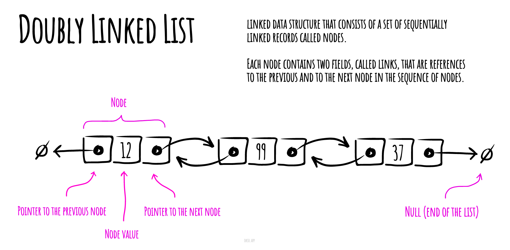
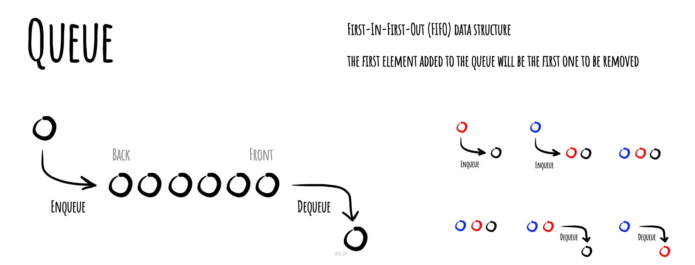
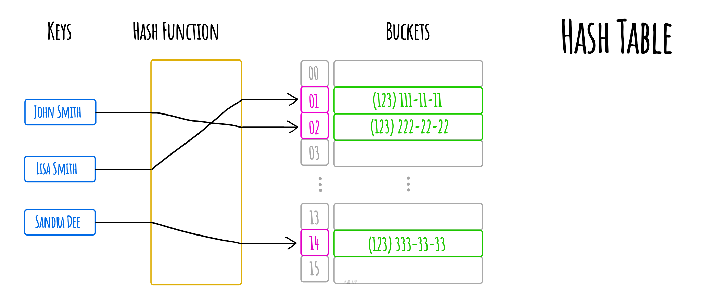
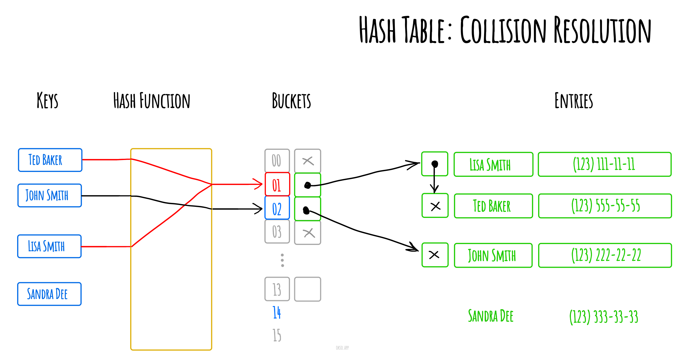
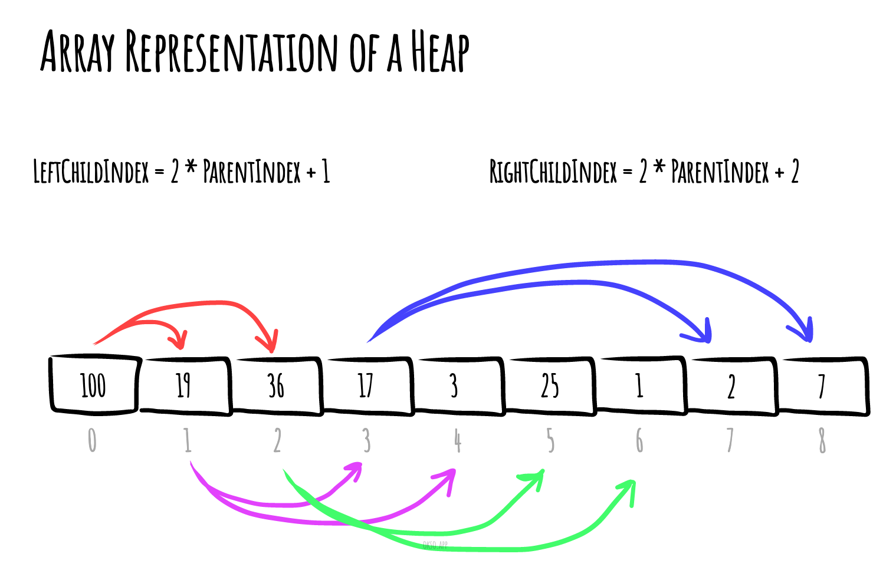
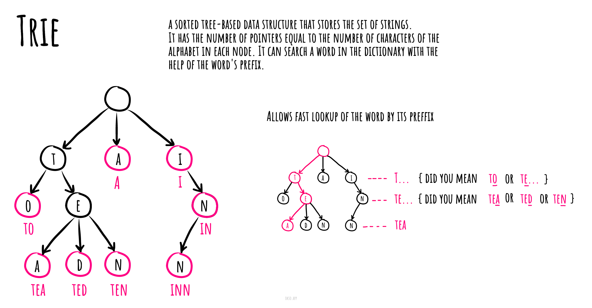
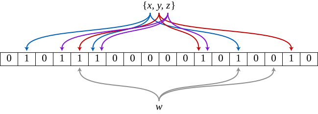
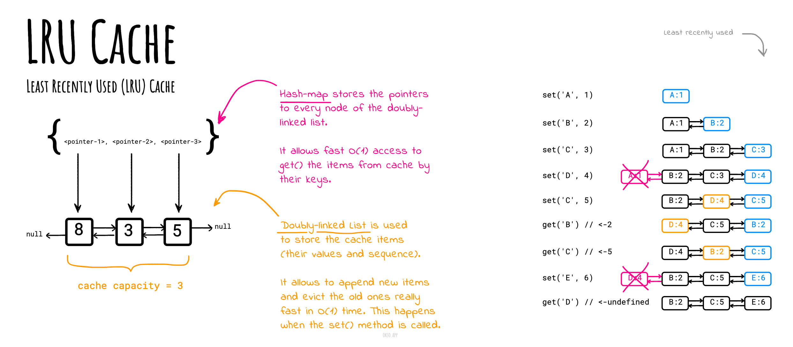

# Linked List

In computer science, a **linked list** is a linear collection
of data elements, in which linear order is not given by
their physical placement in memory. Instead, each
element points to the next. It is a data structure
consisting of a group of nodes which together represent
a sequence. Under the simplest form, each node is
composed of data and a reference (in other words,
a link) to the next node in the sequence. This structure
allows for efficient insertion or removal of elements
from any position in the sequence during iteration.
More complex variants add additional links, allowing
efficient insertion or removal from arbitrary element
references. A drawback of linked lists is that access
time is linear (and difficult to pipeline). Faster
access, such as random access, is not feasible. Arrays
have better cache locality as compared to linked lists.


## Pseudocode for Basic Operations

### Insert

```text
Add(value)
  Pre: value is the value to add to the list
  Post: value has been placed at the tail of the list
  n ← node(value)
  if head = ø
    head ← n
    tail ← n
  else
    tail.next ← n
    tail ← n
  end if
end Add
```

```text
Prepend(value)
 Pre: value is the value to add to the list
 Post: value has been placed at the head of the list
 n ← node(value)
 n.next ← head
 head ← n
 if tail = ø
   tail ← n
 end
end Prepend
```

### Search

```text
Contains(head, value)
  Pre: head is the head node in the list
       value is the value to search for
  Post: the item is either in the linked list, true; otherwise false
  n ← head
  while n != ø and n.value != value
    n ← n.next
  end while
  if n = ø
    return false
  end if
  return true
end Contains
```

### Delete

```text
Remove(head, value)
  Pre: head is the head node in the list
       value is the value to remove from the list
  Post: value is removed from the list, true, otherwise false
  if head = ø
    return false
  end if
  n ← head
  if n.value = value
    if head = tail
      head ← ø
      tail ← ø
    else
      head ← head.next
    end if
    return true
  end if
  while n.next != ø and n.next.value != value
    n ← n.next
  end while
  if n.next != ø
    if n.next = tail
      tail ← n
      tail.next = null
    else
      n.next ← n.next.next
    end if
    return true
  end if
  return false
end Remove
```

### Traverse

```text
Traverse(head)
  Pre: head is the head node in the list
  Post: the items in the list have been traversed
  n ← head
  while n != ø
    yield n.value
    n ← n.next
  end while
end Traverse
```

### Traverse in Reverse

```text
ReverseTraversal(head, tail)
  Pre: head and tail belong to the same list
  Post: the items in the list have been traversed in reverse order
  if tail != ø
    curr ← tail
    while curr != head
      prev ← head
      while prev.next != curr
        prev ← prev.next
      end while
      yield curr.value
      curr ← prev
    end while
   yield curr.value
  end if
end ReverseTraversal
```

## Complexities

### Time Complexity

| Access | Search | Insertion | Deletion |
| :----: | :----: | :-------: | :------: |
|  O(n)  |  O(n)  |   O(1)    |   O(n)   |

### Space Complexity

O(n)

# Doubly Linked List

In computer science, a **doubly linked list** is a linked data structure that
consists of a set of sequentially linked records called nodes. Each node contains
two fields, called links, that are references to the previous and to the next
node in the sequence of nodes. The beginning and ending nodes' previous and next
links, respectively, point to some kind of terminator, typically a sentinel
node or null, to facilitate the traversal of the list. If there is only one
sentinel node, then the list is circularly linked via the sentinel node. It can
be conceptualized as two singly linked lists formed from the same data items,
but in opposite sequential orders.



The two node links allow traversal of the list in either direction. While adding
or removing a node in a doubly linked list requires changing more links than the
same operations on a singly linked list, the operations are simpler and
potentially more efficient (for nodes other than first nodes) because there
is no need to keep track of the previous node during traversal or no need
to traverse the list to find the previous node, so that its link can be modified.

## Pseudocode for Basic Operations

### Insert

```text
Add(value)
  Pre: value is the value to add to the list
  Post: value has been placed at the tail of the list
  n ← node(value)
  if head = ø
    head ← n
    tail ← n
  else
    n.previous ← tail
    tail.next ← n
    tail ← n
  end if
end Add
```

### Delete

```text
Remove(head, value)
  Pre: head is the head node in the list
       value is the value to remove from the list
  Post: value is removed from the list, true; otherwise false
  if head = ø
    return false
  end if
  if value = head.value
    if head = tail
      head ← ø
      tail ← ø
    else
      head ← head.next
      head.previous ← ø
    end if
    return true
  end if
  n ← head.next
  while n != ø and value !== n.value
    n ← n.next
  end while
  if n = tail
    tail ← tail.previous
    tail.next ← ø
    return true
  else if n != ø
    n.previous.next ← n.next
    n.next.previous ← n.previous
    return true
  end if
  return false
end Remove
```

### Reverse Traversal

```text
ReverseTraversal(tail)
  Pre: tail is the node of the list to traverse
  Post: the list has been traversed in reverse order
  n ← tail
  while n != ø
    yield n.value
    n ← n.previous
  end while
end Reverse Traversal
```

## Complexities

## Time Complexity

| Access | Search | Insertion | Deletion |
| :----: | :----: | :-------: | :------: |
|  O(n)  |  O(n)  |   O(1)    |   O(n)   |

### Space Complexity

O(n)

# Queue

In computer science, a **queue** is a particular kind of abstract data
type or collection in which the entities in the collection are
kept in order and the principle (or only) operations on the
collection are the addition of entities to the rear terminal
position, known as enqueue, and removal of entities from the
front terminal position, known as dequeue. This makes the queue
a First-In-First-Out (FIFO) data structure. In a FIFO data
structure, the first element added to the queue will be the
first one to be removed. This is equivalent to the requirement
that once a new element is added, all elements that were added
before have to be removed before the new element can be removed.
Often a peek or front operation is also entered, returning the
value of the front element without dequeuing it. A queue is an
example of a linear data structure, or more abstractly a
sequential collection.

Representation of a FIFO (first in, first out) queue



# Stack

In computer science, a **stack** is an abstract data type that serves
as a collection of elements, with two principal operations:

- **push**, which adds an element to the collection, and
- **pop**, which removes the most recently added element that was not yet removed.

The order in which elements come off a stack gives rise to its
alternative name, LIFO (last in, first out). Additionally, a
peek operation may give access to the top without modifying
the stack. The name "stack" for this type of structure comes
from the analogy to a set of physical items stacked on top of
each other, which makes it easy to take an item off the top
of the stack, while getting to an item deeper in the stack
may require taking off multiple other items first.

Simple representation of a stack runtime with push and pop operations.


# Hash Table

In computing, a **hash table** (hash map) is a data
structure which implements an _associative array_
abstract data type, a structure that can _map keys
to values_. A hash table uses a _hash function_ to
compute an index into an array of buckets or slots,
from which the desired value can be found

Ideally, the hash function will assign each key to a
unique bucket, but most hash table designs employ an
imperfect hash function, which might cause hash
collisions where the hash function generates the same
index for more than one key. Such collisions must be
accommodated in some way.



Hash collision resolved by separate chaining.



# Heap (data-structure)

In computer science, a **heap** is a specialized tree-based
data structure that satisfies the heap property described
below.

In a _min heap_, if `P` is a parent node of `C`, then the
key (the value) of `P` is less than or equal to the
key of `C`.


In a _max heap_, the key of `P` is greater than or equal
to the key of `C`




The node at the "top" of the heap with no parents is
called the root node.

## Time Complexities

Here are time complexities of various heap data structures. Function names assume a max-heap.

| Operation                                                                                          | find-max   | delete-max | insert     | increase-key | meld       |
| -------------------------------------------------------------------------------------------------- | ---------- | ---------- | ---------- | ------------ | ---------- |
| [Binary](https://en.wikipedia.org/wiki/Binary_heap)                                                | `Θ(1)`     | `Θ(log n)` | `O(log n)` | `O(log n)`   | `Θ(n)`     |
| [Leftist](https://en.wikipedia.org/wiki/Leftist_tree)                                              | `Θ(1)`     | `Θ(log n)` | `Θ(log n)` | `O(log n)`   | `Θ(log n)` |
| [Binomial](https://en.wikipedia.org/wiki/Binomial_heap)                                            | `Θ(1)`     | `Θ(log n)` | `Θ(1)`     | `O(log n)`   | `O(log n)` |
| [Fibonacci](https://en.wikipedia.org/wiki/Fibonacci_heap)                                          | `Θ(1)`     | `Θ(log n)` | `Θ(1)`     | `Θ(1)`       | `Θ(1)`     |
| [Pairing](https://en.wikipedia.org/wiki/Pairing_heap)                                              | `Θ(1)`     | `Θ(log n)` | `Θ(1)`     | `o(log n)`   | `Θ(1)`     |
| [Brodal](https://en.wikipedia.org/wiki/Brodal_queue)                                               | `Θ(1)`     | `Θ(log n)` | `Θ(1)`     | `Θ(1)`       | `Θ(1)`     |
| [Rank-pairing](https://en.wikipedia.org/w/index.php?title=Rank-pairing_heap&action=edit&redlink=1) | `Θ(1)`     | `Θ(log n)` | `Θ(1)`     | `Θ(1)`       | `Θ(1)`     |
| [Strict Fibonacci](https://en.wikipedia.org/wiki/Fibonacci_heap)                                   | `Θ(1)`     | `Θ(log n)` | `Θ(1)`     | `Θ(1)`       | `Θ(1)`     |
| [2-3 heap](https://en.wikipedia.org/wiki/2%E2%80%933_heap)                                         | `O(log n)` | `O(log n)` | `O(log n)` | `Θ(1)`       | `?`        |

Where:

- **find-max (or find-min):** find a maximum item of a max-heap, or a minimum item of a min-heap, respectively (a.k.a. _peek_)
- **delete-max (or delete-min):** removing the root node of a max heap (or min heap), respectively
- **insert:** adding a new key to the heap (a.k.a., _push_)
- **increase-key or decrease-key:** updating a key within a max- or min-heap, respectively
- **meld:** joining two heaps to form a valid new heap containing all the elements of both, destroying the original heaps.

> In this repository, the [MaxHeap.js](./MaxHeap.js) and [MinHeap.js](./MinHeap.js) are examples of the **Binary** heap.

## Implementation

- [MaxHeap.js](./MaxHeap.js) and [MinHeap.js](./MinHeap.js)
- [MaxHeapAdhoc.js](./MaxHeapAdhoc.js) and [MinHeapAdhoc.js](./MinHeapAdhoc.js) - The minimalistic (ad hoc) version of a MinHeap/MaxHeap data structure that doesn't have external dependencies and that is easy to copy-paste and use during the coding interview if allowed by the interviewer (since many data structures in JS are missing).

# Priority Queue

In computer science, a **priority queue** is an abstract data type
which is like a regular queue or stack data structure, but where
additionally each element has a "priority" associated with it.
In a priority queue, an element with high priority is served before
an element with low priority. If two elements have the same
priority, they are served according to their order in the queue.

While priority queues are often implemented with heaps, they are
conceptually distinct from heaps. A priority queue is an abstract
concept like "a list" or "a map"; just as a list can be implemented
with a linked list or an array, a priority queue can be implemented
with a heap or a variety of other methods such as an unordered
array.

# Trie

In computer science, a **trie**, also called digital tree and sometimes
radix tree or prefix tree (as they can be searched by prefixes),
is a kind of search tree—an ordered tree data structure that is
used to store a dynamic set or associative array where the keys
are usually strings. Unlike a binary search tree, no node in the
tree stores the key associated with that node; instead, its
position in the tree defines the key with which it is associated.
All the descendants of a node have a common prefix of the string
associated with that node, and the root is associated with the
empty string. Values are not necessarily associated with every
node. Rather, values tend only to be associated with leaves,
and with some inner nodes that correspond to keys of interest.
For the space-optimized presentation of prefix tree, see compact
prefix tree.



# Graph

In computer science, a **graph** is an abstract data type
that is meant to implement the undirected graph and
directed graph concepts from mathematics, specifically
the field of graph theory

A graph data structure consists of a finite (and possibly
mutable) set of vertices or nodes or points, together
with a set of unordered pairs of these vertices for an
undirected graph or a set of ordered pairs for a
directed graph. These pairs are known as edges, arcs,
or lines for an undirected graph and as arrows,
directed edges, directed arcs, or directed lines
for a directed graph. The vertices may be part of
the graph structure, or may be external entities
represented by integer indices or references.


# Disjoint Set

**Disjoint-set** data structure (also called a union–find data structure or merge–find set) is a data
structure that tracks a set of elements partitioned into a number of disjoint (non-overlapping) subsets.
It provides near-constant-time operations (bounded by the inverse Ackermann function) to _add new sets_,
to _merge existing sets_, and to _determine whether elements are in the same set_.
In addition to many other uses (see the Applications section), disjoint-sets play a key role in Kruskal's algorithm for finding the minimum spanning tree of a graph.


_MakeSet_ creates 8 singletons.


After some operations of _Union_, some sets are grouped together.

## Implementation

- [DisjointSet.js](./DisjointSet.js)
- [DisjointSetAdhoc.js](./DisjointSetAdhoc.js) - The minimalistic (ad hoc) version of a DisjointSet (or a UnionFind) data structure that doesn't have external dependencies and that is easy to copy-paste and use during the coding interview if allowed by the interviewer (since many data structures in JS are missing).

# Bloom Filter

A **bloom filter** is a space-efficient probabilistic
data structure designed to test whether an element
is present in a set. It is designed to be blazing
fast and use minimal memory at the cost of potential
false positives. False positive matches are possible,
but false negatives are not – in other words, a query
returns either "possibly in set" or "definitely not in set".

Bloom proposed the technique for applications where the
amount of source data would require an impractically large
amount of memory if "conventional" error-free hashing
techniques were applied.

## Algorithm description

An empty Bloom filter is a bit array of `m` bits, all
set to `0`. There must also be `k` different hash functions
defined, each of which maps or hashes some set element to
one of the `m` array positions, generating a uniform random
distribution. Typically, `k` is a constant, much smaller
than `m`, which is proportional to the number of elements
to be added; the precise choice of `k` and the constant of
proportionality of `m` are determined by the intended
false positive rate of the filter.

Here is an example of a Bloom filter, representing the
set `{x, y, z}`. The colored arrows show the positions
in the bit array that each set element is mapped to. The
element `w` is not in the set `{x, y, z}`, because it
hashes to one bit-array position containing `0`. For
this figure, `m = 18` and `k = 3`.



## Operations

There are two main operations a bloom filter can
perform: _insertion_ and _search_. Search may result in
false positives. Deletion is not possible.

In other words, the filter can take in items. When
we go to check if an item has previously been
inserted, it can tell us either "no" or "maybe".

Both insertion and search are `O(1)` operations.

## Making the filter

A bloom filter is created by allotting a certain size.
In our example, we use `100` as a default length. All
locations are initialized to `false`.

### Insertion

During insertion, a number of hash functions,
in our case `3` hash functions, are used to create
hashes of the input. These hash functions output
indexes. At every index received, we simply change
the value in our bloom filter to `true`.

### Search

During a search, the same hash functions are called
and used to hash the input. We then check if the
indexes received _all_ have a value of `true` inside
our bloom filter. If they _all_ have a value of
`true`, we know that the bloom filter may have had
the value previously inserted.

However, it's not certain, because it's possible
that other values previously inserted flipped the
values to `true`. The values aren't necessarily
`true` due to the item currently being searched for.
Absolute certainty is impossible unless only a single
item has previously been inserted.

While checking the bloom filter for the indexes
returned by our hash functions, if even one of them
has a value of `false`, we definitively know that the
item was not previously inserted.

## False Positives

The probability of false positives is determined by
three factors: the size of the bloom filter, the
number of hash functions we use, and the number
of items that have been inserted into the filter.

The formula to calculate probability of a false positive is:

( 1 - e <sup>-kn/m</sup> ) <sup>k</sup>

`k` = number of hash functions

`m` = filter size

`n` = number of items inserted

These variables, `k`, `m`, and `n`, should be picked based
on how acceptable false positives are. If the values
are picked and the resulting probability is too high,
the values should be tweaked and the probability
re-calculated.

## Applications

A bloom filter can be used on a blogging website. If
the goal is to show readers only articles that they
have never seen before, a bloom filter is perfect.
It can store hashed values based on the articles. After
a user reads a few articles, they can be inserted into
the filter. The next time the user visits the site,
those articles can be filtered out of the results.

Some articles will inevitably be filtered out by mistake,
but the cost is acceptable. It's ok if a user never sees
a few articles as long as they have other, brand-new ones
to see every time they visit the site.

# Least Recently Used (LRU) Cache

A **Least Recently Used (LRU) Cache** organizes items in order of use, allowing you to quickly identify which item hasn't been used for the longest amount of time.

Picture a clothes rack, where clothes are always hung up on one side. To find the least-recently used item, look at the item on the other end of the rack.

## The problem statement

Implement the LRUCache class:

- `LRUCache(int capacity)` Initialize the LRU cache with **positive** size `capacity`.
- `int get(int key)` Return the value of the `key` if the `key` exists, otherwise return `undefined`.
- `void set(int key, int value)` Update the value of the `key` if the `key` exists. Otherwise, add the `key-value` pair to the cache. If the number of keys exceeds the `capacity` from this operation, **evict** the least recently used key.

The functions `get()` and `set()` must each run in `O(1)` average time complexity.

## Implementation

### Version 1: Doubly Linked List + Hash Map

See the `LRUCache` implementation example in [LRUCache.js](./LRUCache.js). The solution uses a `HashMap` for fast `O(1)` (in average) cache items access, and a `DoublyLinkedList` for fast `O(1)` (in average) cache items promotions and eviction (to keep the maximum allowed cache capacity).



You may also find more test-case examples of how the LRU Cache works in [LRUCache.test.js](./__test__/LRUCache.test.js) file.

### Version 2: Ordered Map

The first implementation that uses doubly linked list is good for learning purposes and for better understanding of how the average `O(1)` time complexity is achievable while doing `set()` and `get()`.

However, the simpler approach might be to use a JavaScript [Map](https://developer.mozilla.org/en-US/docs/Web/JavaScript/Reference/Global_Objects/Map) object. The `Map` object holds key-value pairs and **remembers the original insertion order** of the keys. We can use this fact in order to keep the recently-used items in the "end" of the map by removing and re-adding items. The item at the beginning of the `Map` is the first one to be evicted if cache capacity overflows. The order of the items may be checked by using the `IterableIterator` like `map.keys()`.

See the `LRUCacheOnMap` implementation example in [LRUCacheOnMap.js](./LRUCacheOnMap.js).

You may also find more test-case examples of how the LRU Cache works in [LRUCacheOnMap.test.js](./__test__/LRUCacheOnMap.test.js) file.

## Complexities

|          | Average |
| -------- | ------- |
| Space    | `O(n)`  |
| Get item | `O(1)`  |
| Set item | `O(1)`  |
