# Tree

In computer science, a **tree** is a widely used abstract data
type (ADT) — or data structure implementing this ADT—that
simulates a hierarchical tree structure, with a root value
and subtrees of children with a parent node, represented as
a set of linked nodes.

A tree data structure can be defined recursively (locally)
as a collection of nodes (starting at a root node), where
each node is a data structure consisting of a value,
together with a list of references to nodes (the "children"),
with the constraints that no reference is duplicated, and none
points to the root.

A simple unordered tree; in this diagram, the node labeled 3 has
two children, labeled 2 and 6, and one parent, labeled 2. The
root node, at the top, has no parent.

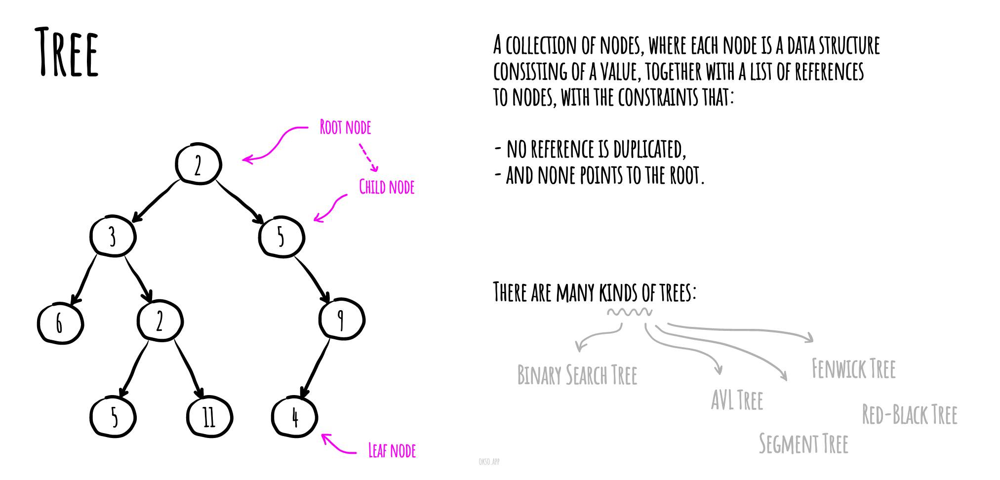

# Segment Tree

In computer science, a **segment tree** also known as a statistic tree
is a tree data structure used for storing information about intervals,
or segments. It allows querying which of the stored segments contain
a given point. It is, in principle, a static structure; that is,
it's a structure that cannot be modified once it's built. A similar
data structure is the interval tree.

A segment tree is a binary tree. The root of the tree represents the
whole array. The two children of the root represent the
first and second halves of the array. Similarly, the
children of each node corresponds to the two halves of
the array corresponding to the node.

We build the tree bottom up, with the value of each node
being the "minimum" (or any other function) of its children's values. This will
take `O(n log n)` time. The number
of operations done is the height of the tree, which
is `O(log n)`. To do range queries, each node splits the
query into two parts, one sub-query for each child.
If a query contains the whole subarray of a node, we
can use the precomputed value at the node. Using this
optimization, we can prove that only `O(log n)` minimum
operations are done.

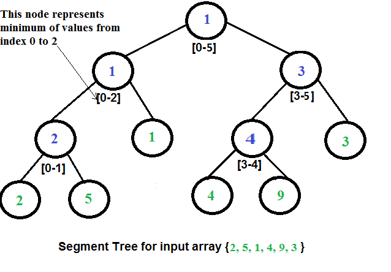

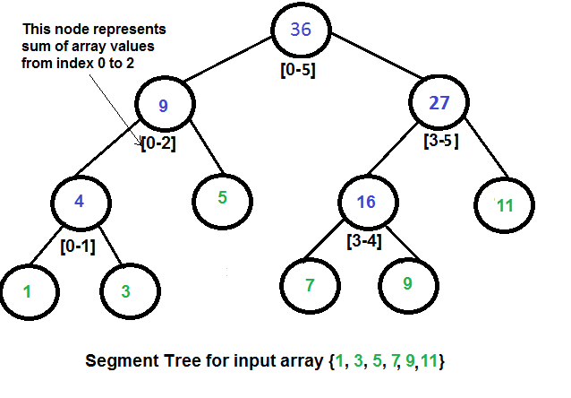

## Application

A segment tree is a data structure designed to perform
certain array operations efficiently - especially those
involving range queries.

Applications of the segment tree are in the areas of computational geometry,
and geographic information systems.

Current implementation of Segment Tree implies that you may
pass any binary (with two input params) function to it, and
thus you're able to do range query for variety of functions.
In tests, you may find examples of doing `min`, `max` and `sum` range
queries on SegmentTree.

# Red–Black Tree

A **red–black tree** is a kind of self-balancing binary search
tree in computer science. Each node of the binary tree has
an extra bit, and that bit is often interpreted as the
color (red or black) of the node. These color bits are used
to ensure the tree remains approximately balanced during
insertions and deletions.

Balance is preserved by painting each node of the tree with
one of two colors in a way that satisfies certain properties,
which collectively constrain how unbalanced the tree can
become in the worst case. When the tree is modified, the
new tree is subsequently rearranged and repainted to
restore the coloring properties. The properties are
designed in such a way that this rearranging and recoloring
can be performed efficiently.

The balancing of the tree is not perfect, but it is good
enough to allow it to guarantee searching in `O(log n)` time,
where `n` is the total number of elements in the tree.
The insertion and deletion operations, along with the tree
rearrangement and recoloring, are also performed
in `O(log n)` time.

An example of a red–black tree:


## Properties

In addition to the requirements imposed on a binary search
tree the following must be satisfied by a red–black tree:

- Each node is either red or black.
- The root is black. This rule is sometimes omitted.
  Since the root can always be changed from red to black,
  but not necessarily vice versa, this rule has little
  effect on analysis.
- All leaves (NIL) are black.
- If a node is red, then both its children are black.
- Every path from a given node to any of its descendant
  NIL nodes contains the same number of black nodes.

Some definitions: the number of black nodes from the root
to a node is the node's **black depth**; the uniform
number of black nodes in all paths from root to the leaves
is called the **black-height** of the red–black tree.

These constraints enforce a critical property of red–black
trees: _the path from the root to the farthest leaf is no more than twice as long as the path from the root to the nearest leaf_.
The result is that the tree is roughly height-balanced.
Since operations such as inserting, deleting, and finding
values require worst-case time proportional to the height
of the tree, this theoretical upper bound on the height
allows red–black trees to be efficient in the worst case,
unlike ordinary binary search trees.

## Balancing during insertion

### If uncle is RED

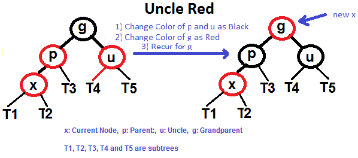

### If uncle is BLACK

- Left Left Case (`p` is left child of `g` and `x` is left child of `p`)
- Left Right Case (`p` is left child of `g` and `x` is right child of `p`)
- Right Right Case (`p` is right child of `g` and `x` is right child of `p`)
- Right Left Case (`p` is right child of `g` and `x` is left child of `p`)

#### Left Left Case (See g, p and x)

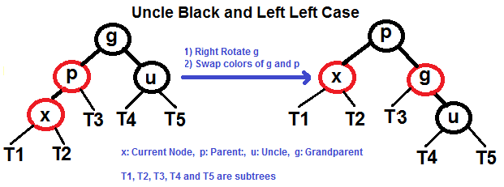

#### Left Right Case (See g, p and x)

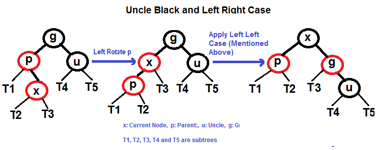

#### Right Right Case (See g, p and x)

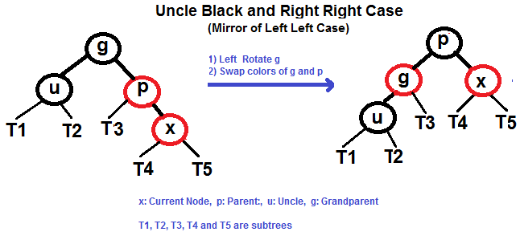

#### Right Left Case (See g, p and x)

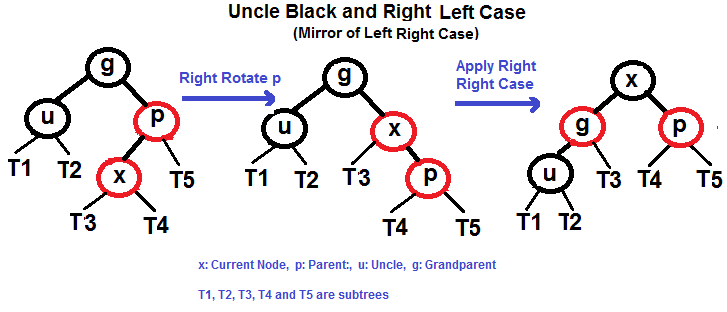

# Fenwick Tree / Binary Indexed Tree

A **Fenwick tree** or **binary indexed tree** is a data
structure that can efficiently update elements and
calculate prefix sums in a table of numbers.

When compared with a flat array of numbers, the Fenwick tree achieves a
much better balance between two operations: element update and prefix sum
calculation. In a flat array of `n` numbers, you can either store the elements,
or the prefix sums. In the first case, computing prefix sums requires linear
time; in the second case, updating the array elements requires linear time
(in both cases, the other operation can be performed in constant time).
Fenwick trees allow both operations to be performed in `O(log n)` time.
This is achieved by representing the numbers as a tree, where the value of
each node is the sum of the numbers in that subtree. The tree structure allows
operations to be performed using only `O(log n)` node accesses.

## Implementation Notes

Binary Indexed Tree is represented as an array. Each node of Binary Indexed Tree
stores sum of some elements of given array. Size of Binary Indexed Tree is equal
to `n` where `n` is size of input array. In current implementation we have used
size as `n+1` for ease of implementation. All the indexes are 1-based.

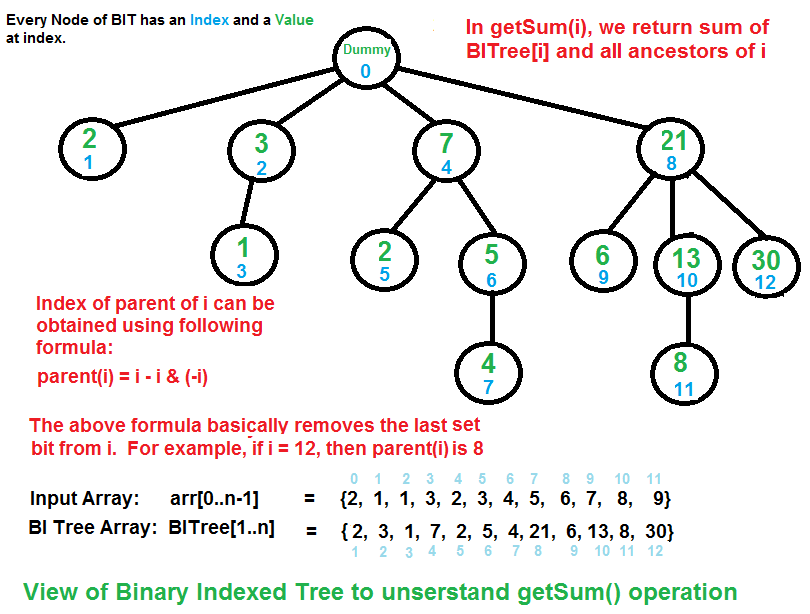

On the picture below you may see animated example of
creation of binary indexed tree for the
array `[1, 2, 3, 4, 5]` by inserting one by one.

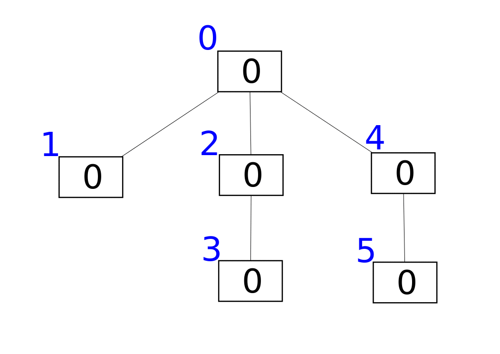

# Binary Search Tree

In computer science, **binary search trees** (BST), sometimes called
ordered or sorted binary trees, are a particular type of container:
data structures that store "items" (such as numbers, names etc.)
in memory. They allow fast lookup, addition and removal of
items, and can be used to implement either dynamic sets of
items, or lookup tables that allow finding an item by its key
(e.g., finding the phone number of a person by name).

Binary search trees keep their keys in sorted order, so that lookup
and other operations can use the principle of binary search:
when looking for a key in a tree (or a place to insert a new key),
they traverse the tree from root to leaf, making comparisons to
keys stored in the nodes of the tree and deciding, on the basis
of the comparison, to continue searching in the left or right
subtrees. On average, this means that each comparison allows
the operations to skip about half of the tree, so that each
lookup, insertion or deletion takes time proportional to the
logarithm of the number of items stored in the tree. This is
much better than the linear time required to find items by key
in an (unsorted) array, but slower than the corresponding
operations on hash tables.

A binary search tree of size 9 and depth 3, with 8 at the root.
The leaves are not drawn.

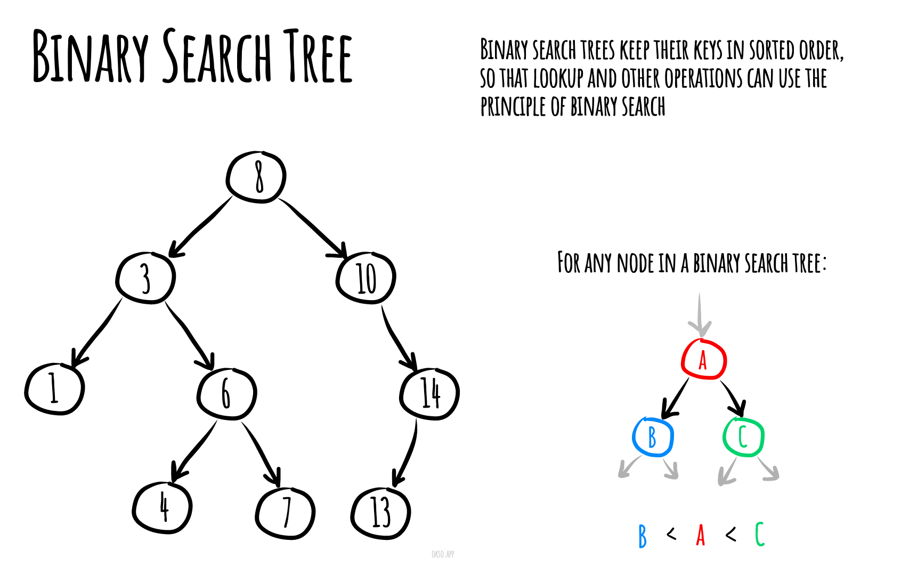

## Pseudocode for Basic Operations

### Insertion

```text
insert(value)
  Pre: value has passed custom type checks for type T
  Post: value has been placed in the correct location in the tree
  if root = ø
    root ← node(value)
  else
    insertNode(root, value)
  end if
end insert
```

```text
insertNode(current, value)
  Pre: current is the node to start from
  Post: value has been placed in the correct location in the tree
  if value < current.value
    if current.left = ø
      current.left ← node(value)
    else
      InsertNode(current.left, value)
    end if
  else
    if current.right = ø
      current.right ← node(value)
    else
      InsertNode(current.right, value)
    end if
  end if
end insertNode
```

### Searching

```text
contains(root, value)
  Pre: root is the root node of the tree, value is what we would like to locate
  Post: value is either located or not
  if root = ø
    return false
  end if
  if root.value = value
    return true
  else if value < root.value
    return contains(root.left, value)
  else
    return contains(root.right, value)
  end if
end contains
```

### Deletion

```text
remove(value)
  Pre: value is the value of the node to remove, root is the node of the BST
      count is the number of items in the BST
  Post: node with value is removed if found in which case yields true, otherwise false
  nodeToRemove ← findNode(value)
  if nodeToRemove = ø
    return false
  end if
  parent ← findParent(value)
  if count = 1
    root ← ø
  else if nodeToRemove.left = ø and nodeToRemove.right = ø
    if nodeToRemove.value < parent.value
      parent.left ←  nodeToRemove.right
    else
      parent.right ← nodeToRemove.right
    end if
  else if nodeToRemove.left != ø and nodeToRemove.right != ø
    next ← nodeToRemove.right
    while next.left != ø
      next ← next.left
    end while
    if next != nodeToRemove.right
      remove(next.value)
      nodeToRemove.value ← next.value
    else
      nodeToRemove.value ← next.value
      nodeToRemove.right ← nodeToRemove.right.right
    end if
  else
    if nodeToRemove.left = ø
      next ← nodeToRemove.right
    else
      next ← nodeToRemove.left
    end if
    if root = nodeToRemove
      root = next
    else if parent.left = nodeToRemove
      parent.left = next
    else if parent.right = nodeToRemove
      parent.right = next
    end if
  end if
  count ← count - 1
  return true
end remove
```

### Find Parent of Node

```text
findParent(value, root)
  Pre: value is the value of the node we want to find the parent of
       root is the root node of the BST and is != ø
  Post: a reference to the prent node of value if found; otherwise ø
  if value = root.value
    return ø
  end if
  if value < root.value
    if root.left = ø
      return ø
    else if root.left.value = value
      return root
    else
      return findParent(value, root.left)
    end if
  else
    if root.right = ø
      return ø
    else if root.right.value = value
      return root
    else
      return findParent(value, root.right)
    end if
  end if
end findParent
```

### Find Node

```text
findNode(root, value)
  Pre: value is the value of the node we want to find the parent of
       root is the root node of the BST
  Post: a reference to the node of value if found; otherwise ø
  if root = ø
    return ø
  end if
  if root.value = value
    return root
  else if value < root.value
    return findNode(root.left, value)
  else
    return findNode(root.right, value)
  end if
end findNode
```

### Find Minimum

```text
findMin(root)
  Pre: root is the root node of the BST
    root = ø
  Post: the smallest value in the BST is located
  if root.left = ø
    return root.value
  end if
  findMin(root.left)
end findMin
```

### Find Maximum

```text
findMax(root)
  Pre: root is the root node of the BST
    root = ø
  Post: the largest value in the BST is located
  if root.right = ø
    return root.value
  end if
  findMax(root.right)
end findMax
```

### Traversal

#### InOrder Traversal

```text
inorder(root)
  Pre: root is the root node of the BST
  Post: the nodes in the BST have been visited in inorder
  if root != ø
    inorder(root.left)
    yield root.value
    inorder(root.right)
  end if
end inorder
```

#### PreOrder Traversal

```text
preorder(root)
  Pre: root is the root node of the BST
  Post: the nodes in the BST have been visited in preorder
  if root != ø
    yield root.value
    preorder(root.left)
    preorder(root.right)
  end if
end preorder
```

#### PostOrder Traversal

```text
postorder(root)
  Pre: root is the root node of the BST
  Post: the nodes in the BST have been visited in postorder
  if root != ø
    postorder(root.left)
    postorder(root.right)
    yield root.value
  end if
end postorder
```

## Complexities

### Time Complexity

|  Access   |  Search   | Insertion | Deletion  |
| :-------: | :-------: | :-------: | :-------: |
| O(log(n)) | O(log(n)) | O(log(n)) | O(log(n)) |

### Space Complexity

O(n)

# AVL Tree

In computer science, an **AVL tree** (named after inventors
Adelson-Velsky and Landis) is a self-balancing binary search
tree. It was the first such data structure to be invented.
In an AVL tree, the heights of the two child subtrees of any
node differ by at most one; if at any time they differ by
more than one, rebalancing is done to restore this property.
Lookup, insertion, and deletion all take `O(log n)` time in
both the average and worst cases, where n is the number of
nodes in the tree prior to the operation. Insertions and
deletions may require the tree to be rebalanced by one or
more tree rotations.

Animation showing the insertion of several elements into an AVL
tree. It includes left, right, left-right and right-left rotations.


AVL tree with balance factors (green)

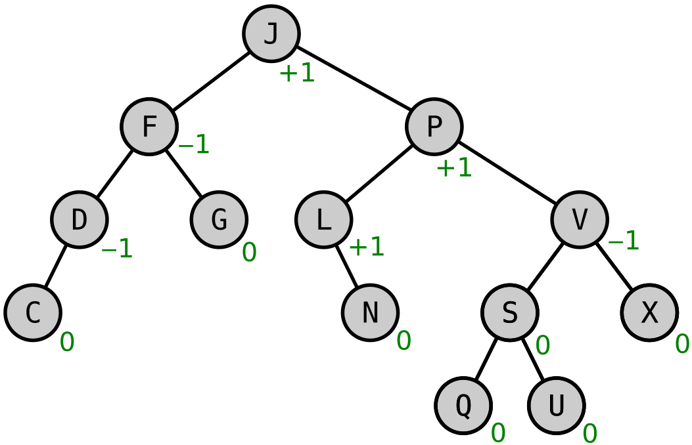

### AVL Tree Rotations

**Left-Left Rotation**


**Right-Right Rotation**


**Left-Right Rotation**


**Right-Left Rotation**


